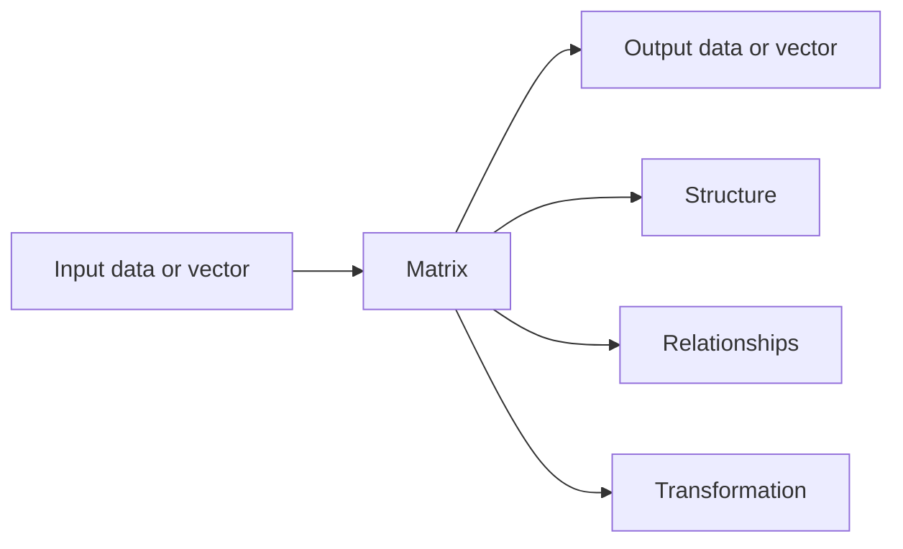

# Chapter 1: Why Matrices Matter

## Opening Picture

Imagine four scenes:

- A phone recommends a film you end up loving.
- A photo app rotates an image without changing its shape.
- A navigation system updates travel times across a city.
- A scientist simulates how heat spreads across a metal plate.

These do not look like the same problem. One is about taste, one is about images, one is about roads, and one is about physics. Yet all four can be described with the same mathematical object: the **matrix**.

A matrix is often introduced as a rectangular array of numbers. That description is correct, but it hides the interesting part. A matrix is also:

- a **compact way to organize information**
- a **machine that turns one vector into another**
- a **map of relationships**
- a **language for many systems acting at once**

This book is about learning to see all of those meanings at the same time.

## The Big Idea

At first glance, a matrix looks passive, like a spreadsheet. In practice, matrices are active. They take inputs, combine them in structured ways, and produce outputs.



If you remember only one sentence from this chapter, let it be this:

> A matrix is a structured rule for combining many numbers at once.

That rule may represent measurements, equations, motions, networks, probabilities, or patterns in data.

## A First Look at a Matrix

Here is a simple matrix:

\[
A =
\begin{bmatrix}
2 & 1 \\
0 & 3
\end{bmatrix}
\]

It has 2 rows and 2 columns, so we call it a `2 x 2` matrix.

You can read it in several ways:

- As a table of four numbers.
- As instructions for mixing two input quantities.
- As a geometric rule that transforms points in the plane.
- As a record of how two parts of a system influence two outputs.

Already the same object has multiple lives. That flexibility is why matrices matter so much.

## Matrices as Tables

The most familiar interpretation is the table view.

Suppose a small shop tracks sales of three products across four days:

| Product | Mon | Tue | Wed | Thu |
|---|---:|---:|---:|---:|
| Notebooks | 12 | 9 | 14 | 11 |
| Pens | 20 | 18 | 24 | 19 |
| Folders | 5 | 7 | 6 | 8 |

This can be written as a `3 x 4` matrix:

\[
S =
\begin{bmatrix}
12 & 9 & 14 & 11 \\
20 & 18 & 24 & 19 \\
5 & 7 & 6 & 8
\end{bmatrix}
\]

The matrix does not just save space. It gives us a disciplined way to ask questions:

- Which day had the highest total sales?
- Which product was most consistent?
- How do we compare products and days fairly?

Matrices make it easy to represent many quantities together without losing structure.

### Analogy: A Matrix as a Filing Cabinet

Think of a matrix as a filing cabinet with a very strict layout.

- Rows may represent categories.
- Columns may represent moments, features, or choices.
- Each entry sits at a precise address.

Because everything has a fixed location, the cabinet can be searched, compared, and processed automatically.

## Matrices as Machines

Now for the deeper view.

Take the matrix

\[
A =
\begin{bmatrix}
2 & 1 \\
0 & 3
\end{bmatrix}
\]

and an input vector

\[
x =
\begin{bmatrix}
4 \\
5
\end{bmatrix}
\]

When the matrix acts on the vector, we get

\[
Ax =
\begin{bmatrix}
2 & 1 \\
0 & 3
\end{bmatrix}
\begin{bmatrix}
4 \\
5
\end{bmatrix}
=
\begin{bmatrix}
13 \\
15
\end{bmatrix}
\]

This is not magic. The matrix mixes the input coordinates according to its rows:

- first output: `2(4) + 1(5) = 13`
- second output: `0(4) + 3(5) = 15`

So the matrix is behaving like a machine:

```text
input (4, 5)
   |
   v
[ 2  1 ]
[ 0  3 ]
   |
   v
output (13, 15)
```

Each row tells you how to build one output from the inputs.

This viewpoint becomes central later. It is one of the cleanest ways to understand linear algebra.

## Matrices as Geometric Transformations

Numbers in a matrix can describe movement in space.

If we apply a matrix to many points in the plane, the whole grid changes shape in a systematic way.

For example, the matrix

\[
\begin{bmatrix}
1 & 1 \\
0 & 1
\end{bmatrix}
\]

keeps vertical position the same but shifts horizontal position by an amount depending on height. This is called a **shear**.


Some matrices rotate. Some stretch. Some flip. Some collapse the plane onto a line. In every case, the transformation is controlled by a small grid of numbers.

This is one reason matrices are indispensable in:

- computer graphics
- robotics
- simulation
- physics
- engineering

### Analogy: A Matrix as a Lens

A camera lens changes what you see without changing the underlying scene. A matrix does something similar for coordinates: it changes how points are placed, scaled, or oriented.

## Matrices as Relationship Maps

Matrices are also useful when entries describe connections.

Suppose we have four cities. A `4 x 4` matrix could record travel times:

| From/To | A | B | C | D |
|---|---:|---:|---:|---:|
| A | 0 | 2 | 7 | 5 |
| B | 2 | 0 | 4 | 3 |
| C | 7 | 4 | 0 | 6 |
| D | 5 | 3 | 6 | 0 |

Or a matrix could record which web pages link to which pages, which people interact in a network, or which states of a system can transition to which others.

In this interpretation, a matrix is like a map of influence:

- entry `(i, j)` says how object `i` relates to object `j)`
- the whole matrix captures the full system at once

This is the foundation of graph algorithms, ranking systems, and Markov chains.

## Why Matrices Show Up Everywhere

Matrices appear so often because modern problems tend to have three features:

1. Many quantities must be handled at once.
2. Those quantities interact in patterned ways.
3. We want one framework that supports computation.

Matrices satisfy all three.

Here is a compact survey:

| Field | Matrix role |
|---|---|
| Economics | input-output models, optimization, forecasting |
| Physics | rotations, state evolution, quantum systems |
| Data science | datasets, regression, dimensionality reduction |
| Machine learning | model parameters, embeddings, neural network layers |
| Computer graphics | projection, scaling, rotation, lighting |
| Networks | adjacency matrices, flow, ranking |
| Statistics | covariance, correlation, linear models |
| Engineering | signals, control systems, finite element methods |

The specifics differ, but the core pattern is the same: matrices organize and transform many related numbers together.

## A Real-World Story: Recommending Movies

Suppose a streaming service has a small table of user ratings:

| User | Action | Comedy | Documentary |
|---|---:|---:|---:|
| Ada | 5 | 2 | 4 |
| Ben | 4 | 1 | 5 |
| Cy | 1 | 5 | 2 |
| Dia | 2 | 4 | 1 |

This rating table is a matrix.

What can the service do with it?

- compare users with similar tastes
- compare films liked by similar users
- fill in missing ratings
- compress the table into a smaller set of hidden features

This is not a side use of matrices. It is one of their natural strengths: they make patterns in large collections of data visible and computable.

## A Real-World Story: Images as Matrices

A grayscale image can be represented by a matrix in which each entry is a brightness value.

```text
0   = black
255 = white
middle values = gray
```

A tiny `5 x 5` image might look like this:

|   |   |   |   |   |
|---:|---:|---:|---:|---:|
| 20 | 20 | 20 | 20 | 20 |
| 20 | 200 | 200 | 200 | 20 |
| 20 | 200 | 20 | 200 | 20 |
| 20 | 200 | 200 | 200 | 20 |
| 20 | 20 | 20 | 20 | 20 |

Now operations on matrices become operations on images:

- blur
- sharpen
- rotate
- resize
- compress

The visual world becomes algebraic.

## A Real-World Story: Solving Many Equations at Once

Suppose a factory uses two raw materials to make two products. Cost and supply constraints lead to a system of equations. Instead of tracking each equation separately, we place the coefficients into a matrix.

That matrix lets us:

- organize the system cleanly
- solve it systematically
- recognize whether the system has one solution, many solutions, or none

This is the starting point of one of the main themes of the book: matrices are the natural language of linear systems.

## The Word "Linear"

You will often hear matrices discussed in the setting of **linear algebra**. The word *linear* matters.

Very roughly, linear systems are the ones that respect:

- addition
- scaling

That means the output of a matrix reacts predictably when the input is combined or resized.

This predictability makes matrices powerful. They are flexible enough to describe many problems, but structured enough to analyze deeply.

## The Hidden Strength: Compression of Complexity

One matrix can stand in for a long set of instructions.

For example, instead of writing

- first output equals `2x + y`
- second output equals `3y`

we can store the same rule as

\[
\begin{bmatrix}
2 & 1 \\
0 & 3
\end{bmatrix}
\]

This is more than shorthand. It lets us do higher-level reasoning:

- compose rules
- invert rules
- compare rules
- approximate rules
- compute at scale

Matrices compress complexity into form.

## Reading a Matrix in Three Ways at Once

An important skill is learning to switch viewpoints without getting lost.

Consider

\[
M =
\begin{bmatrix}
1 & 2 \\
3 & 4
\end{bmatrix}
\]

You should gradually become able to say:

- As a table, it stores four numbers.
- As a machine, it sends `(x, y)` to `(x + 2y, 3x + 4y)`.
- As a geometric transformation, it changes the entire plane in a consistent way.

Experts do not memorize separate facts for each topic. They see these as different faces of the same object.

## Common Misconceptions

### "A matrix is just a table."

It is a table, but not *just* a table. The table view is the doorway, not the whole building.

### "The numbers inside a matrix are all that matter."

The **arrangement** matters just as much. If you reorder rows or columns, you usually change the meaning.

### "Matrices are only for advanced theory."

They are central in advanced theory, but also in practical computing, graphics, statistics, and engineering.

### "Matrices are only about solving equations."

That is one major application, not the only one. They also encode transformations, interactions, probabilities, and data structure.

## How to Learn Matrices Well

This subject becomes much easier if you deliberately alternate between intuition and procedure.

When you meet a new idea, ask:

1. What is the picture?
2. What is the formal rule?
3. What does a simple example look like?
4. Where does this idea appear in real work?

This book follows that pattern repeatedly.

## Chapter Recap

- A matrix is a rectangular array of numbers, but that is only the starting definition.
- Matrices organize information, encode relationships, and act like machines on vectors.
- They can represent data tables, linear transformations, networks, images, and systems of equations.
- Their power comes from handling many related quantities at once in a structured way.
- Learning matrices well means holding multiple interpretations together, not choosing only one.

## Exercises

1. Write one short paragraph explaining a matrix as a table, and one short paragraph explaining a matrix as a machine. Use different language for each.
2. Give one real-world example where rows represent objects and columns represent features.
3. Give one real-world example where a matrix represents connections in a network.
4. Consider the matrix

\[
\begin{bmatrix}
3 & 0 \\
1 & 2
\end{bmatrix}
\]

Explain in words how it transforms an input vector `(x, y)`.

5. A grayscale image is stored as a matrix of brightness values. What do rows and columns represent? What do entries represent?
6. Why is it useful that a matrix can represent many equations or many relationships at once?
7. Make a small `2 x 3` matrix that could represent sales of two products over three days. Label the meaning of rows and columns.
8. Look back at the travel-time matrix in this chapter. Why are the diagonal entries zero?

