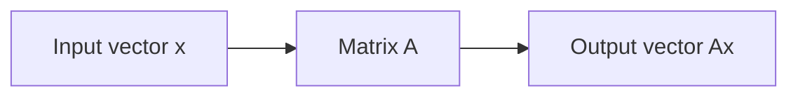
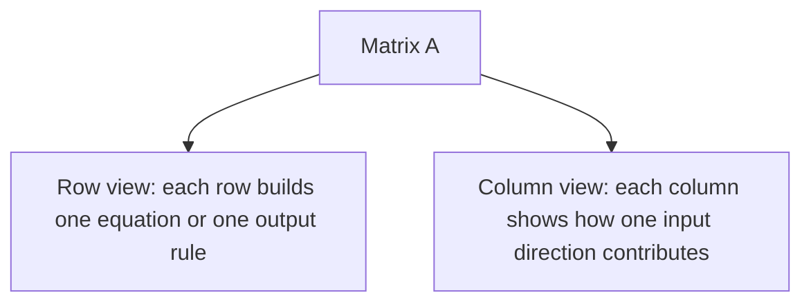
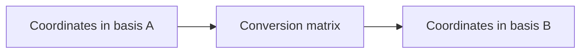

# Chapter 2: Seeing Matrices

## Opening Intuition

Before we do much with matrices, we need to become visually comfortable with them.

Beginners often see a rectangle of numbers and feel that every entry has equal status. That is not quite right. A matrix has structure:

- entries live inside rows and columns
- rows and columns can each have their own interpretation
- the shape of a matrix matters
- a matrix interacts naturally with vectors

This chapter is about learning to **read** a matrix, not just look at it.

## Shape Comes First

If a matrix has `m` rows and `n` columns, we call it an `m x n` matrix.

\[
A =
\begin{bmatrix}
a_{11} & a_{12} & \cdots & a_{1n} \\
a_{21} & a_{22} & \cdots & a_{2n} \\
\vdots & \vdots & \ddots & \vdots \\
a_{m1} & a_{m2} & \cdots & a_{mn}
\end{bmatrix}
\]

The notation `a_ij` means:

- `i` tells you the row
- `j` tells you the column

So `a_23` means “entry in row 2, column 3.”

### Why Shape Matters

The shape tells you what kind of job the matrix can do.

- A `3 x 4` matrix can hold 3 groups of 4 measurements.
- A `2 x 2` matrix can transform points in the plane.
- A `5 x 1` matrix is really a column vector.
- A `1 x 5` matrix is a row vector.

Matrix size is not decoration. It is part of the meaning.

## Rows and Columns as Different Stories

Consider the matrix

\[
T =
\begin{bmatrix}
78 & 82 & 91 \\
65 & 70 & 68 \\
88 & 84 & 90
\end{bmatrix}
\]

We might interpret it as test scores:

- rows = students
- columns = exams

Then the first row means:

```text
Student 1 scored 78, 82, 91
```

The second column means:

```text
Exam 2 scores were 82, 70, 84
```

Rows tell one story. Columns tell another.

### Visual Reminder

```text
[ 78  82  91 ]  <- row 1
[ 65  70  68 ]  <- row 2
[ 88  84  90 ]  <- row 3
   ^   ^   ^
   |   |   |
 columns 1, 2, 3
```

Many matrix ideas become simple once you ask:

- what does a row mean?
- what does a column mean?

## Matrices and Vectors

A vector is a one-dimensional list of numbers. In this book we usually write vectors as **column vectors**:

\[
x =
\begin{bmatrix}
2 \\
-1 \\
4
\end{bmatrix}
\]

You can think of a vector as:

- a point
- a direction
- a list of features
- a stack of quantities

Matrices and vectors belong together. A matrix often takes a vector as input and produces another vector as output.



This is why vectors feel like the natural “things” that matrices act on.

## Row View and Column View

One of the most useful habits in linear algebra is seeing a matrix in two ways at once.

Let

\[
A =
\begin{bmatrix}
1 & 2 \\
3 & 4 \\
5 & 6
\end{bmatrix}
\]

### Row View

The matrix is made of three rows:

\[
\begin{bmatrix}1 & 2\end{bmatrix},\quad
\begin{bmatrix}3 & 4\end{bmatrix},\quad
\begin{bmatrix}5 & 6\end{bmatrix}
\]

This view becomes important when solving systems of equations, because each row can represent one equation.

### Column View

The same matrix is made of two columns:

\[
\begin{bmatrix}1 \\ 3 \\ 5\end{bmatrix},\quad
\begin{bmatrix}2 \\ 4 \\ 6\end{bmatrix}
\]

This view becomes important when thinking about combinations of columns, spanning, and linear transformations.

### Mental Picture



Neither view is more correct. Each reveals different structure.

## A Matrix as a Collection of Vectors

It is often helpful to say:

- a matrix is a stack of row vectors
- or a matrix is a lineup of column vectors

For example,

\[
A =
\begin{bmatrix}
2 & 1 & 0 \\
-1 & 3 & 4
\end{bmatrix}
\]

can be seen as two row vectors:

\[
\begin{bmatrix}2 & 1 & 0\end{bmatrix},
\begin{bmatrix}-1 & 3 & 4\end{bmatrix}
\]

or three column vectors:

\[
\begin{bmatrix}2 \\ -1\end{bmatrix},
\begin{bmatrix}1 \\ 3\end{bmatrix},
\begin{bmatrix}0 \\ 4\end{bmatrix}
\]

This flexibility is not cosmetic. It is one reason matrix multiplication has two natural interpretations later.

## Special Matrix Shapes

Some shapes and patterns appear so often that they get names.

### Row Matrix

A `1 x n` matrix, such as

\[
\begin{bmatrix}
4 & 7 & 1
\end{bmatrix}
\]

### Column Matrix

An `m x 1` matrix, such as

\[
\begin{bmatrix}
4 \\
7 \\
1
\end{bmatrix}
\]

### Square Matrix

A matrix with the same number of rows and columns.

\[
\begin{bmatrix}
2 & 3 \\
1 & 5
\end{bmatrix}
\]

Square matrices are especially important because they can represent transformations from a space back to itself.

### Diagonal Matrix

Only diagonal entries may be nonzero:

\[
\begin{bmatrix}
3 & 0 & 0 \\
0 & -2 & 0 \\
0 & 0 & 5
\end{bmatrix}
\]

This usually means “stretch each coordinate independently.”

### Identity Matrix

The matrix that changes nothing:

\[
I_3 =
\begin{bmatrix}
1 & 0 & 0 \\
0 & 1 & 0 \\
0 & 0 & 1
\end{bmatrix}
\]

It is the matrix version of the number 1 for multiplication.

### Zero Matrix

All entries are zero:

\[
\begin{bmatrix}
0 & 0 \\
0 & 0
\end{bmatrix}
\]

This matrix sends every input vector to the zero vector.

## Reading a Matrix by Meaning

Suppose

\[
P =
\begin{bmatrix}
0.2 & 0.5 & 0.3 \\
0.1 & 0.7 & 0.2 \\
0.4 & 0.1 & 0.5
\end{bmatrix}
\]

At first it is just numbers. But if we say:

- rows = current weather state
- columns = next day's weather state

then every entry becomes meaningful. For example:

- `0.5` in row 1, column 2 might mean a 50% chance of moving from sunny to cloudy

A matrix is easiest to understand when you can complete the sentence:

> Entry `(i, j)` means ...

That sentence is one of the best tools in the whole subject.

## Matrices as Coordinate Converters

Suppose a robot uses one coordinate system internally and another externally. A matrix can convert descriptions from one system to another.

This interpretation is very common in geometry, graphics, and engineering.



Later we will make this precise, but the intuition matters now: a matrix can be a translator between coordinate languages.

## From Entries to Patterns

When you are new to matrices, you often focus on entries one by one. Over time you learn to notice patterns instead.

For example:

\[
\begin{bmatrix}
1 & 0 & 0 \\
0 & 1 & 0 \\
0 & 0 & 1
\end{bmatrix}
\quad
\begin{bmatrix}
2 & 0 & 0 \\
0 & 2 & 0 \\
0 & 0 & 2
\end{bmatrix}
\quad
\begin{bmatrix}
1 & 0 \\
0 & -1
\end{bmatrix}
\]

These are not just random matrices. They suggest:

- do nothing
- scale equally in all directions
- reflect across an axis

Seeing patterns turns matrix algebra from symbol pushing into understanding.

## Worked Example: Reading a Matrix Three Ways

Consider

\[
M =
\begin{bmatrix}
4 & 1 \\
2 & 3 \\
0 & 5
\end{bmatrix}
\]

### As a Data Table

It could describe 3 products measured on 2 features.

### As Rows

It contains three row vectors:

- `[4, 1]`
- `[2, 3]`
- `[0, 5]`

Each row could be one observation.

### As Columns

It contains two column vectors:

\[
\begin{bmatrix}4 \\ 2 \\ 0\end{bmatrix}
\quad \text{and} \quad
\begin{bmatrix}1 \\ 3 \\ 5\end{bmatrix}
\]

Each column could be one feature measured across 3 cases.

### As a Machine

Because `M` has 2 columns, it can take a `2 x 1` input vector:

\[
\begin{bmatrix}
x \\
y
\end{bmatrix}
\]

and produce a `3 x 1` output:

\[
M
\begin{bmatrix}
x \\
y
\end{bmatrix}
=
\begin{bmatrix}
4x + y \\
2x + 3y \\
5y
\end{bmatrix}
\]

One input description becomes three output quantities.

## Dimensions as Compatibility Rules

Dimensions tell us what fits.

If a matrix has shape `m x n`, then:

- it expects input vectors with `n` entries
- it produces output vectors with `m` entries

You can visualize this as:

```text
(m x n) matrix  x  (n x 1) vector  ->  (m x 1) vector
```

The inside dimensions must match.

This simple rule prevents many mistakes.

## Common Mistakes When Reading Matrices

### Mixing Up Rows and Columns

If rows represent students and columns represent exams, then swapping those interpretations changes the meaning completely.

### Ignoring Shape

Two matrices with the same entries in a different arrangement are not the same object.

For example,

\[
\begin{bmatrix}
1 & 2 & 3
\end{bmatrix}
\neq
\begin{bmatrix}
1 \\
2 \\
3
\end{bmatrix}
\]

The first is a row vector. The second is a column vector.

### Looking Only at Single Entries

Sometimes the key meaning lives in whole rows, whole columns, or global patterns.

### Forgetting Context

The same numerical matrix can mean completely different things in different applications.

## Good Questions to Ask About Any Matrix

Whenever you meet a new matrix, try asking:

1. What are the rows?
2. What are the columns?
3. What does a typical entry mean?
4. What is the shape?
5. If it acts on a vector, what kind of input does it accept?
6. What kind of output does it produce?
7. Are there visible patterns such as symmetry, zeros, or repeated columns?

These questions slow you down in a useful way.

## Chapter Recap

- A matrix has both entries and structure.
- Shape matters: an `m x n` matrix has `m` rows and `n` columns.
- Rows and columns often carry different interpretations.
- A matrix can be seen as a collection of row vectors or column vectors.
- Matrices naturally act on vectors, taking `n`-entry inputs to `m`-entry outputs.
- Special matrices such as diagonal, identity, and zero matrices appear constantly.
- Learning to read a matrix by meaning is as important as learning to compute with it.

## Exercises

1. A matrix has 4 rows and 7 columns. What is its shape?
2. In your own words, explain the difference between a row vector and a column vector.
3. Give a possible real-world interpretation of a `5 x 3` matrix.
4. For the matrix

\[
\begin{bmatrix}
7 & 1 \\
0 & -2 \\
4 & 5
\end{bmatrix}
\]

list its rows and columns.

5. If `A` is a `3 x 2` matrix, what size input vector can it multiply? What size output vector does it produce?
6. Explain the meaning of entry `(2, 3)` in a matrix whose rows are cities and columns are days of the week.
7. Build a small `3 x 3` matrix that could represent transitions between three weather states.
8. Which is a square matrix, and why?

\[
\begin{bmatrix}
1 & 2 \\
3 & 4
\end{bmatrix}
\quad
\begin{bmatrix}
1 & 2 & 3
\end{bmatrix}
\]

