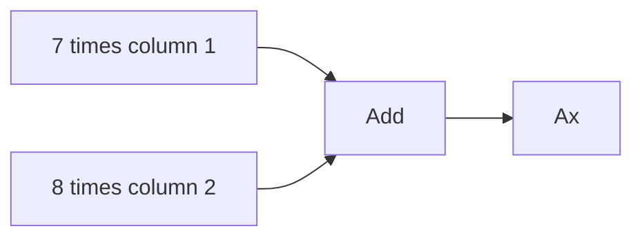
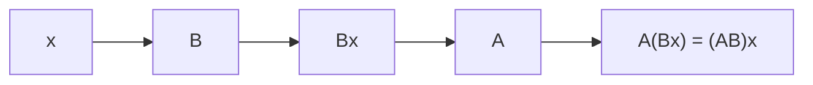

# Chapter 3: Matrix Operations

## Opening Intuition

Once you can read matrices, the next step is learning what you are allowed to do with them.

At first, matrix operations can feel arbitrary. Why can we add some matrices but not others? Why is matrix multiplication more complicated than ordinary multiplication? Why does order matter?

The short answer is that matrix operations are designed to preserve meaning.

- Matrix addition combines objects of the same shape.
- Scalar multiplication rescales a matrix.
- Matrix-vector multiplication applies a matrix as a machine.
- Matrix-matrix multiplication composes machines.
- Transpose flips rows and columns.

Each rule will make more sense if we keep the underlying interpretation in view.

## Addition: Combine Matching Structures

Two matrices can be added only if they have the same shape.

For example,

\[
A =
\begin{bmatrix}
1 & 4 \\
2 & 3
\end{bmatrix},
\quad
B =
\begin{bmatrix}
5 & -1 \\
0 & 6
\end{bmatrix}
\]

Then

\[
A + B =
\begin{bmatrix}
1+5 & 4+(-1) \\
2+0 & 3+6
\end{bmatrix}
=
\begin{bmatrix}
6 & 3 \\
2 & 9
\end{bmatrix}
\]

### Why Same Shape?

If matrices represent tables, then addition means combining matching entries. That only works if the tables line up.

If matrices represent transformations, addition creates a new transformation by adding corresponding effects.

### Analogy: Overlaying Two Transparent Grids

Imagine two transparent sheets with the same grid drawn on them. You can stack them cell by cell only if the grids match.

## Scalar Multiplication: Stretch or Shrink

A scalar is an ordinary number. Multiplying a matrix by a scalar means multiplying every entry by that number.

If

\[
A =
\begin{bmatrix}
2 & -1 \\
4 & 3
\end{bmatrix}
\]

then

\[
3A =
\begin{bmatrix}
6 & -3 \\
12 & 9
\end{bmatrix}
\]

and

\[
-\frac{1}{2}A =
\begin{bmatrix}
-1 & \frac{1}{2} \\
-2 & -\frac{3}{2}
\end{bmatrix}
\]

### Meaning

- In a data table, scalar multiplication rescales all measurements.
- In a geometric transformation, it magnifies or reverses the effect.
- In a system model, it changes the strength of every relationship proportionally.

## Matrix-Vector Multiplication: The Matrix as a Machine

This is one of the central operations in the subject.

Let

\[
A =
\begin{bmatrix}
1 & 2 \\
3 & 4 \\
5 & 6
\end{bmatrix}
,\quad
x =
\begin{bmatrix}
7 \\
8
\end{bmatrix}
\]

Then

\[
Ax =
\begin{bmatrix}
1 \cdot 7 + 2 \cdot 8 \\
3 \cdot 7 + 4 \cdot 8 \\
5 \cdot 7 + 6 \cdot 8
\end{bmatrix}
=
\begin{bmatrix}
23 \\
53 \\
83
\end{bmatrix}
\]

The matrix has shape `3 x 2`, so it accepts a `2 x 1` input and returns a `3 x 1` output.

### Row Interpretation

Each row tells you how to build one output:

- first output = row 1 dotted with the input
- second output = row 2 dotted with the input
- third output = row 3 dotted with the input

### Column Interpretation

There is another equally important way to see the same product.

Write the columns of `A` as

\[
a_1 =
\begin{bmatrix}
1 \\
3 \\
5
\end{bmatrix},
\quad
a_2 =
\begin{bmatrix}
2 \\
4 \\
6
\end{bmatrix}
\]

Then

\[
Ax = 7a_1 + 8a_2
\]

So matrix-vector multiplication is also a **weighted combination of columns**.

This is a major idea:

> Multiplying by a matrix combines its columns using the entries of the input vector as weights.



## Why the Rules Matter

Suppose

\[
A =
\begin{bmatrix}
2 & 1 \\
0 & 3
\end{bmatrix}
\]

Then for an input vector

\[
\begin{bmatrix}
x \\
y
\end{bmatrix}
\]

we get

\[
A
\begin{bmatrix}
x \\
y
\end{bmatrix}
=
\begin{bmatrix}
2x + y \\
3y
\end{bmatrix}
\]

That is not merely arithmetic. It describes a rule from one space to another.

Matrix-vector multiplication is the bridge between symbolic matrices and meaningful action.

## Matrix-Matrix Multiplication: Machines Feeding Machines

Now take two matrices:

\[
A =
\begin{bmatrix}
1 & 2 \\
0 & 1
\end{bmatrix},
\quad
B =
\begin{bmatrix}
3 & 1 \\
4 & 2
\end{bmatrix}
\]

Their product is

\[
AB =
\begin{bmatrix}
1\cdot 3 + 2\cdot 4 & 1\cdot 1 + 2\cdot 2 \\
0\cdot 3 + 1\cdot 4 & 0\cdot 1 + 1\cdot 2
\end{bmatrix}
=
\begin{bmatrix}
11 & 5 \\
4 & 2
\end{bmatrix}
\]

### Compatibility Rule

If `A` is `m x n` and `B` is `n x p`, then `AB` is `m x p`.

```text
(m x n)(n x p) -> (m x p)
```

The inside dimensions must match.

### What Does `AB` Mean?

The product `AB` means:

1. apply `B` first
2. then apply `A`

So matrix multiplication corresponds to **composition**.



This is why matrix multiplication is so important. It lets us build large systems from smaller steps.

## Why Order Matters

For ordinary numbers, `ab = ba`. For matrices, usually

\[
AB \neq BA
\]

Why? Because doing one action and then another is usually not the same as reversing the order.

Imagine:

1. rotate an image
2. then stretch it horizontally

That generally gives a different result from:

1. stretch first
2. then rotate

This is one of the biggest conceptual differences between matrix arithmetic and ordinary arithmetic.

### Small Example

Let

\[
A =
\begin{bmatrix}
1 & 1 \\
0 & 1
\end{bmatrix},
\quad
B =
\begin{bmatrix}
2 & 0 \\
0 & 1
\end{bmatrix}
\]

Then

\[
AB =
\begin{bmatrix}
2 & 1 \\
0 & 1
\end{bmatrix}
\quad \text{but} \quad
BA =
\begin{bmatrix}
2 & 2 \\
0 & 1
\end{bmatrix}
\]

Not equal.

## Computing Matrix Products Efficiently

There are two common ways to think about an entry of `AB`.

### Row-by-Column Rule

The entry in row `i`, column `j` of `AB` comes from:

- row `i` of `A`
- column `j` of `B`

This is the direct computational rule.

### Column Combination Rule

Each column of `AB` is what happens when `A` acts on the corresponding column of `B`.

This second view is often more insightful.

If \(B = [b_1 \; b_2 \; \cdots \; b_p]\), then

\[
AB = [Ab_1 \; Ab_2 \; \cdots \; Ab_p]
\]

That means you can understand a whole product by understanding what `A` does to the columns of `B`.

## Transpose: Flipping a Matrix

The transpose of a matrix `A`, written `A^T`, is formed by turning rows into columns and columns into rows.

If

\[
A =
\begin{bmatrix}
1 & 2 & 3 \\
4 & 5 & 6
\end{bmatrix}
\]

then

\[
A^T =
\begin{bmatrix}
1 & 4 \\
2 & 5 \\
3 & 6
\end{bmatrix}
\]

### Visual Picture

```text
original:   2 rows, 3 columns
transpose:  3 rows, 2 columns
```

### Why Transpose Matters

Transpose appears in:

- switching between row and column viewpoints
- defining symmetry
- dot products and projections
- statistics and least squares

If you reflect a matrix across its main diagonal, you get the transpose.

## Basic Properties

Let `A`, `B` be matrices of compatible sizes and let `c` be a scalar.

Some useful rules are:

\[
A + B = B + A
\]

\[
(A + B) + C = A + (B + C)
\]

\[
c(A + B) = cA + cB
\]

\[
A(B + C) = AB + AC
\]

\[
(A + B)C = AC + BC
\]

\[
(AB)C = A(BC)
\]

\[
(A^T)^T = A
\]

\[
(AB)^T = B^T A^T
\]

The last one is important: the order reverses when transposing a product.

## Worked Example: A Transformation Pipeline

Suppose a point is first scaled horizontally by 2 and then sheared.

Use

\[
S =
\begin{bmatrix}
2 & 0 \\
0 & 1
\end{bmatrix}
,\quad
H =
\begin{bmatrix}
1 & 1 \\
0 & 1
\end{bmatrix}
\]

If the scaling happens first and the shear second, the total transformation is

\[
HS =
\begin{bmatrix}
1 & 1 \\
0 & 1
\end{bmatrix}
\begin{bmatrix}
2 & 0 \\
0 & 1
\end{bmatrix}
=
\begin{bmatrix}
2 & 1 \\
0 & 1
\end{bmatrix}
\]

So the combined effect on a point `(x, y)` is

\[
\begin{bmatrix}
2x + y \\
y
\end{bmatrix}
\]

One matrix captures the whole pipeline.

## Common Mistakes

### Adding Matrices of Different Shapes

Not allowed. The entries do not line up.

### Forgetting Dimension Compatibility

If `A` is `2 x 3` and `B` is `2 x 2`, then `AB` is not defined because the inside dimensions do not match.

### Assuming `AB = BA`

This is almost never safe.

### Mixing Up Matrix-Vector Multiplication with Entrywise Multiplication

Matrix multiplication is about weighted sums, not multiplying corresponding entries.

### Forgetting What the Product Means

`AB` means “do `B` first, then `A`.” The order in notation can feel backward at first, but the action is consistent.

## Strategy for Learning Operations

When practicing a new operation, always do three things:

1. check dimensions
2. compute a concrete example
3. explain the meaning in words

That habit prevents matrix algebra from becoming empty symbol manipulation.

## Chapter Recap

- Matrix addition combines matrices of the same shape entry by entry.
- Scalar multiplication rescales every entry.
- Matrix-vector multiplication is the action of a matrix on an input vector.
- The product `Ax` can be read by rows or as a combination of columns.
- Matrix-matrix multiplication represents composition of linear transformations or systems.
- The product `AB` is generally not the same as `BA`.
- The transpose swaps rows and columns and appears throughout linear algebra.

## Exercises

1. Compute

\[
\begin{bmatrix}
2 & 1 \\
3 & 0
\end{bmatrix}
+
\begin{bmatrix}
4 & -1 \\
0 & 5
\end{bmatrix}
\]

2. Compute `-2A` for

\[
A =
\begin{bmatrix}
1 & -3 \\
2 & 4
\end{bmatrix}
\]

3. Compute

\[
\begin{bmatrix}
1 & 2 \\
0 & 3
\end{bmatrix}
\begin{bmatrix}
4 \\
5
\end{bmatrix}
\]

4. Rewrite the product in Exercise 3 as a combination of the columns of the matrix.
5. If `A` is `4 x 3`, what size vector can it multiply? What size vector comes out?
6. Determine whether the following product is defined:

\[
(2 x 5)(5 x 3)
\]

What is the size of the result?

7. Determine whether the following product is defined:

\[
(3 x 2)(4 x 3)
\]

8. Compute `AB` and `BA` for

\[
A =
\begin{bmatrix}
1 & 1 \\
0 & 1
\end{bmatrix},
\quad
B =
\begin{bmatrix}
2 & 0 \\
0 & 3
\end{bmatrix}
\]

9. Find the transpose of

\[
\begin{bmatrix}
4 & 0 & 2 \\
1 & -1 & 5
\end{bmatrix}
\]

10. In one paragraph, explain why matrix multiplication naturally models “doing one process and then another.”
