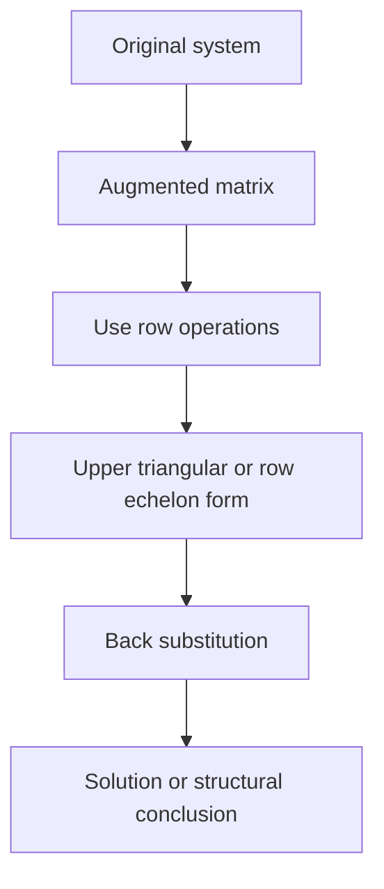
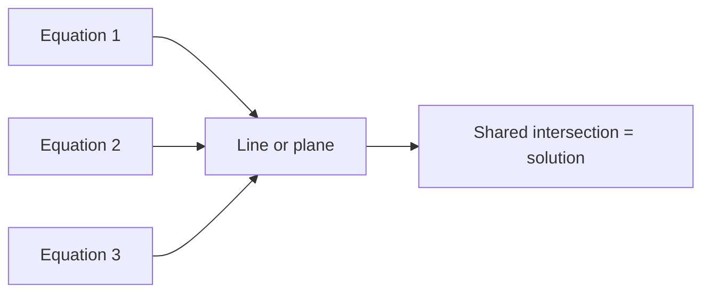

# Chapter 4: Solving Systems

## Opening Intuition

One of the oldest and most useful reasons to study matrices is to solve systems of linear equations.

A system of equations asks for values that satisfy several constraints at once. For example:

\[
\begin{aligned}
x + y &= 5 \\
2x - y &= 1
\end{aligned}
\]

You may have solved such systems in school by substitution or elimination. Matrices bring structure and scale. They let us solve not just two equations in two unknowns, but hundreds or millions of equations with the same basic ideas.

The key move is this:

> Instead of staring at the equations one by one, collect their coefficients into a matrix.

That turns the system into something we can manipulate systematically.

## From Equations to a Matrix

Consider the system

\[
\begin{aligned}
2x + y - z &= 3 \\
x - y + 2z &= 4 \\
3x + 2y + z &= 10
\end{aligned}
\]

The coefficient matrix is

\[
A =
\begin{bmatrix}
2 & 1 & -1 \\
1 & -1 & 2 \\
3 & 2 & 1
\end{bmatrix}
\]

The variable vector is

\[
x =
\begin{bmatrix}
x \\
y \\
z
\end{bmatrix}
\]

The right-hand side vector is

\[
b =
\begin{bmatrix}
3 \\
4 \\
10
\end{bmatrix}
\]

So the whole system becomes

\[
Ax = b
\]

This compact form is one of the great organizing ideas in mathematics.

## Augmented Matrices

When solving a system, we often attach the right-hand side to the coefficient matrix:

\[
\left[
\begin{array}{ccc|c}
2 & 1 & -1 & 3 \\
1 & -1 & 2 & 4 \\
3 & 2 & 1 & 10
\end{array}
\right]
\]

This is called the **augmented matrix**.

It is useful because the variables themselves no longer need to be written at every step. We focus on the numerical structure of the system.

### Visual Idea

```text
coefficients | constants
```

Everything to the left of the bar controls the variables. Everything to the right records the target values.

## The Goal of Elimination

Gaussian elimination is a method for simplifying the system step by step until the answers become easy to read.

The idea is to use legal row operations to create zeros underneath key entries that lead each row.

Those key entries are called **pivots**.



We are not changing the solution set. We are only rewriting the system in an easier form.

## The Three Legal Row Operations

These are the moves allowed in Gaussian elimination:

1. Swap two rows.
2. Multiply a row by a nonzero constant.
3. Add a multiple of one row to another row.

Why are these legal? Because each operation creates a new system that has exactly the same solutions as the old one.

### Interpretation

- Swapping rows just changes the order of equations.
- Multiplying a row by a nonzero constant scales an equation without changing its meaning.
- Adding one equation to another in a controlled way produces an equivalent equation.

## Pivots

When you do elimination, you usually pick one useful entry in a row and use it as the "handle" for cleaning out the entries below it. That handle is the pivot for that stage.

For example, in

\[
\left[
\begin{array}{cc|c}
1 & 1 & 5 \\
2 & -1 & 1
\end{array}
\right]
\]

the `1` in the upper-left corner is the first pivot. We use it to eliminate the `2` beneath it.

So a pivot is not just any nonzero number. It is the entry that leads the current row and helps organize the elimination process.

Think of elimination as clearing a staircase shape through the matrix:

- pick a pivot,
- use it to clear entries below,
- move one step down and to the right,
- pick the next pivot,
- repeat.

## Worked Example: A `2 x 2` System

Solve

\[
\begin{aligned}
x + y &= 5 \\
2x - y &= 1
\end{aligned}
\]

Write the augmented matrix:

\[
\left[
\begin{array}{cc|c}
1 & 1 & 5 \\
2 & -1 & 1
\end{array}
\right]
\]

Now eliminate the `2` below the first pivot:

\[
R_2 \leftarrow R_2 - 2R_1
\]

This gives

\[
\left[
\begin{array}{cc|c}
1 & 1 & 5 \\
0 & -3 & -9
\end{array}
\right]
\]

So the second equation is

\[
-3y = -9
\]

hence `y = 3`. Then from `x + y = 5`, we get `x = 2`.

### What Happened Conceptually?

We used the first equation to cancel `x` from the second equation. Elimination is controlled cancellation.

## Pivots

A **pivot** is a leading nonzero entry in a row after earlier elimination steps have been carried out.

In practice, it is the entry you use as an anchor:

- it leads the row,
- it helps clear entries below it,
- and later it helps reveal which variables are determined and which are free.

People also talk about a **pivot position**, which means the location of that pivot inside the matrix.

In row echelon form, pivots step to the right as you move downward.

Example:

\[
\begin{bmatrix}
1 & 2 & 0 \\
0 & 3 & 4 \\
0 & 0 & 5
\end{bmatrix}
\]

The pivots are `1`, `3`, and `5`.

Notice the pattern:

- the first pivot is in the first column,
- the second pivot is farther to the right,
- the third pivot is farther right again.

That staircase pattern is what elimination is trying to create.

Pivots tell us a great deal:

- which variables are controlled
- whether the system is fully determined
- whether some variables are free
- whether the system is inconsistent

## Row Echelon Form

A matrix is in **row echelon form** if:

- all zero rows, if any, are at the bottom
- each pivot is to the right of the pivot above it
- all entries below each pivot are zero

For example:

\[
\left[
\begin{array}{ccc|c}
1 & 2 & -1 & 4 \\
0 & 3 & 5 & 7 \\
0 & 0 & 2 & 6
\end{array}
\right]
\]

This is not yet the final answer, but it is easy to solve by **back substitution**.

## Reduced Row Echelon Form

If we keep going and make pivots equal to 1, with zeros above and below each pivot, we reach **reduced row echelon form**.

Example:

\[
\left[
\begin{array}{ccc|c}
1 & 0 & 0 & 2 \\
0 & 1 & 0 & -1 \\
0 & 0 & 1 & 3
\end{array}
\right]
\]

Now the solution can be read directly:

\[
x = 2,\quad y = -1,\quad z = 3
\]

Reduced row echelon form is more work, but it makes the structure of the system completely transparent.

## Worked Example: A `3 x 3` System

Solve

\[
\begin{aligned}
x + y + z &= 6 \\
2x + 3y + z &= 10 \\
x - y + 2z &= 5
\end{aligned}
\]

Start with the augmented matrix:

\[
\left[
\begin{array}{ccc|c}
1 & 1 & 1 & 6 \\
2 & 3 & 1 & 10 \\
1 & -1 & 2 & 5
\end{array}
\right]
\]

Eliminate below the first pivot:

\[
R_2 \leftarrow R_2 - 2R_1,\quad
R_3 \leftarrow R_3 - R_1
\]

Result:

\[
\left[
\begin{array}{ccc|c}
1 & 1 & 1 & 6 \\
0 & 1 & -1 & -2 \\
0 & -2 & 1 & -1
\end{array}
\right]
\]

Now eliminate below the second pivot:

\[
R_3 \leftarrow R_3 + 2R_2
\]

Result:

\[
\left[
\begin{array}{ccc|c}
1 & 1 & 1 & 6 \\
0 & 1 & -1 & -2 \\
0 & 0 & -1 & -5
\end{array}
\right]
\]

So `z = 5`. Then from row 2:

\[
y - z = -2 \Rightarrow y = 3
\]

Then from row 1:

\[
x + y + z = 6 \Rightarrow x + 3 + 5 = 6 \Rightarrow x = -2
\]

The solution is

\[
(x, y, z) = (-2, 3, 5)
\]

## Geometric Meaning of Solutions

Systems of linear equations are not just algebraic objects. They are geometric.

In two variables:

- each equation represents a line
- solving the system means finding intersection points

In three variables:

- each equation represents a plane
- solving the system means finding common intersection points



This explains why different systems behave differently:

- one intersection point means one solution
- parallel or conflicting constraints mean no solution
- overlapping constraints can produce infinitely many solutions

## Three Possible Outcomes

Every linear system falls into one of three broad cases.

### One Solution

Example:

\[
\begin{aligned}
x + y &= 3 \\
x - y &= 1
\end{aligned}
\]

The lines cross once.

### No Solution

Example:

\[
\begin{aligned}
x + y &= 2 \\
x + y &= 5
\end{aligned}
\]

Same left side, different right side. Impossible.

In row form this often appears as

\[
\left[
\begin{array}{ccc|c}
0 & 0 & 0 & 1
\end{array}
\right]
\]

which represents the contradiction `0 = 1`.

### Infinitely Many Solutions

Example:

\[
\begin{aligned}
x + y &= 2 \\
2x + 2y &= 4
\end{aligned}
\]

The second equation is just a multiple of the first. The system does not pin down a unique point.

In row reduction, this leads to at least one **free variable**.

## Free Variables and Dependent Variables

Suppose row reduction produces

\[
\left[
\begin{array}{ccc|c}
1 & 0 & 2 & 5 \\
0 & 1 & -1 & 3 \\
0 & 0 & 0 & 0
\end{array}
\right]
\]

Then the equations are

\[
x + 2z = 5,\quad y - z = 3
\]

There is no pivot in the `z` column, so `z` is free.

Let `z = t`. Then

\[
x = 5 - 2t,\quad y = 3 + t,\quad z = t
\]

So the solution set is

\[
\begin{bmatrix}
x \\
y \\
z
\end{bmatrix}
=
\begin{bmatrix}
5 \\
3 \\
0
\end{bmatrix}
+
t
\begin{bmatrix}
-2 \\
1 \\
1
\end{bmatrix}
\]

This is a line of solutions in three-dimensional space.

## Why Row Reduction Is So Powerful

Row reduction does more than find answers.

It tells us:

- whether a system is solvable
- whether the solution is unique
- which variables are free
- which columns carry pivot positions

Later, these ideas become rank, null space, basis, and dimension. For now, the important point is that elimination reveals structure.

## Numerical Caution: Choosing Good Pivots

In practical computation, row swaps are not just convenient. They can improve stability.

For example, if the entry you want to use as a pivot is zero, you must swap rows. Even if it is merely very small, swapping can reduce rounding error on a computer.

This is called **pivoting**.

At an introductory level, the main lesson is simple:

- if a pivot position is zero, try swapping with a lower row that has a nonzero entry there

## Worked Example: Detecting Inconsistency

Solve or classify:

\[
\begin{aligned}
x + 2y - z &= 1 \\
2x + 4y - 2z &= 3
\end{aligned}
\]

Augmented matrix:

\[
\left[
\begin{array}{ccc|c}
1 & 2 & -1 & 1 \\
2 & 4 & -2 & 3
\end{array}
\right]
\]

Now eliminate:

\[
R_2 \leftarrow R_2 - 2R_1
\]

giving

\[
\left[
\begin{array}{ccc|c}
1 & 2 & -1 & 1 \\
0 & 0 & 0 & 1
\end{array}
\right]
\]

The second row says `0 = 1`, which is impossible. So the system has **no solution**.

## Connection to Matrix Form `Ax = b`

When we solve a system, we are really asking:

> Does the matrix `A` send some vector `x` to the target vector `b`?

If yes, find it.

This connects solving systems to the “matrix as machine” viewpoint from earlier chapters. The vector `b` is the desired output; the unknown vector `x` is the input that would produce it.

That viewpoint becomes even more important later when we study column spaces and inverses.

## Common Mistakes

### Changing the System Illegally

Only the three elementary row operations preserve the solution set.

### Arithmetic Slips

Most elimination errors are not conceptual. They are sign mistakes, especially with negatives and fractions.

### Forgetting What a Pivot Means

A pivot is not just a number to circle. It marks a column that is structurally important.

### Ignoring Contradictions

A row like `0 0 0 | 1` immediately means no solution.

### Stopping Too Early

Sometimes a matrix is simplified enough for back substitution, but not yet enough to clearly see free variables or uniqueness. Know what your goal is.

## A Practical Checklist

When solving a system by elimination:

1. Write the augmented matrix carefully.
2. Choose the leftmost available nonzero entry as a pivot candidate.
3. Swap rows if needed.
4. Eliminate below the pivot.
5. Move right and down to the next pivot position.
6. When in echelon form, use back substitution or continue to reduced echelon form.
7. Interpret the result: one solution, none, or infinitely many.

## Chapter Recap

- A system of linear equations can be written compactly as `Ax = b`.
- The augmented matrix keeps the coefficients and constants together during solution.
- Gaussian elimination uses legal row operations to simplify the system.
- Pivots mark leading positions that control the structure of the solution.
- Row echelon form supports back substitution.
- Reduced row echelon form lets you read solutions directly.
- A linear system can have one solution, no solution, or infinitely many solutions.
- Free variables arise when some columns do not contain pivots.

## Exercises

1. Write the coefficient matrix, variable vector, and right-hand side vector for

\[
\begin{aligned}
3x + y &= 7 \\
2x - 4y &= -6
\end{aligned}
\]

2. Solve by elimination:

\[
\begin{aligned}
x + y &= 4 \\
x - y &= 2
\end{aligned}
\]

3. Solve by elimination:

\[
\begin{aligned}
x + 2y &= 5 \\
3x - y &= 4
\end{aligned}
\]

4. Convert this system to an augmented matrix:

\[
\begin{aligned}
x - y + z &= 2 \\
2x + y - z &= 1 \\
3x + 0y + 2z &= 7
\end{aligned}
\]

5. Use elimination to solve:

\[
\begin{aligned}
x + y + z &= 3 \\
2x + y - z &= 0 \\
x - y + 2z &= 5
\end{aligned}
\]

6. What does the row

\[
\left[
\begin{array}{ccc|c}
0 & 0 & 0 & 4
\end{array}
\right]
\]

tell you about a system?

7. What does it mean if a column has no pivot?
8. Give an example of a system with infinitely many solutions.
9. In geometric terms, what does solving a `2 x 2` linear system mean?
10. Explain in your own words why row reduction preserves solutions.
