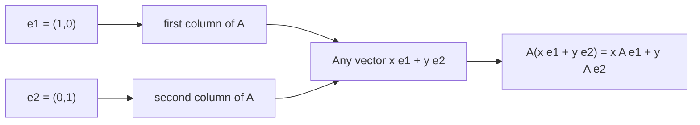
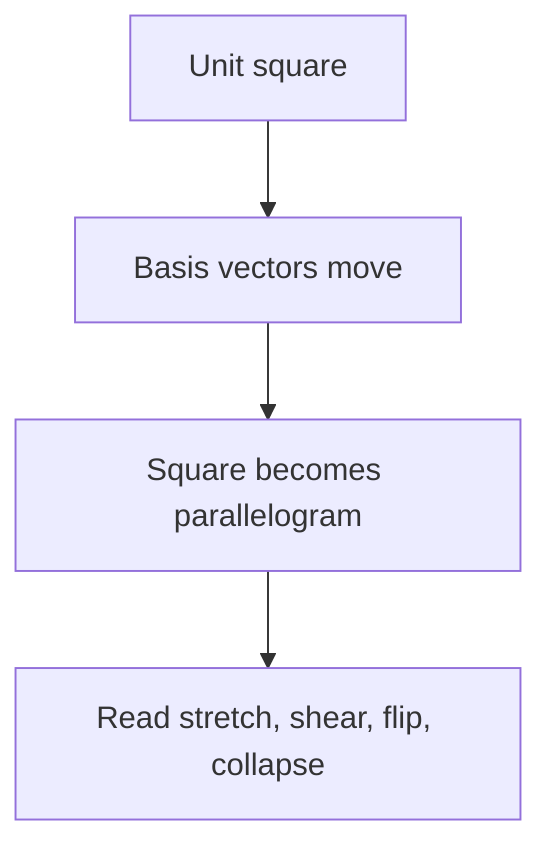

# Chapter 5: Linear Transformations and Geometry

## Opening Intuition: A Matrix as a Shape-Moving Machine

By now, matrices are no longer just rectangular arrays of numbers. They can add, multiply, and help solve systems of equations. In this chapter, we make a major shift in viewpoint:

**a matrix is also a machine that transforms space.**

That sentence is worth slowing down for.

If you feed a matrix a vector, the matrix sends that vector somewhere else. A vector that used to point northeast might get stretched, rotated, reflected, or tilted. A square grid might become a slanted grid. A circle might become an ellipse.

This geometric viewpoint is one of the deepest ideas in linear algebra. It turns matrix multiplication from a symbol-pushing exercise into something you can picture.

Think of a sheet of transparent graph paper. A matrix is like a rule that grabs the sheet and moves every point at once:

- some matrices stretch it,
- some flip it,
- some shear it,
- some rotate it,
- and some squash the whole sheet into a line.

The remarkable part is that linear transformations do this in a very structured way. They preserve straightness and preserve the origin. That structure is what makes them mathematically tractable and enormously useful.

## Why Geometry Matters

When you see a matrix geometrically, several facts suddenly become natural:

- The **columns** of a matrix tell you where the standard basis vectors go.
- Matrix multiplication means **doing one transformation after another**.
- Some matrices can be undone and some cannot.
- Some matrices preserve lengths or angles.
- The determinant, which we study next, measures how area or volume changes.

So this chapter is about more than pretty pictures. Geometry is the intuition layer underneath the algebra.

## The Core Rule

Let

\[
A =
\begin{bmatrix}
a & b \\
c & d
\end{bmatrix}.
\]

If we apply \(A\) to a vector

\[
\mathbf{x} =
\begin{bmatrix}
x \\
y
\end{bmatrix},
\]

then

\[
A\mathbf{x} =
\begin{bmatrix}
ax + by \\
cx + dy
\end{bmatrix}.
\]

This is the algebraic formula. Geometrically, it means the point \((x,y)\) is sent to a new point.

But the most important idea is not the formula. It is this:

## The Columns Tell the Story

Write the vector \(\mathbf{x}\) as

\[
\mathbf{x} = x
\begin{bmatrix}
1 \\
0
\end{bmatrix}
+ y
\begin{bmatrix}
0 \\
1
\end{bmatrix}.
\]

Then

\[
A\mathbf{x}
= xA
\begin{bmatrix}
1 \\
0
\end{bmatrix}
+ yA
\begin{bmatrix}
0 \\
1
\end{bmatrix}.
\]

The two vectors

\[
A\mathbf{e}_1
\quad \text{and} \quad
A\mathbf{e}_2
\]

are exactly the first and second columns of \(A\).

So:

- the first column tells you where \(\mathbf{e}_1 = (1,0)\) goes,
- the second column tells you where \(\mathbf{e}_2 = (0,1)\) goes.

Once you know where the basis vectors go, you know where **every** vector goes.

That is one of the central ideas of the whole subject.

## Linear Transformations

A transformation \(T\) is called **linear** if it satisfies two rules:

1. \(T(\mathbf{u}+\mathbf{v}) = T(\mathbf{u}) + T(\mathbf{v})\)
2. \(T(c\mathbf{u}) = cT(\mathbf{u})\)

for all vectors \(\mathbf{u}, \mathbf{v}\) and scalars \(c\).

These rules mean a linear transformation respects vector addition and scalar multiplication.

Another way to say this:

- sums stay sums,
- scaled vectors stay scaled,
- straight lines stay straight,
- the origin stays fixed.

That last fact is crucial. A linear transformation cannot move the origin somewhere else. If a rule shifts every point by \((3,2)\), then it is not linear.

### Visual Character of Linearity

Imagine a square grid on the plane.

- Horizontal lines may tilt.
- Vertical lines may tilt.
- Squares may become parallelograms.
- But lines stay lines.
- The crossing point at the origin stays where it is.

This is why linear transformations are often described as the geometry of rubber sheets that can stretch and shear, but not tear or translate.

## A Gallery of Basic Transformations

Let us look at some standard examples.

## Stretching

\[
A =
\begin{bmatrix}
2 & 0 \\
0 & 1
\end{bmatrix}
\]

This doubles all \(x\)-coordinates and leaves \(y\)-coordinates unchanged. It stretches the plane horizontally.

- \((1,0)\) becomes \((2,0)\)
- \((0,1)\) stays \((0,1)\)
- a unit square becomes a rectangle of width 2 and height 1

## Vertical Stretch

\[
A =
\begin{bmatrix}
1 & 0 \\
0 & 3
\end{bmatrix}
\]

This stretches vertically by a factor of 3.

## Uniform Scaling

\[
A =
\begin{bmatrix}
2 & 0 \\
0 & 2
\end{bmatrix}
\]

Everything gets twice as far from the origin. Angles stay the same. Shapes keep their form, though their size changes.

## Reflection

\[
A =
\begin{bmatrix}
1 & 0 \\
0 & -1
\end{bmatrix}
\]

This reflects the plane across the \(x\)-axis.

- points above the axis go below it,
- points below go above,
- points on the axis stay fixed.

## Shear

\[
A =
\begin{bmatrix}
1 & 1 \\
0 & 1
\end{bmatrix}
\]

This keeps vertical position the same but pushes points sideways in proportion to their height:

\[
\begin{bmatrix}
x \\
y
\end{bmatrix}
\mapsto
\begin{bmatrix}
x+y \\
y
\end{bmatrix}.
\]

A square becomes a parallelogram.

## Rotation

The matrix

\[
R_\theta =
\begin{bmatrix}
\cos\theta & -\sin\theta \\
\sin\theta & \cos\theta
\end{bmatrix}
\]

rotates vectors counterclockwise by angle \(\theta\).

For example, a 90-degree rotation is

\[
\begin{bmatrix}
0 & -1 \\
1 & 0
\end{bmatrix}.
\]

It sends

- \((1,0)\) to \((0,1)\),
- \((0,1)\) to \((-1,0)\).

## A Visual Summary

| Matrix | Geometric effect |
|---|---|
| \(\begin{bmatrix}2&0\\0&1\end{bmatrix}\) | horizontal stretch |
| \(\begin{bmatrix}1&0\\0&-1\end{bmatrix}\) | reflection across \(x\)-axis |
| \(\begin{bmatrix}1&1\\0&1\end{bmatrix}\) | shear |
| \(\begin{bmatrix}0&-1\\1&0\end{bmatrix}\) | 90-degree rotation |

## Worked Example: Reading a Transformation from Its Columns

Consider

\[
A =
\begin{bmatrix}
2 & 1 \\
1 & 3
\end{bmatrix}.
\]

The first column is

\[
\begin{bmatrix}
2 \\
1
\end{bmatrix},
\]

so \(\mathbf{e}_1\) goes to \((2,1)\).

The second column is

\[
\begin{bmatrix}
1 \\
3
\end{bmatrix},
\]

so \(\mathbf{e}_2\) goes to \((1,3)\).

That means the unit square spanned by \(\mathbf{e}_1\) and \(\mathbf{e}_2\) becomes the parallelogram spanned by those two new vectors.

If

\[
\mathbf{x} =
\begin{bmatrix}
4 \\
2
\end{bmatrix},
\]

then

\[
A\mathbf{x}
= 4
\begin{bmatrix}
2 \\
1
\end{bmatrix}
+ 2
\begin{bmatrix}
1 \\
3
\end{bmatrix}
=
\begin{bmatrix}
10 \\
10
\end{bmatrix}.
\]

The matrix acts by combining its columns with the coordinates of the input vector.

## The Unit Square as a Diagnostic Tool

One of the easiest ways to understand a \(2\times2\) matrix is to see what it does to:

- \(\mathbf{e}_1\),
- \(\mathbf{e}_2\),
- the unit square with corners \((0,0), (1,0), (0,1), (1,1)\).

This gives a fast geometric portrait.

If the parallelogram is large, area has grown. If it is flipped, orientation has changed. If it collapses into a line, something important has been lost.

## Composition: Doing One Transformation After Another

Suppose we first apply matrix \(B\), then apply matrix \(A\). The combined effect is

\[
A(B\mathbf{x}) = (AB)\mathbf{x}.
\]

So matrix multiplication is composition of transformations.

This is a profound fact:

- \(B\) happens first,
- then \(A\),
- and the product \(AB\) represents the total action.

The order matters.

In general,

\[
AB \neq BA.
\]

Geometrically, rotating then reflecting is usually different from reflecting then rotating.

## Worked Example: Order Matters

Let

\[
R=
\begin{bmatrix}
0 & -1 \\
1 & 0
\end{bmatrix}
\quad\text{and}\quad
S=
\begin{bmatrix}
1 & 0 \\
0 & -1
\end{bmatrix}.
\]

Here \(R\) is a 90-degree rotation and \(S\) is reflection across the \(x\)-axis.

Compute:

\[
RS=
\begin{bmatrix}
0 & 1 \\
1 & 0
\end{bmatrix},
\qquad
SR=
\begin{bmatrix}
0 & -1 \\
-1 & 0
\end{bmatrix}.
\]

These are different matrices, so the resulting transformations are different.

This is why matrix multiplication is not commutative.

## What Transformations Preserve

Different matrices preserve different geometric features.

### All linear transformations preserve:

- straight lines,
- the origin,
- parallelism of lines.

### Some also preserve:

- lengths,
- angles,
- area,
- orientation.

For example:

- Rotations preserve lengths and angles.
- Reflections preserve lengths and angles, but reverse orientation.
- General shears preserve area only in special cases.
- Scalings change lengths and areas.

This way of classifying matrices becomes extremely useful later.

## Singular Transformations: When Space Collapses

Not every matrix gives a reversible transformation.

Consider

\[
A=
\begin{bmatrix}
1 & 1 \\
2 & 2
\end{bmatrix}.
\]

Its columns are multiples of each other, so both basis directions get sent into the same line. The whole plane collapses into a line.

That means distinct vectors can land at the same output. Information is lost. Such a matrix cannot be undone.

Geometrically:

- a square becomes a line segment,
- area becomes zero,
- the transformation is **singular**.

This connects directly to determinants and inverses in the next chapters.

## Transformations in Three Dimensions

Everything we have said extends to \(\mathbb{R}^3\).

A \(3\times3\) matrix transforms three-dimensional space. The columns tell you where the basis vectors

\[
\mathbf{e}_1,\mathbf{e}_2,\mathbf{e}_3
\]

go.

Now the unit cube may become:

- a stretched box,
- a slanted parallelepiped,
- a reflected version,
- or a flattened object with zero volume.

The geometric picture is harder to draw, but the principle is exactly the same.

## A Useful Analogy: A New Coordinate Grid

There is another nice way to think about a matrix.

Instead of saying the matrix moves the vector, imagine the matrix moves the grid itself.

The original basis vectors are the old coordinate axes. The columns of the matrix form a new pair of axes. Multiplying by the matrix expresses the vector relative to that deformed grid.

This viewpoint helps explain why columns matter so much.

It also helps explain why a matrix can encode both:

- a transformation of vectors,
- and a change in the coordinate frame.

Those viewpoints are closely related.

## Worked Example: Track the Image of a Triangle

Take the triangle with vertices

- \(A=(0,0)\),
- \(B=(1,0)\),
- \(C=(1,2)\).

Apply

\[
M=
\begin{bmatrix}
2 & 1 \\
0 & 1
\end{bmatrix}.
\]

Compute the new vertices:

\[
M(0,0)=(0,0),
\]

\[
M(1,0)=
\begin{bmatrix}
2 \\
0
\end{bmatrix},
\]

\[
M(1,2)=
\begin{bmatrix}
4 \\
2
\end{bmatrix}.
\]

So the triangle becomes a new triangle with vertices

- \((0,0)\),
- \((2,0)\),
- \((4,2)\).

You can picture the original triangle being stretched and sheared.

This simple exercise is a good habit: apply a matrix to a few landmark points and you quickly understand the transformation.

## Common Mistakes

### Mistake 1: Thinking a matrix only acts on numbers

A matrix acts on coordinate vectors, and that means it acts on geometric objects too: points, arrows, polygons, grids, and whole spaces.

### Mistake 2: Forgetting that columns are images of basis vectors

Students often memorize multiplication rules but miss this conceptual shortcut. The columns are not random. They are the transformed basis vectors.

### Mistake 3: Assuming order does not matter

With transformations, order is everything. First rotate then shear is not the same as first shear then rotate.

### Mistake 4: Calling translations linear

Moving every point by a fixed vector is important geometry, but it is not a linear transformation because the origin does not stay fixed.

### Mistake 5: Ignoring collapse

If a matrix crushes the plane into a line, it is still a linear transformation. It is just not invertible.

## Visual Checklist for Any \(2\times2\) Matrix

When you see a matrix

\[
A=
\begin{bmatrix}
a & b \\
c & d
\end{bmatrix},
\]

ask these questions:

1. Where does \(\mathbf{e}_1\) go?
2. Where does \(\mathbf{e}_2\) go?
3. What happens to the unit square?
4. Is there stretching, shearing, rotation, or reflection?
5. Does the square collapse into a line?
6. Does orientation appear to flip?

These six questions will take you a long way.

## Chapter Recap

- A matrix can be viewed as a **linear transformation**, a rule that moves vectors while preserving addition and scalar multiplication.
- The columns of a matrix tell you where the standard basis vectors go.
- In two dimensions, a matrix sends the unit square to a parallelogram.
- Common geometric actions include stretching, shearing, rotation, and reflection.
- Matrix multiplication corresponds to composing transformations.
- Order matters: \(AB\) usually differs from \(BA\).
- Some matrices are singular and collapse space into a lower-dimensional object.

## Exercises

1. For the matrix

   \[
   A=
   \begin{bmatrix}
   3 & 0 \\
   0 & 2
   \end{bmatrix},
   \]

   describe geometrically what happens to the plane.

2. For

   \[
   B=
   \begin{bmatrix}
   1 & 2 \\
   0 & 1
   \end{bmatrix},
   \]

   compute \(B\mathbf{e}_1\) and \(B\mathbf{e}_2\), and describe the image of the unit square.

3. Apply

   \[
   C=
   \begin{bmatrix}
   0 & -1 \\
   1 & 0
   \end{bmatrix}
   \]

   to the vectors \((1,2)\), \((2,0)\), and \((0,-3)\). What geometric transformation is this?

4. Give an example of a \(2\times2\) matrix that collapses the plane into a line.

5. Explain in words why the columns of a matrix determine the entire transformation.

6. Let

   \[
   R=
   \begin{bmatrix}
   0 & -1 \\
   1 & 0
   \end{bmatrix},
   \quad
   S=
   \begin{bmatrix}
   1 & 0 \\
   0 & -1
   \end{bmatrix}.
   \]

   Compute \(RS\) and \(SR\). Interpret the difference geometrically.

7. Find the image of the triangle with vertices \((0,0)\), \((1,1)\), and \((2,1)\) under

   \[
   M=
   \begin{bmatrix}
   2 & 1 \\
   1 & 1
   \end{bmatrix}.
   \]

8. A translation sends \((x,y)\) to \((x+4,y-1)\). Explain why this is not linear.

9. In your own words, explain the difference between a reflection and a rotation.

10. Draw a square grid on paper and sketch what happens to it under a horizontal shear. Label the images of \(\mathbf{e}_1\) and \(\mathbf{e}_2\).
