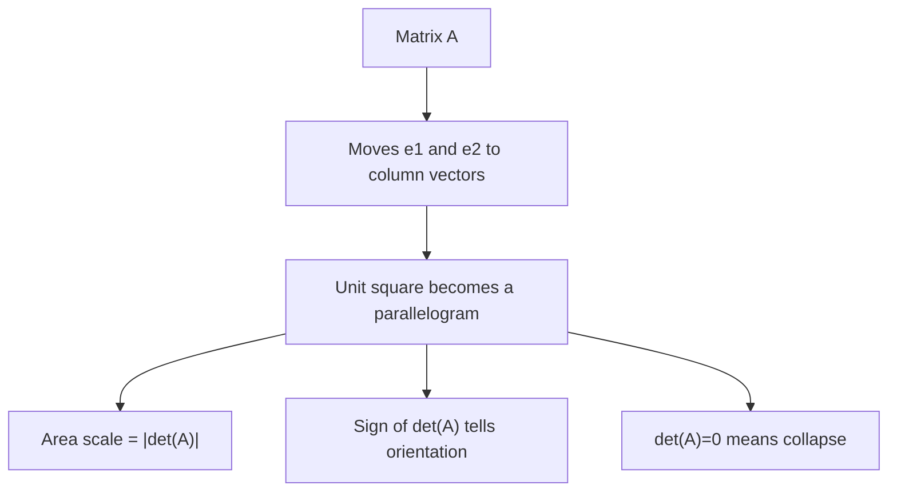

# Chapter 6: Determinants

## Opening Intuition: How Much Does a Matrix Distort Space?

When a matrix acts on the plane, the unit square may become a rectangle, a parallelogram, or even a flattened line segment. In three dimensions, the unit cube may become a box, a slanted solid, or a flattened sheet.

The **determinant** is the number that measures this distortion.

At first, determinants often feel like an arbitrary formula to memorize:

\[
\det
\begin{bmatrix}
a & b \\
c & d
\end{bmatrix}
= ad-bc.
\]

But that formula is only the surface. Underneath it is a geometric story:

- the determinant tells you how area or volume scales,
- its sign tells you whether orientation is preserved or reversed,
- and a zero determinant tells you the transformation collapses space and cannot be undone.

So determinants are not really about a formula. They are about what a transformation does to space.

<figure class="book-media">
  <video controls playsinline preload="metadata" src="/media/animations/ch06-determinant-area-scale.mp4"></video>
  <figcaption>This animation shows the unit square turning into a new shape. The determinant records the area scaling factor.</figcaption>
</figure>

## The Determinant in One Sentence

For a square matrix, the determinant tells you:

**how much oriented area or oriented volume changes under the transformation.**

The word *oriented* matters. A positive determinant and a negative determinant can have the same absolute size but different geometric meaning.

## Determinants in Two Dimensions

Let

\[
A=
\begin{bmatrix}
a & b \\
c & d
\end{bmatrix}.
\]

Its columns are

\[
\mathbf{v}_1=
\begin{bmatrix}
a \\
c
\end{bmatrix},
\qquad
\mathbf{v}_2=
\begin{bmatrix}
b \\
d
\end{bmatrix}.
\]

These columns are the images of \(\mathbf{e}_1\) and \(\mathbf{e}_2\). So the unit square becomes the parallelogram spanned by \(\mathbf{v}_1\) and \(\mathbf{v}_2\).

The determinant is the signed area of that parallelogram:

\[
\det(A)=ad-bc.
\]

### What the sign means

- If \(\det(A) > 0\), orientation is preserved.
- If \(\det(A) < 0\), orientation is reversed.
- If \(\det(A) = 0\), the parallelogram has zero area and the plane has collapsed into a line.

## A First Example

Consider

\[
A=
\begin{bmatrix}
2 & 1 \\
1 & 3
\end{bmatrix}.
\]

Then

\[
\det(A)=2\cdot 3 - 1\cdot 1 = 5.
\]

This means:

- the unit square becomes a parallelogram of area 5,
- orientation is preserved,
- the transformation is invertible.

If a small shape had area \(7\) before the transformation, its image would have area \(35\).

## Why \(ad-bc\)?

Let us build some intuition for the formula rather than just accept it.

The columns of

\[
\begin{bmatrix}
a & b \\
c & d
\end{bmatrix}
\]

form a parallelogram. The signed area of that parallelogram turns out to be \(ad-bc\).

You can think of this as:

- the area contribution from the rectangle-like part \(ad\),
- minus the overlapping or oppositely oriented part \(bc\).

Another useful perspective is that determinants are the unique area-scaling rule that is:

- linear in each column,
- alternating when columns swap,
- equal to 1 for the identity matrix.

That is abstract language, but it explains why the formula has the shape it does.

## Determinant of the Identity Matrix

\[
I=
\begin{bmatrix}
1 & 0 \\
0 & 1
\end{bmatrix}
\]

has determinant 1.

This is exactly what we want. The identity does nothing to the plane, so area scale should be 1.

## Stretching and Determinants

If

\[
A=
\begin{bmatrix}
2 & 0 \\
0 & 3
\end{bmatrix},
\]

then

\[
\det(A)=6.
\]

That makes sense geometrically:

- horizontal lengths double,
- vertical lengths triple,
- area is multiplied by \(2\times 3 = 6\).

If

\[
A=
\begin{bmatrix}
2 & 0 \\
0 & \frac12
\end{bmatrix},
\]

then

\[
\det(A)=1.
\]

The transformation stretches in one direction and compresses in the other so that total area stays the same.

## Shears and Determinants

Consider

\[
A=
\begin{bmatrix}
1 & 1 \\
0 & 1
\end{bmatrix}.
\]

This is a shear. It changes the shape of the unit square into a parallelogram, but

\[
\det(A)=1.
\]

So the area does not change.

This is a useful reminder:

the determinant measures **area or volume change**, not general shape change.

A matrix can dramatically tilt and distort an object while leaving its area unchanged.

## Reflections and the Sign of the Determinant

Consider reflection across the \(x\)-axis:

\[
R=
\begin{bmatrix}
1 & 0 \\
0 & -1
\end{bmatrix}.
\]

Its determinant is

\[
\det(R)=-1.
\]

The area scale is 1, but orientation flips.

You can think of orientation as the handedness of the coordinate system. A positive determinant keeps clockwise and counterclockwise relationships consistent; a negative determinant reverses them.

## Zero Determinant Means Collapse

Consider

\[
A=
\begin{bmatrix}
1 & 2 \\
2 & 4
\end{bmatrix}.
\]

Then

\[
\det(A)=1\cdot 4 - 2\cdot 2 = 0.
\]

Its columns lie on the same line, so the image of the unit square is not a genuine parallelogram. It has collapsed into a line segment with zero area.

That means:

- different vectors can map to the same output,
- the transformation loses information,
- the matrix is not invertible.

This is one of the most important implications of the determinant.

## Determinants in Three Dimensions

For a \(3\times3\) matrix, the determinant measures signed volume scale.

The unit cube becomes a slanted box-like shape called a **parallelepiped**. The determinant tells you its signed volume.

If

\[
\det(A)=4,
\]

then every volume is multiplied by 4.

If

\[
\det(A)=-4,
\]

then volume scale is still 4, but orientation flips.

If

\[
\det(A)=0,
\]

the cube gets flattened into a lower-dimensional object, such as a plane or a line.

## Computing a \(3\times3\) Determinant

For

\[
A=
\begin{bmatrix}
a & b & c \\
d & e & f \\
g & h & i
\end{bmatrix},
\]

one standard expansion is

\[
\det(A)=
a(ei-fh)-b(di-fg)+c(dh-eg).
\]

This is useful, but for larger matrices direct expansion becomes inefficient. In practice, row reduction is usually the better route.

## Determinants and Row Operations

Row operations affect determinants in predictable ways:

1. Swapping two rows multiplies the determinant by \(-1\).
2. Multiplying a row by \(k\) multiplies the determinant by \(k\).
3. Adding a multiple of one row to another leaves the determinant unchanged.

These rules are extremely valuable because they let us convert a matrix into an upper triangular matrix, whose determinant is easy to read.

### Triangular matrices

If a matrix is upper triangular or lower triangular, then its determinant is just the product of the diagonal entries.

For example,

\[
\begin{bmatrix}
2 & 5 & 1 \\
0 & 3 & -4 \\
0 & 0 & 7
\end{bmatrix}
\]

has determinant

\[
2\cdot 3\cdot 7 = 42.
\]

This works because the elimination process preserves the geometric scaling information in a controlled way.

## Worked Example Using Row Reduction

Compute the determinant of

\[
A=
\begin{bmatrix}
1 & 2 & 1 \\
2 & 5 & 3 \\
1 & 0 & 8
\end{bmatrix}.
\]

Use row operations that do not change the determinant:

- \(R_2 \leftarrow R_2 - 2R_1\)
- \(R_3 \leftarrow R_3 - R_1\)

This gives

\[
\begin{bmatrix}
1 & 2 & 1 \\
0 & 1 & 1 \\
0 & -2 & 7
\end{bmatrix}.
\]

Now use

- \(R_3 \leftarrow R_3 + 2R_2\)

to get

\[
\begin{bmatrix}
1 & 2 & 1 \\
0 & 1 & 1 \\
0 & 0 & 9
\end{bmatrix}.
\]

The matrix is now upper triangular, so

\[
\det(A)=1\cdot 1\cdot 9=9.
\]

## Determinants and Invertibility

For a square matrix \(A\), the following are equivalent:

- \(\det(A)\neq 0\)
- \(A\) is invertible
- the columns of \(A\) are linearly independent
- the transformation does not collapse space
- the system \(A\mathbf{x}=\mathbf{b}\) has a unique solution for every \(\mathbf{b}\)

This is a major connecting point in linear algebra. The determinant is not an isolated topic. It is linked to geometry, algebra, and system-solving all at once.

## Multiplicative Property

One of the most beautiful facts is

\[
\det(AB)=\det(A)\det(B).
\]

Geometrically, this is exactly what you would expect.

If \(B\) scales area by a factor of 3, and then \(A\) scales area by a factor of 5, the total scale factor should be \(15\).

The determinant packages that intuition perfectly.

This also implies:

\[
\det(A^{-1})=\frac{1}{\det(A)}
\]

whenever \(A^{-1}\) exists.

## Determinant as a Quick Diagnostic

When you see a square matrix, the determinant answers several fast questions:

- Does the transformation preserve or reverse orientation?
- Does it preserve area or volume?
- Is it singular?
- Is it invertible?
- Does it flatten space?

That is a lot of information from one number.

## A Useful Analogy: Determinant as a Volume Dial

Imagine a matrix as a machine that deforms a clay block.

- If the determinant is 2, the machine doubles the block's oriented volume.
- If the determinant is \(-2\), it doubles volume and flips orientation.
- If the determinant is \(0.1\), it shrinks volume to one tenth.
- If the determinant is 0, it squashes the block flat.

The machine may also rotate, shear, or reflect the block, but the determinant is specifically the volume dial.

## Common Mistakes

### Mistake 1: Thinking the determinant measures all distortion

It does not. It measures area or volume scaling, plus orientation. A shear can look dramatic while keeping determinant 1.

### Mistake 2: Forgetting the determinant only applies to square matrices

Only square matrices have determinants in the standard sense.

### Mistake 3: Interpreting a negative determinant as "negative area"

The sign is about orientation, not literal negative physical area.

### Mistake 4: Assuming nonzero determinant means "small error"

Even a tiny nonzero determinant can still correspond to a badly conditioned problem. Determinant alone does not measure numerical stability.

### Mistake 5: Ignoring row operation effects

When you reduce a matrix to triangular form, you must track swaps and row scaling carefully. Otherwise the determinant can come out wrong.

## A Compact Visual Guide

| Determinant value | Meaning |
|---|---|
| \(>0\) | orientation preserved |
| \(<0\) | orientation reversed |
| \(=0\) | collapse, not invertible |
| \(|\det(A)|>1\) | area or volume expands |
| \(|\det(A)|<1\) | area or volume contracts |
| \(|\det(A)|=1\) | area or volume preserved |

## Chapter Recap

- The determinant of a square matrix measures signed area or volume scaling.
- In \(2\times2\) matrices, the determinant equals the signed area of the parallelogram formed by the columns.
- A positive determinant preserves orientation; a negative one reverses it.
- A zero determinant means the transformation collapses space and is not invertible.
- Row operations change the determinant in controlled ways.
- For triangular matrices, the determinant is the product of the diagonal entries.
- Determinants multiply under composition: \(\det(AB)=\det(A)\det(B)\).

## Exercises

1. Compute the determinant of

   \[
   \begin{bmatrix}
   4 & 1 \\
   2 & 3
   \end{bmatrix}.
   \]

   Interpret the result geometrically.

2. Give a \(2\times2\) matrix with determinant \(-1\). Describe its effect on orientation and area.

3. Find a nonzero \(2\times2\) matrix whose determinant is 0. Explain why it is not invertible.

4. For

   \[
   A=
   \begin{bmatrix}
   1 & 3 \\
   0 & 2
   \end{bmatrix},
   \]

   describe the image of the unit square and compute its area.

5. Show that the shear matrix

   \[
   \begin{bmatrix}
   1 & k \\
   0 & 1
   \end{bmatrix}
   \]

   always has determinant 1.

6. Compute the determinant of

   \[
   \begin{bmatrix}
   2 & 1 & 0 \\
   0 & 3 & 4 \\
   0 & 0 & 5
   \end{bmatrix}.
   \]

7. Use row reduction to compute the determinant of

   \[
   \begin{bmatrix}
   1 & 2 & 0 \\
   2 & 1 & 1 \\
   3 & 0 & 4
   \end{bmatrix}.
   \]

8. Explain in words why a matrix with two equal columns must have determinant 0.

9. If \(\det(A)=3\) and \(\det(B)=-2\), what is \(\det(AB)\)?

10. A matrix doubles horizontal lengths and halves vertical lengths. What can you say about its determinant?
