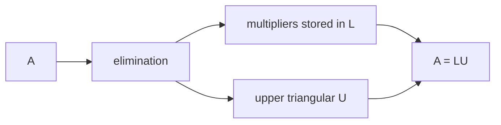

# Chapter 7: Inverses and Factorizations

## Opening Intuition: Can the Transformation Be Undone?

Suppose a matrix stretches and rotates the plane. After the transformation, can you recover the original vector exactly?

Sometimes yes. Sometimes no.

If you can reverse the action perfectly, the matrix has an **inverse**. If you cannot, then somewhere along the way information was lost.

This chapter is about two linked ideas:

- the **inverse**, which undoes a transformation,
- and **factorization**, which breaks a complicated matrix into simpler pieces that are easier to understand and compute with.

The inverse is conceptually elegant. Factorization is computationally practical. Together they form one of the most useful toolkits in linear algebra.

## The Inverse Matrix

For a square matrix \(A\), an inverse is a matrix \(A^{-1}\) such that

\[
A^{-1}A = I
\quad\text{and}\quad
AA^{-1}=I,
\]

where \(I\) is the identity matrix.

This means:

- applying \(A\) and then \(A^{-1}\) gives you back the original vector,
- applying \(A^{-1}\) and then \(A\) also gives you back the original vector.

So \(A^{-1}\) is the exact undoing machine for \(A\).

## Geometric Meaning

If \(A\) is invertible, then its transformation:

- does not collapse space,
- sends different vectors to different outputs,
- allows perfect recovery of inputs.

Geometrically, an invertible matrix may stretch, rotate, shear, or reflect, but it never flattens the plane into a line or a three-dimensional solid into a plane.

A singular matrix loses information. An invertible matrix preserves enough information to reverse the process.

<figure class="book-media">
  <video controls playsinline preload="metadata" src="/media/animations/ch07-inverse-undo.mp4"></video>
  <figcaption>The inverse really is an undo button: the grid and shape are transformed by <code>A</code>, then brought exactly back by <code>A^{-1}</code>.</figcaption>
</figure>

## A Simple Example

Let

\[
A=
\begin{bmatrix}
2 & 0 \\
0 & 3
\end{bmatrix}.
\]

This stretches horizontally by 2 and vertically by 3. Its inverse should undo those scalings:

\[
A^{-1}=
\begin{bmatrix}
\tfrac12 & 0 \\
0 & \tfrac13
\end{bmatrix}.
\]

Indeed,

\[
A^{-1}A=
\begin{bmatrix}
\tfrac12 & 0 \\
0 & \tfrac13
\end{bmatrix}
\begin{bmatrix}
2 & 0 \\
0 & 3
\end{bmatrix}
=
\begin{bmatrix}
1 & 0 \\
0 & 1
\end{bmatrix}.
\]

## Inverse of a \(2\times2\) Matrix

If

\[
A=
\begin{bmatrix}
a & b \\
c & d
\end{bmatrix},
\]

and \(ad-bc\neq 0\), then

\[
A^{-1}
=
\frac{1}{ad-bc}
\begin{bmatrix}
d & -b \\
-c & a
\end{bmatrix}.
\]

This formula is useful, but it is best understood geometrically:

- the determinant \(ad-bc\) tells whether inversion is possible,
- the inverse rescales by the reciprocal determinant,
- and it reverses the action of the original transformation.

If \(ad-bc=0\), the formula breaks down because the matrix is not invertible.

## Solving Systems with Inverses

If

\[
A\mathbf{x}=\mathbf{b}
\]

and \(A\) is invertible, then

\[
\mathbf{x}=A^{-1}\mathbf{b}.
\]

So the inverse gives a formal solution to a whole family of systems.

This is conceptually nice, but in practice we often do **not** compute the inverse explicitly. For actual numerical work, elimination or factorization is usually better.

That point matters. Inverse matrices are important, but they are not always the best computational tool.

## When Does an Inverse Exist?

For a square matrix \(A\), the following conditions are equivalent:

- \(A\) has an inverse,
- \(\det(A)\neq 0\),
- the columns of \(A\) are linearly independent,
- \(A\mathbf{x}=\mathbf{0}\) has only the trivial solution,
- \(A\mathbf{x}=\mathbf{b}\) has a unique solution for every \(\mathbf{b}\).

This list is worth remembering. It ties geometry, systems of equations, determinants, and vector spaces together.

## Worked Example: Inverse of a \(2\times2\) Matrix

Find the inverse of

\[
A=
\begin{bmatrix}
2 & 1 \\
5 & 3
\end{bmatrix}.
\]

First compute the determinant:

\[
\det(A)=2\cdot 3 - 1\cdot 5 = 1.
\]

Since the determinant is nonzero, the inverse exists.

\[
A^{-1}=
\begin{bmatrix}
3 & -1 \\
-5 & 2
\end{bmatrix}.
\]

Check:

\[
\begin{bmatrix}
2 & 1 \\
5 & 3
\end{bmatrix}
\begin{bmatrix}
3 & -1 \\
-5 & 2
\end{bmatrix}
=
\begin{bmatrix}
1 & 0 \\
0 & 1
\end{bmatrix}.
\]

Because the determinant is 1, the correction factor is especially simple.

## Finding the Inverse by Row Reduction

For larger matrices, the standard method is to augment with the identity and row reduce:

\[
[A \mid I] \longrightarrow [I \mid A^{-1}].
\]

This works because row operations correspond to multiplying by elementary matrices, which gradually turn \(A\) into \(I\). The same operations then turn \(I\) into \(A^{-1}\).

### Example

Take

\[
A=
\begin{bmatrix}
1 & 2 \\
3 & 7
\end{bmatrix}.
\]

Start with

\[
\left[
\begin{array}{cc|cc}
1 & 2 & 1 & 0 \\
3 & 7 & 0 & 1
\end{array}
\right].
\]

Now eliminate:

- \(R_2 \leftarrow R_2 - 3R_1\)

\[
\left[
\begin{array}{cc|cc}
1 & 2 & 1 & 0 \\
0 & 1 & -3 & 1
\end{array}
\right].
\]

Then:

- \(R_1 \leftarrow R_1 - 2R_2\)

\[
\left[
\begin{array}{cc|cc}
1 & 0 & 7 & -2 \\
0 & 1 & -3 & 1
\end{array}
\right].
\]

So

\[
A^{-1}=
\begin{bmatrix}
7 & -2 \\
-3 & 1
\end{bmatrix}.
\]

## Why Computing the Inverse Explicitly Is Often a Bad Habit

Students often learn that

\[
\mathbf{x}=A^{-1}\mathbf{b}
\]

and then conclude that solving systems means "find the inverse first."

That is usually inefficient.

If you only need one solution vector \(\mathbf{x}\), row reduction is typically cheaper and more stable than computing the entire inverse.

The inverse is like buying a whole toolkit when you only need one screwdriver.

However, if you need to solve

\[
A\mathbf{x}_1=\mathbf{b}_1,\quad
A\mathbf{x}_2=\mathbf{b}_2,\quad
\ldots
\]

for many right-hand sides, then factorization becomes very valuable.

## Factorization: Breaking a Matrix into Simpler Pieces

A **factorization** writes a matrix as a product of simpler matrices.

Why do this?

Because complicated transformations often become easier to understand when broken into stages.

This is exactly the same strategy used everywhere else in mathematics:

- factor integers into primes,
- factor polynomials into simpler polynomials,
- factor matrices into simpler matrices.

The matrix viewpoint is:

**a hard transformation may be composed of several easy ones.**

## LU Factorization

One of the most useful factorizations is

\[
A=LU,
\]

where

- \(L\) is lower triangular,
- \(U\) is upper triangular.

Why is this useful?

Because triangular systems are easy to solve.

The elimination process that turns \(A\) into an upper triangular matrix can be recorded in a structured way. The multipliers used during elimination become entries of \(L\).

<figure class="book-media">
  <video controls playsinline preload="metadata" src="/media/animations/ch07-factorization-steps.mp4"></video>
  <figcaption>Instead of one mysterious transformation, factorization lets you see a sequence of simpler moves: shear, shear, then scale.</figcaption>
</figure>

## A Concrete LU Example

Let

\[
A=
\begin{bmatrix}
2 & 3 \\
4 & 7
\end{bmatrix}.
\]

To eliminate the 4 below the pivot 2, subtract \(2\) times the first row from the second. The multiplier is 2.

So

\[
U=
\begin{bmatrix}
2 & 3 \\
0 & 1
\end{bmatrix},
\qquad
L=
\begin{bmatrix}
1 & 0 \\
2 & 1
\end{bmatrix}.
\]

Check:

\[
LU=
\begin{bmatrix}
1 & 0 \\
2 & 1
\end{bmatrix}
\begin{bmatrix}
2 & 3 \\
0 & 1
\end{bmatrix}
=
\begin{bmatrix}
2 & 3 \\
4 & 7
\end{bmatrix}.
\]

So the original matrix is the product of a lower triangular matrix and an upper triangular one.

## Why LU Helps Solve Systems Fast

Suppose

\[
A\mathbf{x}=\mathbf{b}
\]

and \(A=LU\). Then

\[
LU\mathbf{x}=\mathbf{b}.
\]

Let

\[
U\mathbf{x}=\mathbf{y}.
\]

Then we solve two simpler systems:

1. \(L\mathbf{y}=\mathbf{b}\) by **forward substitution**
2. \(U\mathbf{x}=\mathbf{y}\) by **back substitution**

This is much more efficient than repeating Gaussian elimination from scratch each time.

That is why factorization is so important in computation.

## Forward and Back Substitution

If

\[
L=
\begin{bmatrix}
1 & 0 & 0 \\
\ell_{21} & 1 & 0 \\
\ell_{31} & \ell_{32} & 1
\end{bmatrix},
\]

then solving \(L\mathbf{y}=\mathbf{b}\) starts from the top and moves downward.

If

\[
U=
\begin{bmatrix}
u_{11} & u_{12} & u_{13} \\
0 & u_{22} & u_{23} \\
0 & 0 & u_{33}
\end{bmatrix},
\]

then solving \(U\mathbf{x}=\mathbf{y}\) starts from the bottom and moves upward.

Triangular systems are easy because each equation isolates a new variable cleanly.

## Not Every Matrix Has a Plain LU Without Row Swaps

Some matrices need row exchanges during elimination. In that case we use

\[
PA=LU,
\]

where \(P\) is a permutation matrix representing row swaps.

This matters in practice because zero or tiny pivots can cause trouble.

For a first pass through the subject, the important idea is simple:

- elimination creates triangular structure,
- factorization records that structure,
- row swaps may be needed for stability or feasibility.

## Other Useful Factorizations

LU is only the beginning. Later chapters will introduce more:

- **QR factorization** for orthogonality and least squares,
- **eigendecomposition** for repeated actions and dynamics,
- **SVD** for compression, data analysis, and robust geometry.

Each factorization highlights a different hidden structure inside a matrix.

## Inverse Through the Lens of Factorization

Factorizations also help us think about inverses.

If

\[
A=LU,
\]

and both \(L\) and \(U\) are invertible, then

\[
A^{-1}=U^{-1}L^{-1}.
\]

Notice the order reverses.

That makes sense: to undo a two-step process, you undo the last step first.

This mirrors everyday life:

- to get dressed, you put on socks then shoes,
- to undo that, you remove shoes then socks.

Matrix inverses behave the same way.

## Worked Example: Solving with an LU Factorization

Let

\[
A=
\begin{bmatrix}
2 & 3 \\
4 & 7
\end{bmatrix}
=
\begin{bmatrix}
1 & 0 \\
2 & 1
\end{bmatrix}
\begin{bmatrix}
2 & 3 \\
0 & 1
\end{bmatrix}.
\]

Solve

\[
A\mathbf{x}=
\begin{bmatrix}
5 \\
11
\end{bmatrix}.
\]

First solve

\[
L\mathbf{y}=
\begin{bmatrix}
5 \\
11
\end{bmatrix}.
\]

That is,

\[
\begin{bmatrix}
1 & 0 \\
2 & 1
\end{bmatrix}
\begin{bmatrix}
y_1 \\
y_2
\end{bmatrix}
=
\begin{bmatrix}
5 \\
11
\end{bmatrix}.
\]

From the first row, \(y_1=5\). From the second, \(2(5)+y_2=11\), so \(y_2=1\).

Now solve

\[
U\mathbf{x}=
\begin{bmatrix}
5 \\
1
\end{bmatrix},
\]

that is,

\[
\begin{bmatrix}
2 & 3 \\
0 & 1
\end{bmatrix}
\begin{bmatrix}
x_1 \\
x_2
\end{bmatrix}
=
\begin{bmatrix}
5 \\
1
\end{bmatrix}.
\]

From the second row, \(x_2=1\). Then \(2x_1+3=5\), so \(x_1=1\).

Therefore

\[
\mathbf{x}=
\begin{bmatrix}
1 \\
1
\end{bmatrix}.
\]

## Common Mistakes

### Mistake 1: Confusing "nonzero matrix" with "invertible matrix"

A matrix can be full of nonzero entries and still fail to be invertible if its rows or columns are dependent.

### Mistake 2: Believing every system should be solved by computing \(A^{-1}\)

This is conceptually possible, but often computationally wasteful.

### Mistake 3: Forgetting that only square matrices have two-sided inverses

Rectangular matrices can have related notions such as left inverses or right inverses, but the standard inverse belongs to square matrices.

### Mistake 4: Reversing factor orders incorrectly

If \(A=LU\), then \(A^{-1}=U^{-1}L^{-1}\), not \(L^{-1}U^{-1}\).

### Mistake 5: Treating factorization as purely symbolic

Factorization is about structure. It explains what elimination is doing and why solving repeated systems becomes efficient.

## A Comparison Table

| Idea | Main question | Best viewpoint |
|---|---|---|
| inverse | can we undo the transformation? | geometry and algebra |
| elimination | how do we solve one system? | row operations |
| LU factorization | how do we reuse the work? | computation and structure |

## Chapter Recap

- An inverse matrix undoes the action of a matrix.
- A square matrix is invertible exactly when it does not collapse space.
- For a \(2\times2\) matrix, the inverse exists when the determinant is nonzero.
- Systems \(A\mathbf{x}=\mathbf{b}\) can be solved formally by \(\mathbf{x}=A^{-1}\mathbf{b}\).
- In practice, elimination and factorization are often better computational tools than explicitly forming the inverse.
- LU factorization writes a matrix as a product of a lower triangular matrix and an upper triangular matrix.
- Factorizations reveal internal structure and make repeated computations faster.

## Exercises

1. Determine whether the matrix

   \[
   \begin{bmatrix}
   2 & 1 \\
   4 & 2
   \end{bmatrix}
   \]

   is invertible. Explain geometrically.

2. Find the inverse of

   \[
   \begin{bmatrix}
   3 & 1 \\
   2 & 1
   \end{bmatrix}.
   \]

3. Solve

   \[
   \begin{bmatrix}
   1 & 2 \\
   3 & 5
   \end{bmatrix}
   \mathbf{x}
   =
   \begin{bmatrix}
   4 \\
   9
   \end{bmatrix}
   \]

   by row reduction.

4. Explain why a matrix with determinant 0 cannot have an inverse.

5. Find an LU factorization of

   \[
   \begin{bmatrix}
   1 & 2 \\
   3 & 7
   \end{bmatrix}.
   \]

6. Use your factorization from the previous exercise to solve

   \[
   \begin{bmatrix}
   1 & 2 \\
   3 & 7
   \end{bmatrix}
   \mathbf{x}
   =
   \begin{bmatrix}
   5 \\
   16
   \end{bmatrix}.
   \]

7. If \(A\) and \(B\) are invertible, show that \(AB\) is invertible and write its inverse.

8. In words, explain why undoing a sequence of transformations requires reversing the order.

9. Give an example of an invertible matrix that is not diagonal.

10. Why is LU factorization especially useful when the same matrix \(A\) appears with many different right-hand sides \(\mathbf{b}\)?
