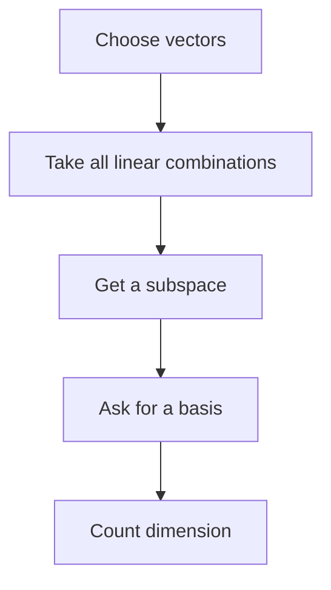
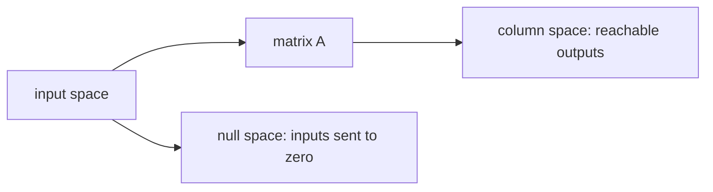

# Chapter 8: Subspaces, Basis, and Rank

## Opening Intuition: The Hidden Shape Inside a Collection of Vectors

Suppose someone hands you a list of vectors and asks:

- What directions can these vectors reach?
- Are some of them redundant?
- What is the smallest set that still captures the whole picture?

These questions lead directly to some of the central ideas of linear algebra:

- **subspace**
- **span**
- **linear independence**
- **basis**
- **dimension**
- **column space**
- **null space**
- **rank**

At first this vocabulary can feel abstract. The key is to remember that each word answers a geometric question.

Think of vectors as building materials.

- The **span** is everything you can build.
- A **subspace** is a space closed under the allowed building operations.
- A **basis** is a minimal toolkit.
- **Rank** tells how many independent directions a matrix really contains.

This chapter gives the language needed to describe the internal structure of matrices.

## Span: All Reachable Combinations

Given vectors \(\mathbf{v}_1,\mathbf{v}_2,\ldots,\mathbf{v}_k\), their **span** is the set of all linear combinations

\[
c_1\mathbf{v}_1+c_2\mathbf{v}_2+\cdots+c_k\mathbf{v}_k.
\]

This answers the question:

**What can we reach using these vectors?**

### Examples

- The span of one nonzero vector in \(\mathbb{R}^2\) is a line through the origin.
- The span of two nonparallel vectors in \(\mathbb{R}^2\) is the whole plane.
- The span of two dependent vectors in \(\mathbb{R}^3\) may still be just a line.

Span is about possibility. It describes the full output of all combinations.

## Subspaces

A **subspace** of a vector space is a set of vectors that is closed under:

- addition,
- scalar multiplication,
- and contains the zero vector.

In plain language, a subspace is a smaller vector world living inside a larger one.

In \(\mathbb{R}^3\), the most common subspaces are:

- the zero space \(\{\mathbf{0}\}\),
- lines through the origin,
- planes through the origin,
- all of \(\mathbb{R}^3\).

Why "through the origin"? Because subspaces must contain \(\mathbf{0}\), and linear combinations always keep you anchored there.

### Not a subspace

A line not passing through the origin is **not** a subspace.

For example, the set of points satisfying \(y=2x+1\) is a line, but not a subspace of \(\mathbb{R}^2\), because it misses the origin and is not closed under scalar multiplication.

## Span Creates Subspaces

The span of any set of vectors is always a subspace.

That is useful because it gives a natural way to produce subspaces:

- start with some vectors,
- take all linear combinations,
- the result is automatically a subspace.

So span is one of the main engines that generates subspaces.

## Linear Independence

A list of vectors is **linearly independent** if none of them can be built from the others.

Formally, vectors \(\mathbf{v}_1,\ldots,\mathbf{v}_k\) are linearly independent if

\[
c_1\mathbf{v}_1+\cdots+c_k\mathbf{v}_k=\mathbf{0}
\]

implies

\[
c_1=c_2=\cdots=c_k=0.
\]

If there is a nontrivial combination that gives zero, then the vectors are **linearly dependent**.

### Intuition

Independent vectors each contribute a genuinely new direction.

Dependent vectors include redundancy.

For example:

- \((1,0)\) and \((0,1)\) are independent.
- \((1,2)\) and \((2,4)\) are dependent because one is a multiple of the other.

## Basis: A Minimal Generating Set

A **basis** for a subspace is a set of vectors that:

- spans the subspace,
- and is linearly independent.

This means a basis is both:

- enough,
- but not too much.

It generates the whole space with no redundancy.

### Examples

- A basis for \(\mathbb{R}^2\) is

  \[
  \left\{
  \begin{bmatrix}
  1\\0
  \end{bmatrix},
  \begin{bmatrix}
  0\\1
  \end{bmatrix}
  \right\}.
  \]

- A basis for the line spanned by \((3,1)\) is just \(\{(3,1)\}\).

- A basis for the plane in \(\mathbb{R}^3\) spanned by \((1,0,0)\) and \((0,1,0)\) is those two vectors.

Different bases can describe the same space. What matters is not the particular basis but the directions it captures.

## Dimension

The **dimension** of a subspace is the number of vectors in any basis for that subspace.

So:

- a line through the origin has dimension 1,
- a plane through the origin has dimension 2,
- \(\mathbb{R}^3\) has dimension 3.

Dimension counts independent directions.

This is one of the cleanest ways to interpret it:

**dimension = number of independent degrees of freedom.**

## Column Space

For a matrix \(A\), the **column space** is the span of its columns.

It is often written as \(\operatorname{Col}(A)\).

If

\[
A=
\begin{bmatrix}
1 & 2 \\
0 & 1 \\
1 & 3
\end{bmatrix},
\]

then the column space is the span of

\[
\begin{bmatrix}
1\\0\\1
\end{bmatrix}
\quad\text{and}\quad
\begin{bmatrix}
2\\1\\3
\end{bmatrix}.
\]

Geometrically, the column space is the set of all vectors you can produce as \(A\mathbf{x}\).

That makes it the **output space** of the matrix transformation.

If the columns span a plane in \(\mathbb{R}^3\), then the matrix can only output vectors on that plane.

## Null Space

The **null space** of a matrix \(A\) is the set of all vectors \(\mathbf{x}\) such that

\[
A\mathbf{x}=\mathbf{0}.
\]

It is often written as \(\operatorname{Null}(A)\).

The null space captures the directions that the matrix destroys.

If a nonzero vector lies in the null space, then the transformation sends that vector to zero. Geometrically, this means some direction gets collapsed completely.

### Example

Let

\[
A=
\begin{bmatrix}
1 & 1 \\
2 & 2
\end{bmatrix}.
\]

Solve

\[
A\mathbf{x}=\mathbf{0}.
\]

This becomes

\[
x_1+x_2=0.
\]

So

\[
\mathbf{x}=
\begin{bmatrix}
t\\-t
\end{bmatrix}
=
t
\begin{bmatrix}
1\\-1
\end{bmatrix}.
\]

The null space is a line through the origin.

That matches the geometry: this matrix collapses the plane onto a line.

## Column Space and Null Space as Two Sides of a Matrix

For a matrix \(A\):

- the **column space** tells what outputs are possible,
- the **null space** tells what inputs disappear.

This is a powerful dual viewpoint.

One space describes reach. The other describes loss.

## Rank

The **rank** of a matrix is the dimension of its column space.

In plain language:

**rank counts how many independent columns the matrix really has.**

If a matrix has four columns but only two of them contribute new directions, then its rank is 2.

Rank is one of the most important summary numbers attached to a matrix.

It tells you how much of the ambient space the matrix can actually access.

## Worked Example: Finding Rank by Row Reduction

Consider

\[
A=
\begin{bmatrix}
1 & 2 & 3 \\
2 & 4 & 6 \\
1 & 1 & 2
\end{bmatrix}.
\]

Row reduce:

\[
\begin{bmatrix}
1 & 2 & 3 \\
2 & 4 & 6 \\
1 & 1 & 2
\end{bmatrix}
\to
\begin{bmatrix}
1 & 2 & 3 \\
0 & 0 & 0 \\
0 & -1 & -1
\end{bmatrix}
\to
\begin{bmatrix}
1 & 2 & 3 \\
0 & 1 & 1 \\
0 & 0 & 0
\end{bmatrix}.
\]

There are two pivot positions, so the rank is 2.

That means:

- the columns span a two-dimensional subspace,
- one column is redundant,
- the matrix cannot reach every vector in \(\mathbb{R}^3\).

## Pivot Columns and a Basis for the Column Space

When row reducing a matrix, the pivot columns tell you which original columns form a basis for the column space.

This is subtle and important:

- use row reduction to **identify** pivot columns,
- but take the basis vectors from the **original matrix**, not the reduced one.

In the previous example, the first and second columns are pivot columns, so a basis for the column space is

\[
\left\{
\begin{bmatrix}
1\\2\\1
\end{bmatrix},
\begin{bmatrix}
2\\4\\1
\end{bmatrix}
\right\}.
\]

## Rank and Solutions of Systems

Rank helps explain whether systems are solvable.

For

\[
A\mathbf{x}=\mathbf{b},
\]

- if \(\mathbf{b}\) lies in the column space of \(A\), the system is consistent,
- if \(\mathbf{b}\) lies outside the column space, the system has no solution.

So the column space determines which right-hand sides are reachable.

The null space determines whether solutions are unique.

- If the null space contains only \(\mathbf{0}\), solutions are unique whenever they exist.
- If the null space contains nonzero vectors, then any solution can be shifted by a null-space vector to get another solution.

That is why the null space controls non-uniqueness.

## Rank-Nullity: A Deep Balance

For an \(m\times n\) matrix \(A\),

\[
\text{rank}(A)+\text{nullity}(A)=n,
\]

where nullity means the dimension of the null space.

This theorem says the input dimension splits into two parts:

- directions that survive and contribute to outputs,
- directions that vanish into the null space.

It is a conservation law for dimension.

### Example

If a matrix has 5 columns and rank 3, then its nullity is 2.

So there are:

- 3 independent output directions,
- 2 independent input directions that get killed.

## Basis as a Coordinate System

A basis does more than generate a space. It also provides a coordinate system.

For example, in \(\mathbb{R}^2\), the standard basis gives ordinary coordinates:

\[
\begin{bmatrix}
x\\y
\end{bmatrix}
=
x
\begin{bmatrix}
1\\0
\end{bmatrix}
+
y
\begin{bmatrix}
0\\1
\end{bmatrix}.
\]

But another basis, such as

\[
\begin{bmatrix}
1\\1
\end{bmatrix},
\quad
\begin{bmatrix}
1\\-1
\end{bmatrix},
\]

provides a different coordinate language for describing the same vectors.

This becomes especially important later when we choose bases that simplify a matrix.

## Worked Example: Column Space and Null Space Together

Take

\[
A=
\begin{bmatrix}
1 & 2 & 3 \\
0 & 1 & 1
\end{bmatrix}.
\]

### Column space

The columns are

\[
\mathbf{c}_1=
\begin{bmatrix}
1\\0
\end{bmatrix},
\quad
\mathbf{c}_2=
\begin{bmatrix}
2\\1
\end{bmatrix},
\quad
\mathbf{c}_3=
\begin{bmatrix}
3\\1
\end{bmatrix}.
\]

The first two are independent, so rank is 2 and the column space is all of \(\mathbb{R}^2\).

### Null space

Solve

\[
\begin{bmatrix}
1 & 2 & 3 \\
0 & 1 & 1
\end{bmatrix}
\begin{bmatrix}
x_1\\x_2\\x_3
\end{bmatrix}
=
\begin{bmatrix}
0\\0
\end{bmatrix}.
\]

From the second row,

\[
x_2=-x_3.
\]

From the first row,

\[
x_1+2(-x_3)+3x_3=0
\quad\Rightarrow\quad
x_1=-x_3.
\]

Let \(x_3=t\). Then

\[
\mathbf{x}=
t
\begin{bmatrix}
-1\\-1\\1
\end{bmatrix}.
\]

So the null space is one-dimensional.

That matches rank-nullity:

- number of columns = 3,
- rank = 2,
- nullity = 1.

## Common Mistakes

### Mistake 1: Confusing span with the set of original vectors

The span is not just the listed vectors. It is all linear combinations of them.

### Mistake 2: Forgetting that subspaces must contain the zero vector

If a set misses \(\mathbf{0}\), it cannot be a subspace.

### Mistake 3: Assuming more vectors means larger dimension

Extra vectors may be redundant. Dimension counts independent directions, not raw quantity.

### Mistake 4: Taking basis vectors for the column space from the reduced matrix

Pivot locations come from row reduction, but the basis vectors must come from the original columns.

### Mistake 5: Thinking the null space lives in the same space as the column space

The column space lives in the output space \(\mathbb{R}^m\). The null space lives in the input space \(\mathbb{R}^n\). They answer different questions.

## A Compact Analogy

Imagine a music mixer with several input sliders and a few output speakers.

- The **column space** is the collection of sounds the speaker setup can produce.
- The **null space** is the set of input combinations that result in silence.
- The **rank** is the number of genuinely distinct sound directions available.
- A **basis** is the minimal set of independent channels you need to describe everything the system can produce.

No analogy is perfect, but this one captures the idea of reach, redundancy, and loss.

## Summary Table

| Term | Main idea |
|---|---|
| span | all reachable linear combinations |
| subspace | a vector space inside a vector space |
| independent | no vector is redundant |
| basis | minimal independent spanning set |
| dimension | number of basis vectors |
| column space | all possible outputs \(A\mathbf{x}\) |
| null space | all inputs sent to zero |
| rank | dimension of the column space |

## Chapter Recap

- The span of a set of vectors is the set of all linear combinations of those vectors.
- A subspace is a set closed under addition and scalar multiplication and containing the zero vector.
- Linear independence means no vector in the set is redundant.
- A basis is an independent spanning set.
- Dimension counts the number of independent directions in a space.
- The column space of a matrix is the span of its columns and describes all reachable outputs.
- The null space consists of inputs that the matrix sends to zero.
- Rank is the dimension of the column space.
- Rank-nullity connects output directions and lost directions in a single theorem.

## Exercises

1. Describe the span of the vector \((2,5)\) in \(\mathbb{R}^2\).

2. Are the vectors \((1,0)\), \((0,1)\), and \((1,1)\) linearly independent in \(\mathbb{R}^2\)? Explain.

3. Give a basis for the plane

   \[
   \left\{
   \begin{bmatrix}
   x\\y\\z
   \end{bmatrix}
   : z=0
   \right\}
   \subset \mathbb{R}^3.
   \]

4. Find the rank of

   \[
   \begin{bmatrix}
   1 & 2 & 3 \\
   2 & 4 & 6
   \end{bmatrix}.
   \]

5. Find a basis for the column space of

   \[
   \begin{bmatrix}
   1 & 0 & 1 \\
   2 & 1 & 3 \\
   0 & 1 & 1
   \end{bmatrix}.
   \]

6. Compute the null space of

   \[
   \begin{bmatrix}
   1 & 1 & 1 \\
   0 & 1 & 1
   \end{bmatrix}.
   \]

7. Explain why the set of points \((x,y)\) satisfying \(y=3x+2\) is not a subspace of \(\mathbb{R}^2\).

8. A matrix has 6 columns and rank 4. What is its nullity?

9. In your own words, explain the difference between the column space and the null space.

10. Why is a basis a better description of a space than a long redundant list of spanning vectors?
