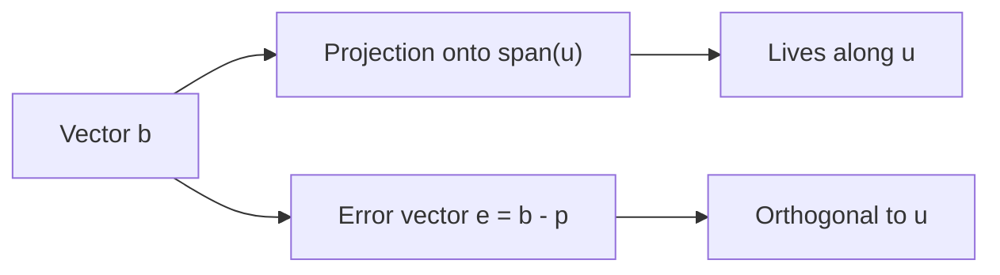
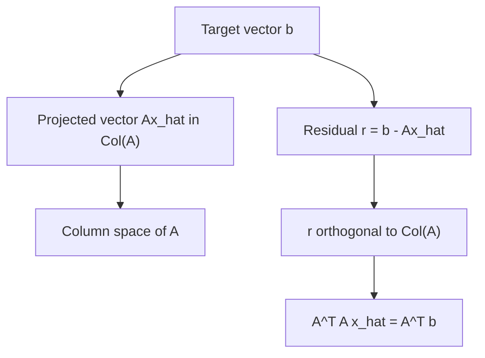

# Chapter 9: Orthogonality and Least Squares

Orthogonality is one of the most useful organizing ideas in linear algebra. It tells us when two directions are independent in the strongest possible geometric sense: they meet at a right angle. Once that idea is in place, a long list of topics suddenly becomes easier to understand. Projections make sense. Coordinates become cleaner. Approximations become more honest. Data fitting becomes a geometric problem instead of an algebraic mess.

This chapter is about that cluster of ideas. We will move from dot products to projections, from orthonormal bases to least squares, and from geometric pictures to practical data fitting.

## Why this chapter matters

Suppose you are trying to explain a point in the plane using a line. The point is not on the line, so you cannot represent it exactly. What is the next best thing?

The answer is: drop a perpendicular.

That one sentence is the entire spirit of least squares. When you cannot solve a problem exactly, you solve it as well as possible by making the error orthogonal to the space you can use.

That is the core pattern:

- exact fit if possible
- best approximation if not
- orthogonality tells you when “best” has been reached

## A first picture

Imagine standing at a point above a road and asking, “Where is the closest point on the road?” You do not walk along the road. You drop straight down to it.

```text
point p
   *
   |\
   | \
   |  \
   |   \
   |    \
   *-----*-------> line L
   foot  along line
```

The shortest path to the line is perpendicular to the line. Linear algebra uses that idea over and over again.

<figure class="book-media">
  <video controls playsinline preload="metadata" src="/media/animations/ch09-least-squares-projection.mp4"></video>
  <figcaption>Play the animation to see a vector drop to its closest point on a line. Least squares is this perpendicular-drop idea in higher dimensions.</figcaption>
</figure>

## The dot product

The dot product of two vectors `u` and `v` in `R^n` is

`u · v = u_1 v_1 + u_2 v_2 + ... + u_n v_n`

For example, if

`u = [2, 1]`

and

`v = [3, -4]`

then

`u · v = 2(3) + 1(-4) = 2`

At first glance, this is just a recipe. But geometrically it is much more important than that.

The dot product measures directional agreement.

- positive dot product: vectors point somewhat in the same direction
- zero dot product: vectors are perpendicular
- negative dot product: vectors point somewhat in opposite directions

The geometric formula is

`u · v = ||u|| ||v|| cos(theta)`

where `theta` is the angle between them.

This formula explains why orthogonality means dot product zero. If `theta = 90°`, then `cos(theta) = 0`.

## Length and norm

The length, or norm, of a vector `v` is

`||v|| = sqrt(v · v)`

For `v = [3, 4]`, we get

`||v|| = sqrt(3^2 + 4^2) = 5`

The dot product is therefore doing two jobs at once:

- it measures angles between vectors
- it produces lengths through `v · v`

## Orthogonal vectors

Two vectors are orthogonal if their dot product is zero.

Examples:

- `[1, 0]` and `[0, 1]`
- `[2, 1]` and `[1, -2]`, since `2(1) + 1(-2) = 0`

Orthogonality is stronger than “different.” Two nonparallel vectors can still overlap directionally. Orthogonal vectors have no directional overlap at all.

That is why they are so useful in decompositions.

## Decomposing a vector into parallel and perpendicular parts

Let `u` be a nonzero vector. Given another vector `b`, we want to split `b` into two pieces:

- one piece parallel to `u`
- one piece orthogonal to `u`

The parallel piece is the projection of `b` onto `u`.

## Projection onto one vector

The projection of `b` onto `u` is

`proj_u(b) = (b · u / u · u) u`

This formula is compact, but it has a very natural meaning:

- `b · u` asks how much of `b` points along `u`
- dividing by `u · u` rescales for the length of `u`
- multiplying by `u` turns that amount into a vector in the `u` direction

### Worked example

Project `b = [4, 1]` onto `u = [1, 2]`.

First compute:

- `b · u = 4(1) + 1(2) = 6`
- `u · u = 1^2 + 2^2 = 5`

So

`proj_u(b) = (6/5)[1, 2] = [6/5, 12/5]`

The error vector is

`b - proj_u(b) = [4, 1] - [6/5, 12/5] = [14/5, -7/5]`

Now check orthogonality:

`[14/5, -7/5] · [1, 2] = 14/5 - 14/5 = 0`

That is the key sign that the projection is correct.

## The projection picture



The projected vector `p` is the best point in the line `span(u)` for approximating `b`.

## Why projection gives the best approximation

Suppose you try to approximate `b` by some vector `cu` on the line spanned by `u`. The error is

`b - cu`

The best choice of `c` is the one that makes this error as short as possible.

At the minimum, the error is orthogonal to the line:

`(b - cu) · u = 0`

Solving this gives

`c = (b · u) / (u · u)`

which is exactly the projection formula.

This is the first instance of an important principle:

> Best approximation happens when the error is orthogonal to the space of allowable approximations.

## Orthogonal and orthonormal sets

A set of vectors is orthogonal if every pair of distinct vectors in the set has dot product zero.

It is orthonormal if:

- the vectors are orthogonal
- each vector has length 1

For example, in `R^2`,

- `[1, 0]` and `[0, 1]` are orthonormal

In `R^3`,

- `[1, 0, 0]`, `[0, 1, 0]`, `[0, 0, 1]` are orthonormal

An orthonormal basis is the nicest possible coordinate system. Angles are easy. Lengths are easy. Coordinates are easy.

## Coordinates in an orthonormal basis

Suppose `{q_1, q_2, ..., q_n}` is an orthonormal basis. Then any vector `b` can be written as

`b = (b · q_1) q_1 + (b · q_2) q_2 + ... + (b · q_n) q_n`

That is a beautiful formula. The coordinates are just dot products.

No solving needed.

This is one reason orthonormal bases are so powerful.

## Orthogonal matrices

A square matrix `Q` is orthogonal if

`Q^T Q = I`

This means its columns form an orthonormal set.

Geometrically, orthogonal matrices preserve:

- lengths
- angles
- dot products

Typical examples include rotations and reflections.

If `Q` is orthogonal, then

`Q^-1 = Q^T`

That is computationally convenient and geometrically meaningful.

## Projection onto a subspace

Now move from a line to a subspace `W`.

Suppose the columns of a matrix `A` span `W`. We want to approximate `b` by some vector `Ax` in that column space.

If `b` is not exactly in the column space, the equation

`Ax = b`

has no exact solution.

So instead we solve:

find `x` that makes `||Ax - b||` as small as possible

This is the least-squares problem.

## Least squares as geometry

The vector `Ax_hat` is the projection of `b` onto the column space of `A`.

The residual

`r = b - Ax_hat`

is orthogonal to the column space of `A`.

That means `r` is orthogonal to every column of `A`.

Written in matrix form:

`A^T r = 0`

Substitute `r = b - Ax_hat`:

`A^T(b - Ax_hat) = 0`

So we get the normal equations:

`A^T A x_hat = A^T b`

These equations do not come from magic. They come from orthogonality.

## The least-squares diagram



## A simple least-squares example

Suppose we want to fit a line `y = c + mx` to the data points:

| x | y |
|---|---|
| 0 | 1 |
| 1 | 2 |
| 2 | 2 |

The equations are

- `c + 0m ≈ 1`
- `c + 1m ≈ 2`
- `c + 2m ≈ 2`

In matrix form:

```text
[1 0] [c]   [1]
[1 1] [m] ≈ [2]
[1 2]       [2]
```

So

`A = [[1,0],[1,1],[1,2]]`

and

`b = [1,2,2]^T`

Now compute:

```text
A^T A = [3 3]
        [3 5]

A^T b = [5]
        [6]
```

So the normal equations are

```text
[3 3][c] = [5]
[3 5][m]   [6]
```

Solving gives:

- `m = 1/2`
- `c = 7/6`

So the best-fit line is

`y = 7/6 + (1/2)x`

This line does not hit every point exactly, but it is the best compromise in the least-squares sense.

## Why the error is squared

You may wonder why we minimize the sum of squared errors instead of just the sum of errors.

There are three reasons:

- positive and negative errors would otherwise cancel
- squaring punishes large errors more strongly
- the geometry becomes elegant and solvable with linear algebra

The quantity minimized is

`||Ax - b||^2`

This is the squared distance from `b` to the column space of `A`.

## An analogy: fitting a shadow

Imagine shining a light onto a wall. A 3D object casts a 2D shadow. The shadow is not the whole object, but it is the closest visible version of it in the wall’s plane.

Projection works the same way:

- the original vector is the object
- the subspace is the wall
- the projection is the shadow

Least squares asks: if I must live inside this subspace, what shadow is closest to the real thing?

## Orthonormal columns and easy least squares

If the columns of `A` are orthonormal, then

`A^T A = I`

The normal equations simplify to

`x_hat = A^T b`

This is one reason QR factorization is so useful: it rewrites least-squares problems in terms of orthonormal columns.

## A quick note on QR factorization

If `A = QR`, where:

- `Q` has orthonormal columns
- `R` is upper triangular

then the least-squares problem becomes easier to solve.

We have

`Ax = b`

as

`QRx = b`

The least-squares solution satisfies

`Rx = Q^T b`

This is numerically better than forming `A^T A` directly in many practical problems.

## The Gram-Schmidt idea

How do we build orthonormal vectors from ordinary independent vectors?

One classical answer is Gram-Schmidt.

Start with vectors `a_1, a_2, ..., a_n`.

1. Keep `a_1`, then normalize it.
2. Remove the part of `a_2` that points along `q_1`, then normalize.
3. Remove from `a_3` the parts along `q_1` and `q_2`, then normalize.
4. Continue.

The result is an orthonormal set spanning the same subspace.

### Visual intuition

```text
a2 -----> split into

parallel to q1     +     perpendicular to q1

keep only the perpendicular part, then normalize
```

Gram-Schmidt is conceptually important because it turns “a useful basis” into “a very convenient basis.”

## Projection matrices

The matrix that projects onto the column space of `A` is

`P = A(A^T A)^-1 A^T`

provided the columns of `A` are linearly independent.

Then:

- `Pb` is the projection of `b` onto `Col(A)`
- `(I - P)b` is the residual

Projection matrices satisfy

- `P^2 = P`
- `P^T = P`

The first identity says projecting twice does nothing new. The second says orthogonal projection is symmetric.

## Common mistakes

### Mistake 1: confusing orthogonal with independent

Orthogonal nonzero vectors are always linearly independent. But independent vectors do not have to be orthogonal.

### Mistake 2: projecting onto a vector without dividing by `u · u`

`(b · u)u` is only correct if `u` is a unit vector. In general you need

`(b · u / u · u)u`

### Mistake 3: forgetting what is orthogonal in least squares

The residual `b - Ax_hat` is orthogonal to the column space of `A`, not necessarily to `Ax_hat` alone as a separate object.

### Mistake 4: thinking least squares means “smallest absolute error at every point”

Least squares minimizes the total squared error, not each individual error separately.

## Concept map

| Idea | Main question | Key formula |
|---|---|---|
| Dot product | How aligned are two vectors? | `u · v` |
| Norm | How long is a vector? | `||v|| = sqrt(v · v)` |
| Orthogonality | Are two directions perpendicular? | `u · v = 0` |
| Projection | What is the closest vector in a line/subspace? | `proj_u(b) = (b·u/u·u)u` |
| Least squares | What is the closest `Ax` to `b`? | `A^T A x = A^T b` |
| Orthonormal basis | How do we get easy coordinates? | coefficients are dot products |

## Recap

Orthogonality is the geometry of zero overlap. It gives us:

- a way to measure angles using the dot product
- a clean formula for projection
- orthonormal bases with simple coordinates
- least-squares solutions when exact solutions do not exist

The deepest idea in the chapter is simple:

> When you cannot hit the target exactly, the best approximation is the one whose error is perpendicular to the space you are allowed to use.

That single principle powers projection, data fitting, and much of numerical linear algebra.

## Exercises

1. Compute the dot product of `[1, 2, 3]` and `[4, -1, 2]`. Are the vectors orthogonal?

2. Find the projection of `[3, 1]` onto `[2, 0]`.

3. Let `u = [1, 1]` and `b = [2, 0]`. Write `b` as the sum of a vector parallel to `u` and a vector orthogonal to `u`.

4. Show that if `q_1` and `q_2` are orthonormal, then the projection of `b` onto `span(q_1, q_2)` is `(b·q_1)q_1 + (b·q_2)q_2`.

5. For the data points `(0,1)`, `(1,3)`, `(2,4)`, set up the least-squares system for fitting a line `y = c + mx`.

6. Explain in words why the residual in a least-squares problem must be orthogonal to the column space.

7. If `Q` is orthogonal, prove that `||Qx|| = ||x||`.

8. Let

```text
A = [1 0]
    [1 1]
    [1 2]
```

and `b = [1,2,2]^T`. Compute `A^T A` and `A^T b`, then solve for the least-squares estimate.

9. Why is an orthonormal basis usually preferable to an arbitrary basis?

10. A friend says, “Least squares always makes every error tiny.” What is wrong with that statement?
