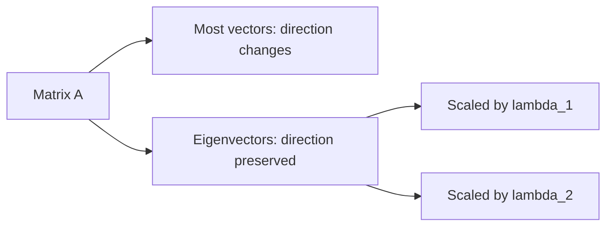

# Chapter 10: Eigenvalues and Eigenvectors

Matrices usually change vectors. They stretch them, rotate them, shear them, reflect them, or mix their coordinates together. Most vectors are bent into new directions.

But sometimes a vector keeps its direction. It may get stretched or flipped, but it does not leave its line.

Those special vectors are eigenvectors. The scale factors attached to them are eigenvalues.

This chapter develops that idea carefully, because it is one of the central ideas in all of linear algebra.

## The core question

Given a square matrix `A`, are there any nonzero vectors `v` such that

`Av = lambda v`

for some scalar `lambda`?

If yes:

- `v` is an eigenvector of `A`
- `lambda` is the corresponding eigenvalue

This equation says: applying `A` to `v` only scales `v`. The direction stays on the same line.

<figure class="book-media">
  <video controls playsinline preload="metadata" src="/media/animations/ch10-eigenvector-directions.mp4"></video>
  <figcaption>The highlighted directions stay on their own lines while the others bend away. Those stable directions are eigenvectors.</figcaption>
</figure>

## The elevator analogy

Imagine a building full of moving walkways that usually shift you sideways as well as forward. Most people step off in a different direction than they entered.

But there are a few special lanes where the motion is perfectly aligned with the lane itself. Step in, and you only move forward or backward along that same lane.

Those lanes are eigenvector directions.

The amount of stretching or reversing is the eigenvalue.

## A first example

Take

```text
A = [3 0]
    [0 2]
```

Then

```text
A[1] = [3]
 [0]   [0]
```

so `[1,0]^T` is an eigenvector with eigenvalue `3`.

Also,

```text
A[0] = [0]
 [1]   [2]
```

so `[0,1]^T` is an eigenvector with eigenvalue `2`.

This matrix stretches the `x` direction by `3` and the `y` direction by `2`.

## What eigenvalues tell us

An eigenvalue can be:

- positive: same direction, stretched or shrunk
- negative: direction flips
- between `0` and `1` in magnitude: shrinking
- larger than `1` in magnitude: growth
- zero: the eigenvector direction collapses to zero

So eigenvalues are not just numbers. They describe the behavior of repeated transformation along certain directions.

## Why eigenvectors are special

Matrices usually mix coordinates. Eigenvectors are the rare directions where the matrix behaves like simple scalar multiplication.

That matters because scalar multiplication is easy to understand.

If you can find enough eigenvectors, a complicated matrix begins to behave like a simpler one in the right coordinate system.

That idea leads directly to diagonalization in the next chapter.

## How to find eigenvalues

Start from

`Av = lambda v`

Move everything to one side:

`Av - lambda v = 0`

Factor out `v`:

`(A - lambda I)v = 0`

For a nonzero solution `v` to exist, the matrix `A - lambda I` must be singular. Therefore,

`det(A - lambda I) = 0`

This equation is called the characteristic equation. Its left side is the characteristic polynomial.

The roots are the eigenvalues.

## Worked example: a `2 x 2` matrix

Let

```text
A = [4 1]
    [2 3]
```

Compute:

```text
A - lambda I = [4-lambda   1       ]
               [2          3-lambda]
```

Its determinant is

`(4 - lambda)(3 - lambda) - 2`

which simplifies to

`lambda^2 - 7lambda + 10`

So the characteristic equation is

`lambda^2 - 7lambda + 10 = 0`

Factoring:

`(lambda - 5)(lambda - 2) = 0`

Thus the eigenvalues are `5` and `2`.

Now find the eigenvectors.

### For `lambda = 5`

Solve

```text
[4-5  1 ] [x] = [0]
[2   3-5] [y]   [0]
```

That is

```text
[-1  1] [x] = [0]
[ 2 -2] [y]   [0]
```

So `x = y`. One eigenvector is

`v_1 = [1, 1]^T`

### For `lambda = 2`

Solve

```text
[2 1] [x] = [0]
[2 1] [y]   [0]
```

So `2x + y = 0`, meaning `y = -2x`. One eigenvector is

`v_2 = [1, -2]^T`

## A geometric picture



Most vectors move into new directions. Eigenvectors sit on invariant lines.

## Distinct eigenvalues give independent eigenvectors

This is one of the most useful facts in the subject:

If a matrix has distinct eigenvalues, then the corresponding eigenvectors are linearly independent.

That means:

- one distinct eigenvalue gives one independent direction
- two distinct eigenvalues give two independent directions
- and so on

This is why matrices with many distinct eigenvalues are often easier to understand.

## Trace and determinant

For a `2 x 2` or `3 x 3` matrix, two quick checks are often helpful:

- the sum of the eigenvalues equals the trace
- the product of the eigenvalues equals the determinant

For the previous example:

```text
trace(A) = 4 + 3 = 7 = 5 + 2
det(A) = 12 - 2 = 10 = 5·2
```

These relationships do not replace the full calculation, but they are excellent consistency checks.

## Repeated eigenvalues

Not every matrix has distinct eigenvalues.

For example,

```text
A = [2 1]
    [0 2]
```

The only eigenvalue is `2`, repeated twice.

Solve `(A - 2I)v = 0`:

```text
[0 1]
[0 0]
```

This forces `y = 0`, so eigenvectors look like `[x,0]^T`.

That means there is only one independent eigenvector direction.

This matters because repeated eigenvalues do not automatically give enough eigenvectors for diagonalization.

## Algebraic and geometric multiplicity

When an eigenvalue is repeated, two counts become important.

- algebraic multiplicity: how many times the eigenvalue appears as a root of the characteristic polynomial
- geometric multiplicity: how many independent eigenvectors it actually has

The geometric multiplicity is always at least `1` and at most the algebraic multiplicity.

When the matrix has enough independent eigenvectors overall, it can be diagonalized.

## Complex eigenvalues

Some real matrices have no real eigenvectors. A rotation matrix is the standard example.

Consider

```text
R = [0 -1]
    [1  0]
```

This rotates vectors by `90°`. No nonzero real vector keeps its line after a `90°` turn, so there are no real eigenvectors.

Yet over the complex numbers, eigenvalues do exist.

This is an important reminder: the eigenvalue story depends on the number system you are working in.

For this book, our main focus stays with real matrices and real geometric intuition, but it is good to know the bigger picture.

## Eigenvectors are directions, not single vectors

If `v` is an eigenvector, then any nonzero scalar multiple of `v` is also an eigenvector for the same eigenvalue.

So it is more accurate to speak of an eigenvector line or eigendirection.

That is why books often say “an eigenvector” while really meaning “any nonzero vector in that eigenspace.”

## Eigenspaces

The set of all eigenvectors for an eigenvalue `lambda`, together with the zero vector, forms a subspace:

`E_lambda = null(A - lambda I)`

This is the eigenspace corresponding to `lambda`.

Thinking in terms of eigenspaces is cleaner than thinking in terms of one chosen eigenvector.

## A useful interpretation: repeated action

Suppose `Av = lambda v`. Then

- `A^2 v = lambda^2 v`
- `A^3 v = lambda^3 v`
- in general, `A^k v = lambda^k v`

This is one of the main reasons eigenvalues are so important. Along an eigenvector direction, repeated matrix multiplication becomes ordinary repeated multiplication by a number.

That turns dynamics into arithmetic.

## Example: growth and decay

Let

```text
A = [1.2 0]
    [0 0.7]
```

Then under repeated application:

- vectors along the first coordinate grow by a factor of `1.2` each step
- vectors along the second coordinate shrink by a factor of `0.7` each step

After many iterations, the growing direction dominates.

This is the beginning of stability analysis.

## The power method intuition

If one eigenvalue has strictly larger magnitude than the others, repeated multiplication by `A` tends to push most vectors toward the dominant eigenvector direction.

That is the idea behind the power method, a simple algorithm for estimating the largest eigenvalue and its eigenvector.

You repeatedly compute

`x_{k+1} = A x_k`

and rescale as needed.

Under good conditions, the vector settles into the dominant eigendirection.

## Symmetric matrices behave especially well

Symmetric matrices are a special class:

`A = A^T`

They have remarkable eigenvalue properties:

- all eigenvalues are real
- eigenvectors from different eigenvalues are orthogonal
- they can be diagonalized by an orthogonal matrix

This makes symmetric matrices much easier to interpret geometrically. We will study them in detail in Chapter 12.

## Common mistakes

### Mistake 1: using the zero vector as an eigenvector

The zero vector satisfies `A0 = lambda 0` for every `lambda`, so it tells us nothing. Eigenvectors must be nonzero.

### Mistake 2: thinking every vector is an eigenvector

Most vectors are not. Eigenvectors are special invariant directions.

### Mistake 3: assuming repeated eigenvalues give repeated independent eigenvectors

They may, but they do not have to. Repeated eigenvalues can come with too few eigenvectors.

### Mistake 4: forgetting that eigenvectors are defined up to scaling

`[1,1]^T` and `[5,5]^T` represent the same eigendirection.

### Mistake 5: expecting every real matrix to have real eigenvectors

Rotation matrices show that this is false.

## Visual summary table

| Object | Meaning |
|---|---|
| `Av = lambda v` | vector keeps its line under `A` |
| eigenvalue `lambda` | stretch, shrink, or flip factor |
| eigenvector `v` | invariant direction |
| `det(A - lambda I)=0` | condition for eigenvalues |
| eigenspace `null(A - lambda I)` | all eigenvectors for one eigenvalue plus zero |

## A worked comparison

Consider these two matrices:

```text
D = [3 0]
    [0 1]

S = [3 1]
    [0 1]
```

Both have eigenvalues `3` and `1`.

But they do not act the same way on arbitrary vectors:

- `D` scales the coordinate axes directly
- `S` mixes coordinates because of the off-diagonal entry

Eigenvalues tell part of the story, not all of it. Eigenvectors and the underlying basis matter too.

## Recap

Eigenvectors are the directions a matrix does not turn away from themselves. Eigenvalues describe how those directions are scaled.

The main ideas of the chapter are:

- the eigenvalue equation `Av = lambda v`
- the characteristic equation `det(A - lambda I)=0`
- eigenspaces as null spaces
- repeated action turning into powers of eigenvalues
- repeated eigenvalues not always giving enough eigenvectors

If a matrix is a machine, eigenvectors are the directions where the machine behaves in the simplest possible way.

That is why they are so important.

## Exercises

1. Show that `[1,0]^T` and `[0,1]^T` are eigenvectors of

```text
[5 0]
[0 2]
```

and identify their eigenvalues.

2. Find the eigenvalues of

```text
[2 1]
[1 2]
```

3. For each eigenvalue in Exercise 2, find an eigenvector.

4. Explain in words what a negative eigenvalue means geometrically.

5. Why does a `90°` rotation matrix have no real eigenvectors?

6. Let

```text
A = [4 1]
    [2 3]
```

Verify that `[1,1]^T` is an eigenvector and find its eigenvalue.

7. If `Av = lambda v`, show that `A^k v = lambda^k v`.

8. A matrix has eigenvalues `4` and `-1`. What are its trace and determinant?

9. A matrix has characteristic polynomial `(lambda - 2)^2`. What are the possible geometric multiplicities of the eigenvalue `2`?

10. In your own words, explain why finding eigenvectors can simplify a matrix problem dramatically.
