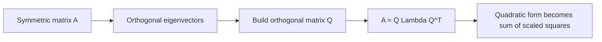

# Chapter 12: Symmetric Matrices and Quadratic Forms

Some matrices behave better than others. Symmetric matrices are among the best.

A matrix is symmetric if

`A = A^T`

That simple condition has deep consequences. Symmetric matrices appear in geometry, optimization, physics, statistics, and machine learning. They describe energy, curvature, covariance, and shape.

This chapter explains why symmetric matrices are so important and how quadratic forms reveal their geometry.

## First intuition: a landscape

Imagine a hilly landscape. At each point, the height tells you how much energy the system has. Move in one direction and the height may increase quickly. Move in another direction and it may increase slowly. In a third direction it may even decrease.

Quadratic forms are algebraic versions of such landscapes.

The matrix behind the quadratic form tells you how space is being curved.

<figure class="book-media">
  
  <figcaption>A quadratic form can be pictured as a landscape: bowls, ridges, and saddle-like regions reveal how the matrix curves space.</figcaption>
</figure>

## Quadratic forms

Given a symmetric matrix `A`, the expression

`q(x) = x^T A x`

is called a quadratic form.

If

```text
x = [x1]
    [x2]
```

and

```text
A = [a b]
    [b c]
```

then

`q(x) = ax_1^2 + 2b x_1 x_2 + c x_2^2`

Notice the square terms and cross term. That is where the name “quadratic” comes from.

## A familiar example

If

```text
A = [1 0]
    [0 1]
```

then

`q(x) = x^T x = x_1^2 + x_2^2`

This is just squared distance from the origin.

Its level curves are circles.

So even the simplest quadratic form already has geometry built into it.

## Symmetry removes ambiguity

Why focus on symmetric matrices?

Because for any matrix `A`,

`x^T A x = x^T ((A + A^T)/2) x`

The skew-symmetric part disappears in a quadratic form.

So every quadratic form is really controlled by a symmetric matrix.

That means symmetry is not a restriction here. It is the natural setting.

## Level curves and level surfaces

To understand `q(x) = x^T A x`, we often look at the sets

`x^T A x = constant`

In two dimensions these are level curves. In three dimensions they are level surfaces.

Depending on `A`, these can be:

- circles
- ellipses
- hyperbolas
- parabolas in certain related settings

Quadratic forms are therefore deeply tied to geometry of conic sections and surfaces.

## Example: ellipse from a diagonal matrix

Let

```text
A = [4 0]
    [0 1]
```

Then

`q(x) = 4x_1^2 + x_2^2`

The level curve `q(x)=1` is

`4x_1^2 + x_2^2 = 1`

That is an ellipse.

Why an ellipse and not a circle? Because the matrix penalizes movement in the `x_1` direction more strongly than movement in the `x_2` direction.

You can think of the matrix as stretching the energy landscape differently in different directions.

## Principal directions

The nicest feature of symmetric matrices is that their important directions are orthogonal eigenvectors.

This means a symmetric matrix comes with a natural set of perpendicular axes, called principal directions.

In those directions, the quadratic form becomes especially simple.

## The spectral theorem

For a real symmetric matrix `A`, there exists an orthogonal matrix `Q` and a diagonal matrix `Lambda` such that

`A = Q Lambda Q^T`

This is the spectral theorem.

It says:

- symmetric matrices are always diagonalizable
- they can be diagonalized with an orthonormal basis
- all eigenvalues are real

That is a remarkably strong result.

## Why the spectral theorem matters

If `x = Qy`, then

`x^T A x = y^T Lambda y`

because

`x^T A x = (Qy)^T (Q Lambda Q^T) (Qy) = y^T Lambda y`

Since `Lambda` is diagonal, the quadratic form becomes

`lambda_1 y_1^2 + lambda_2 y_2^2 + ... + lambda_n y_n^2`

In the right orthonormal coordinates, there are no cross terms.

That is the geometric meaning of the spectral theorem: rotate to the principal axes, and the landscape becomes aligned.

## Visual summary



## Example with cross terms

Take

```text
A = [2 1]
    [1 2]
```

Then

`q(x) = 2x_1^2 + 2x_1x_2 + 2x_2^2`

The cross term `2x_1x_2` means the natural axes of the quadratic form are tilted relative to the standard coordinate axes.

Find the eigenvalues:

`det(A - lambda I) = (2-lambda)^2 - 1`

So the eigenvalues are `3` and `1`.

The corresponding eigenvectors are:

- for `3`: `[1,1]^T`
- for `1`: `[1,-1]^T`

These are orthogonal, as promised.

If we rotate coordinates to those directions, the quadratic form becomes

`3y_1^2 + y_2^2`

Now the geometry is clear: the level curves are ellipses aligned with the eigenvector directions.

## Positive definite, negative definite, indefinite

Quadratic forms are often classified by sign.

### Positive definite

`x^T A x > 0` for all nonzero `x`

This means the landscape is bowl-shaped. The origin is a strict minimum.

### Negative definite

`x^T A x < 0` for all nonzero `x`

This is an upside-down bowl. The origin is a strict maximum.

### Indefinite

The form is positive for some nonzero vectors and negative for others.

This is saddle behavior.

### Semidefinite

The form is never negative or never positive, but can be zero for nonzero vectors.

## Eigenvalues and definiteness

For symmetric matrices, definiteness can be read from the eigenvalues:

- all eigenvalues positive: positive definite
- all eigenvalues negative: negative definite
- mixed signs: indefinite
- zeros allowed with the rest nonnegative or nonpositive: semidefinite

This is one of the cleanest examples of eigenvalues controlling geometry.

## A saddle example

Let

```text
A = [1 0]
    [0 -1]
```

Then

`q(x) = x_1^2 - x_2^2`

Along the `x_1` axis this is positive. Along the `x_2` axis it is negative.

The level curves are hyperbolas.

This is the algebraic signature of a saddle.

## Connection to optimization

Quadratic forms are central in optimization because they describe curvature.

Near a critical point of a smooth function, the second-order behavior is captured by a symmetric matrix called the Hessian.

Very roughly:

- positive definite Hessian: local minimum
- negative definite Hessian: local maximum
- indefinite Hessian: saddle point

So symmetric matrices help classify how functions bend.

## Connection to energy

In physics and engineering, many energies look like quadratic forms.

Examples:

- elastic energy in a spring system
- kinetic energy in suitable coordinates
- electrical energy in certain circuit models

The matrix tells you how expensive different directions of motion are.

## Covariance matrices

In statistics, covariance matrices are symmetric. They describe how data varies across coordinates.

The diagonal entries measure variance of each variable.

The off-diagonal entries measure how pairs of variables vary together.

Because covariance matrices are symmetric, their orthogonal eigenvectors define principal directions of variation. This is one reason eigenanalysis matters in data science.

## Orthogonal diagonalization

For symmetric `A`, the decomposition

`A = Q Lambda Q^T`

is better than ordinary diagonalization `A = P D P^-1`.

Why?

- `Q^-1 = Q^T`, so computations are cleaner
- orthogonal changes of basis preserve lengths and angles
- the geometry is more transparent

This is one of the recurring themes of linear algebra: orthonormal coordinates are not just prettier. They are structurally better.

## Completing the square versus diagonalizing

In basic algebra, you may have simplified quadratic expressions by completing the square.

Orthogonal diagonalization is a higher-dimensional version of the same instinct:

- remove cross terms
- reveal the true axes
- make the geometry visible

The language is more linear-algebraic, but the goal is the same.

## Common mistakes

### Mistake 1: assuming any diagonalizable matrix behaves like a symmetric matrix

Symmetric matrices are special because their eigenvectors can be chosen orthonormal.

### Mistake 2: judging definiteness from diagonal entries alone

Large or positive diagonal entries do not guarantee positive definiteness. The interaction terms matter.

### Mistake 3: forgetting that quadratic forms care about the symmetric part

For `x^T A x`, only the symmetric part of `A` matters.

### Mistake 4: confusing ellipse directions with standard axes

If cross terms are present, the principal axes are usually rotated relative to the coordinate axes.

## A compact decision table

| Eigenvalues of symmetric `A` | Geometry of `x^T A x` |
|---|---|
| all positive | bowl, minimum, ellipses/ellipsoids |
| all negative | upside-down bowl, maximum |
| mixed signs | saddle, hyperbolic behavior |
| some zero, rest nonnegative | flat directions plus bowl |

## A concrete orthogonal change of coordinates

For

```text
A = [2 1]
    [1 2]
```

an orthonormal eigenbasis is

```text
q1 = (1/sqrt(2))[ 1]
                [ 1]

q2 = (1/sqrt(2))[ 1]
                [-1]
```

If `Q = [q_1 q_2]`, then

`Q^T A Q = diag(3,1)`

That means the change of coordinates given by `Q` rotates the plane into the principal-axis frame.

## Recap

Symmetric matrices are special because they connect algebra and geometry in a particularly clean way.

The main ideas are:

- quadratic forms `x^T A x`
- level curves and energy landscapes
- orthogonal diagonalization `A = Q Lambda Q^T`
- principal axes given by orthogonal eigenvectors
- definiteness determined by eigenvalue signs

If you remember one sentence from this chapter, let it be this:

> A symmetric matrix describes a landscape whose true axes are its orthogonal eigenvectors.

Once those axes are found, the geometry becomes clear.

## Exercises

1. Write out the quadratic form for

```text
A = [3 2]
    [2 1]
```

2. What is the quadratic form for the identity matrix in `R^3`?

3. Show that

```text
A = [2 1]
    [1 2]
```

is symmetric and find its eigenvalues.

4. Why do symmetric matrices always have real eigenvalues?

5. Classify the form `x_1^2 + x_2^2` as positive definite, negative definite, or indefinite.

6. Classify the form `x_1^2 - x_2^2`.

7. Explain in words what cross terms such as `2x_1x_2` mean geometrically.

8. A symmetric matrix has eigenvalues `4`, `1`, and `0`. What can you say about definiteness?

9. A symmetric matrix has eigenvalues `3`, `-2`, and `-5`. What geometric behavior do you expect near the origin for `x^T A x`?

10. In your own words, explain why orthogonal diagonalization is more informative than ordinary diagonalization for symmetric matrices.
