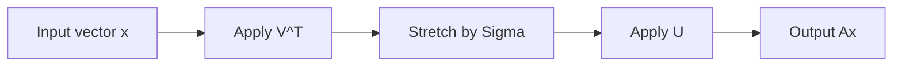

# Chapter 13: Singular Value Decomposition

Some matrices are square. Some are rectangular. Some are invertible. Some are not. Some have a full set of eigenvectors. Some do not.

Singular value decomposition, or SVD, is remarkable because it works for every matrix.

That alone would make it important. But it is even better than that: it provides one of the clearest geometric pictures in all of linear algebra.

It says that any linear transformation can be understood as:

1. rotate or reflect
2. stretch along perpendicular directions
3. rotate or reflect again

This chapter explains that idea carefully and shows why SVD is so useful in data, compression, and approximation.

## The headline statement

For any `m x n` matrix `A`, there exist matrices

`A = U Sigma V^T`

where:

- `U` is an `m x m` orthogonal matrix
- `V` is an `n x n` orthogonal matrix
- `Sigma` is an `m x n` diagonal-like matrix with nonnegative numbers on the main diagonal

Those nonnegative numbers are the singular values of `A`.

This works for every real matrix.

## Why SVD is needed

Eigenvalues are powerful, but they have limitations:

- they are defined only for square matrices
- some matrices do not have enough eigenvectors
- eigenvectors may be complex even when the matrix is real

SVD avoids those problems.

It applies to rectangular matrices and always produces orthonormal directions.

## The geometry in one sentence

SVD says a matrix acts like:

`input rotation/reflection -> axis-by-axis stretching -> output rotation/reflection`

That is a much more universal picture than diagonalization.

## A visual pipeline



This is the basic mental model to keep.

## What `V` does

The columns of `V` give orthonormal input directions.

These are the directions in the domain that the matrix treats in a specially clean way.

If `v_i` is a right singular vector, then

`A v_i = sigma_i u_i`

where `u_i` is the corresponding left singular vector and `sigma_i` is the singular value.

So each special input direction maps to a special output direction, scaled by a nonnegative amount.

## What `U` does

The columns of `U` are orthonormal output directions.

After `A` acts on the right singular vectors, the results line up exactly with these left singular vectors.

That is what makes the decomposition so geometrically clean.

## What `Sigma` does

`Sigma` stores the singular values:

`sigma_1 >= sigma_2 >= ... >= 0`

These numbers tell you how much the matrix stretches along the special input directions.

Large singular values correspond to important, highly amplified directions.

Small singular values correspond to directions that are nearly flattened.

Zero singular values correspond to directions sent all the way to zero.

## From circle to ellipse

One of the best ways to picture a matrix in `R^2` is to see what it does to the unit circle.

- A rotation keeps the circle a circle.
- A diagonal stretch turns the circle into an axis-aligned ellipse.
- A general matrix turns the circle into a tilted ellipse.

SVD explains that tilted ellipse:

- `V^T` rotates the circle to the right orientation
- `Sigma` stretches it along perpendicular axes
- `U` rotates the result to its final position

The singular values are the semiaxis lengths of that ellipse.

## A text illustration

```text
unit circle
   -> rotate
   -> stretch to ellipse with axis lengths sigma1, sigma2
   -> rotate again
```

This picture generalizes to higher dimensions as ellipsoids.

## Where singular values come from

The singular values are the square roots of the eigenvalues of `A^T A`.

Why?

Because `A^T A` is symmetric and positive semidefinite. That means it has:

- real eigenvalues
- orthonormal eigenvectors
- nonnegative eigenvalues

If

`A^T A v_i = lambda_i v_i`

with `lambda_i >= 0`, then

`sigma_i = sqrt(lambda_i)`

These `v_i` become the right singular vectors.

Then define

`u_i = (1/sigma_i) A v_i`

for `sigma_i > 0`.

This builds the left singular vectors.

## Why `A^T A` is helpful

Even if `A` itself is not symmetric, the matrix `A^T A` always is.

So SVD uses the well-behaved geometry of symmetric matrices to understand arbitrary matrices.

This is a recurring pattern in linear algebra: when the original object is messy, construct a related symmetric object and study that.

## A small example

Take

```text
A = [3 0]
    [0 1]
```

Then

```text
A^T A = [9 0]
        [0 1]
```

The eigenvalues are `9` and `1`, so the singular values are `3` and `1`.

Here the SVD is almost obvious:

- `U = I`
- `V = I`
- `Sigma = diag(3,1)`

This is a pure axis-aligned stretch.

## A more interesting interpretation

Suppose a matrix maps a cloud of data points into a flattened, tilted cloud.

SVD identifies:

- the main input directions that matter
- how strongly each one is stretched
- the output directions they become

This is why SVD appears in:

- dimensionality reduction
- image compression
- recommendation systems
- latent semantic analysis
- noise filtering

## Rank and singular values

The rank of `A` equals the number of nonzero singular values.

This is a beautiful fact because it connects geometry and algebra:

- nonzero singular values measure genuine stretching directions
- zero singular values correspond to directions in the null space

So rank is the number of directions that survive the transformation.

## Best low-rank approximation

One of the crown jewels of SVD is the best low-rank approximation theorem.

If you keep only the largest `k` singular values and their corresponding singular vectors, you get the best rank-`k` approximation to `A` in both the spectral norm and Frobenius norm.

That is a deep statement with an intuitive meaning:

> To compress a matrix while preserving as much structure as possible, keep the strongest singular directions.

## The rank-1 picture

The SVD can be written as

`A = sigma_1 u_1 v_1^T + sigma_2 u_2 v_2^T + ...`

Each term `sigma_i u_i v_i^T` is a rank-1 matrix.

So SVD decomposes a matrix into simple rank-1 layers.

This is extremely useful conceptually.

Each layer says:

- look in direction `v_i`
- measure how much of the input lies there
- send it along direction `u_i`
- scale by `sigma_i`

## Image compression intuition

An image can be stored as a matrix of pixel intensities.

If the image has a lot of structure, most of its meaningful content is captured by a relatively small number of singular values.

So instead of storing every entry directly, you store:

- the top singular values
- the corresponding left singular vectors
- the corresponding right singular vectors

This gives a compressed approximation.

Fine detail and noise often live in the smaller singular values, so dropping them can still preserve the main visual content.

## Data science intuition

Suppose rows are users and columns are movies, or rows are documents and columns are words.

The matrix may be huge, sparse, and noisy.

SVD looks for dominant patterns:

- which combinations of columns matter most
- which combinations of rows align with them
- how many significant directions the data really has

This turns raw matrices into interpretable latent structure.

## Connection to PCA

Principal component analysis is closely related to SVD.

If you center a data matrix and compute its SVD, the right singular vectors identify principal directions of variation, and the singular values measure how much variation lies along those directions.

So SVD is one of the engines behind PCA.

## Pseudoinverse

SVD also helps solve systems that are not square or not invertible.

If

`A = U Sigma V^T`

then the Moore-Penrose pseudoinverse is

`A^+ = V Sigma^+ U^T`

where `Sigma^+` replaces each nonzero singular value `sigma_i` by `1/sigma_i`.

This gives a principled way to solve least-squares problems and minimum-norm problems.

## Conditioning

The size ratio

`sigma_max / sigma_min`

for nonzero singular values tells you how sensitive a problem may be.

If one singular value is huge and another is tiny, the transformation stretches some directions strongly and nearly crushes others. That can make inversion unstable.

So singular values are not just geometric descriptors. They are numerical warning signs.

## Common mistakes

### Mistake 1: confusing singular values with eigenvalues

They are related, but not the same.

- eigenvalues can be negative or complex
- singular values are always nonnegative real numbers

### Mistake 2: assuming SVD requires a square matrix

It does not. That is one of its biggest strengths.

### Mistake 3: forgetting that singular vectors come in two families

Right singular vectors live in the input space. Left singular vectors live in the output space.

### Mistake 4: thinking small singular values are irrelevant in every setting

In compression they may be safely dropped, but in scientific applications they can encode important fine structure or signal sensitivity.

## Comparison with eigen-decomposition

| Feature | Eigen-decomposition | SVD |
|---|---|---|
| requires square matrix | yes | no |
| always exists over reals | no | yes |
| orthonormal directions guaranteed | not always | yes |
| geometric interpretation | invariant directions | rotate-stretch-rotate |

## A compact workflow

To understand `A` through SVD:

1. Form `A^T A`.
2. Find its orthonormal eigenvectors and eigenvalues.
3. Take square roots of the eigenvalues to get singular values.
4. Use the eigenvectors as columns of `V`.
5. Compute the corresponding `u_i = Av_i / sigma_i`.
6. Assemble `U Sigma V^T`.

In real applications, software computes SVD numerically. But the conceptual workflow matters.

## A final analogy: music mixing

Imagine a song made from many overlapping sounds. SVD is like separating the track into dominant modes.

- one mode carries the strongest structure
- another adds detail
- another adds subtle texture
- the weakest modes may be mostly noise

Keeping only the loudest, clearest modes gives a compressed but recognizable version of the song.

That is what truncated SVD does for matrices.

## Recap

SVD is one of the most universal tools in linear algebra.

It says any matrix can be written as

`A = U Sigma V^T`

with orthogonal matrices on the outside and nonnegative stretching in the middle.

Its main ideas are:

- every matrix can be understood through orthonormal input and output directions
- singular values measure stretching strength
- rank equals the number of nonzero singular values
- keeping only the largest singular values gives the best low-rank approximation
- SVD underlies compression, PCA, least squares, and numerical stability analysis

If eigen-decomposition is the special story for square matrices with nice invariant directions, SVD is the general story for all matrices.

## Exercises

1. In your own words, explain the phrase “rotate, stretch, rotate.”

2. Why are singular values always nonnegative?

3. Compute `A^T A` for

```text
A = [2 0]
    [0 1]
```

and identify the singular values.

4. What does a zero singular value tell you about a matrix?

5. Why does SVD apply to rectangular matrices even though eigen-decomposition does not?

6. Explain how SVD turns the unit circle into an ellipse.

7. A matrix has singular values `10`, `2`, and `0.1`. Which directions dominate? Which directions are fragile?

8. What is the rank of a matrix with singular values `5`, `3`, `0`, `0`?

9. Why is truncated SVD useful for image compression?

10. Explain the difference between left singular vectors and right singular vectors.
