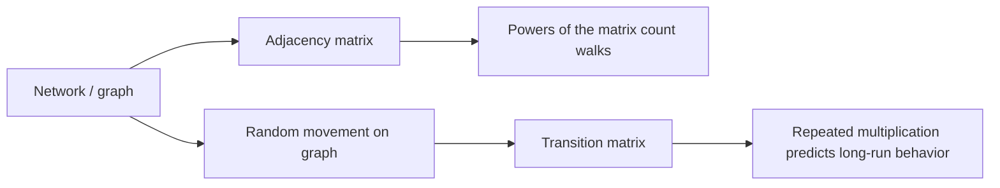
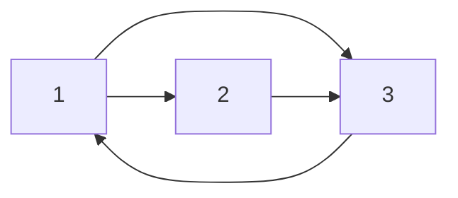
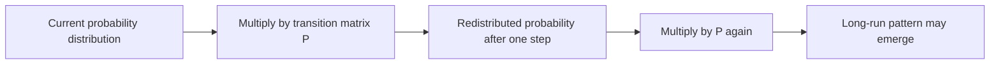

# Chapter 14: Matrices in Networks and Markov Chains

## Opening Intuition: A City Seen from Above

Imagine looking at a city subway map from high above. You do not care about the exact shape of every train car. You care about **connections**:

- Which station links to which?
- How many ways can you get from one neighborhood to another?
- If a rider keeps randomly choosing trains, where are they likely to end up most often?

Matrices are a natural language for these questions. In earlier chapters, matrices acted like machines that stretch space or solve systems. In this chapter, a matrix becomes something slightly different: a compact way to describe a **network** or a **flow of probabilities**.

This is one of the reasons matrices are so powerful. The same object can describe geometry, equations, and movement on graphs.

## The Big Idea

There are two closely related stories in this chapter:

1. **Network matrices** describe who is connected to whom.
2. **Transition matrices** describe how a state changes from one step to the next.

The first story is about structure. The second is about motion.

## 14.1 Graphs and Adjacency Matrices

A **graph** is a set of nodes with links between them. The nodes might be:

- people in a social network,
- web pages on the internet,
- cities connected by flights,
- computers connected by cables,
- molecules linked by chemical bonds.

If a graph has nodes \(1,2,\dots,n\), we can encode it with an **adjacency matrix** \(A\).

For a simple directed graph,

\[
A_{ij} =
\begin{cases}
1 & \text{if there is an edge from node } i \text{ to node } j, \\
0 & \text{otherwise.}
\end{cases}
\]

### Example: A Tiny Web

Suppose page 1 links to pages 2 and 3, page 2 links to page 3, and page 3 links back to page 1.

\[
A=
\begin{bmatrix}
0 & 1 & 1 \\
0 & 0 & 1 \\
1 & 0 & 0
\end{bmatrix}
\]

Read row by row:

- row 1 says node 1 points to nodes 2 and 3,
- row 2 says node 2 points to node 3,
- row 3 says node 3 points to node 1.

That is one of the nicest things about matrices: **a picture becomes a table, and the table can now be calculated with**.

### Visual Picture

## 14.2 What Matrix Powers Mean in a Network

The matrix \(A\) tells us about one-step connections. But what about two-step or three-step journeys?

This is where matrix multiplication becomes surprisingly concrete.

For an adjacency matrix,

- \(A_{ij}\) tells whether there is a 1-step walk from \(i\) to \(j\),
- \((A^2)_{ij}\) counts the number of 2-step walks from \(i\) to \(j\),
- \((A^k)_{ij}\) counts the number of \(k\)-step walks from \(i\) to \(j\).

That is not a coincidence. It comes directly from the definition of matrix multiplication.

\[
(A^2)_{ij} = \sum_{k=1}^n A_{ik}A_{kj}
\]

Each intermediate node \(k\) is a possible “stop in the middle.”

### Worked Example

Take

\[
A=
\begin{bmatrix}
0 & 1 & 1 \\
0 & 0 & 1 \\
1 & 0 & 0
\end{bmatrix}
\]

Then

\[
A^2=
\begin{bmatrix}
1 & 0 & 1 \\
1 & 0 & 0 \\
0 & 1 & 1
\end{bmatrix}
\]

The entry \((A^2)_{11}=1\) says there is exactly one 2-step walk from node 1 back to node 1:

\[
1 \to 3 \to 1
\]

The entry \((A^2)_{13}=1\) says there is exactly one 2-step walk from node 1 to node 3:

\[
1 \to 2 \to 3
\]

So a power of a matrix is not an abstract ritual. It is a walk counter.

## 14.3 Weighted Networks

Not all links are equally strong. A road may be long or short. A friendship may be weak or strong. A trade route may carry many goods or few.

Then we use a **weighted adjacency matrix**:

\[
A_{ij} = \text{weight from node } i \text{ to node } j
\]

Examples of weights:

- distance,
- cost,
- capacity,
- similarity,
- traffic volume.

In a weighted network, matrix multiplication still combines local information into global information, though the interpretation depends on what the weights mean.

If the weights represent direct influence, then \(A^2\) often measures influence through one intermediate node. If they represent connection strength, higher powers often describe multi-step influence spreading through the network.

## 14.4 Degree Matrices and Graph Structure

For an undirected graph, each node has a **degree**: the number of edges touching it.

We collect degrees into a diagonal matrix:

\[
D=
\begin{bmatrix}
d_1 & 0 & \cdots & 0 \\
0 & d_2 & \cdots & 0 \\
\vdots & \vdots & \ddots & \vdots \\
0 & 0 & \cdots & d_n
\end{bmatrix}
\]

The pair \(A\) and \(D\) gives a surprising amount of structural information.

For example:

- nodes with large degree are highly connected,
- disconnected components show up as block structure after reordering,
- special matrices like the **graph Laplacian** \(L=D-A\) capture diffusion and flow on networks.

You do not need the full theory here yet. The main idea is that matrices let us move from “who is connected?” to “how does something spread?”

## 14.5 From Networks to Random Walks

Now suppose we do not just have a graph. We have a traveler who moves randomly on it.

At each step, the traveler chooses a next node according to certain probabilities. That leads to a **Markov chain**.

A Markov chain is a process where the next state depends only on the current state, not on the whole past history.

This “memoryless” idea sounds restrictive, but it models many useful systems:

- weather states,
- customer behavior,
- board games,
- web surfing,
- queues,
- genetic models,
- population movement.

## 14.6 Transition Matrices

A **transition matrix** \(P\) stores step-by-step probabilities.

Using the row-stochastic convention,

\[
P_{ij} = \Pr(\text{next state is } j \mid \text{current state is } i)
\]

Each row must sum to 1, because from any current state, the probabilities of all next states must add up to certainty.

### Example: Weather Model

Suppose the weather each day is either Sunny (S), Cloudy (C), or Rainy (R). Let

\[
P=
\begin{bmatrix}
0.7 & 0.2 & 0.1 \\
0.3 & 0.4 & 0.3 \\
0.2 & 0.5 & 0.3
\end{bmatrix}
\]

Interpretation:

- if today is Sunny, tomorrow is Sunny with probability 0.7,
- if today is Cloudy, tomorrow is Rainy with probability 0.3,
- if today is Rainy, tomorrow is Cloudy with probability 0.5.

### State Vectors

We represent the current distribution over states by a row vector

\[
\pi =
\begin{bmatrix}
\pi_S & \pi_C & \pi_R
\end{bmatrix}
\]

where the entries are nonnegative and sum to 1.

Then one step of evolution is

\[
\pi_{\text{next}} = \pi P
\]

and after \(k\) steps,

\[
\pi_k = \pi_0 P^k
\]

Again, matrix powers mean repeated action. Only the interpretation has changed.

## 14.7 A Visual Way to Think About Markov Chains

Think of probability as water being poured through a system of pipes.

- The current state vector tells you where the water is now.
- The transition matrix tells you what fraction flows along each outgoing pipe.
- Repeated multiplication shows how the water redistributes.

That is a powerful mental model. You are not tracking one individual object anymore. You are tracking a whole cloud of uncertainty.

## 14.8 Steady States

Some Markov chains settle toward a stable long-run distribution. This is called a **steady state** or **stationary distribution**.

It is a probability vector \(\pi^\*\) satisfying

\[
\pi^\* P = \pi^\*
\]

This equation means:

after one more step, the distribution stays the same.

That does **not** mean individuals stop moving. It means the *overall proportions* stop changing.

### Analogy

Imagine commuters constantly moving through a transit system. Every minute, people enter and leave each station. Yet after enough time, the fraction of commuters at each station may settle into a stable pattern. Movement continues, but the large-scale picture becomes steady.

### Why This Looks Like an Eigenvector

The equation

\[
\pi^\* P = \pi^\*
\]

says \(\pi^\*\) is a left eigenvector of \(P\) with eigenvalue 1.

This connects Markov chains to the eigenvalue ideas from earlier and later chapters:

- repeated multiplication,
- dominant long-run modes,
- stability.

## 14.9 Worked Steady-State Example

Consider the two-state chain

\[
P=
\begin{bmatrix}
0.9 & 0.1 \\
0.4 & 0.6
\end{bmatrix}
\]

Let the steady state be

\[
\pi^\*=
\begin{bmatrix}
a & b
\end{bmatrix}
\]

with \(a+b=1\). Solve

\[
\begin{bmatrix}
a & b
\end{bmatrix}
\begin{bmatrix}
0.9 & 0.1 \\
0.4 & 0.6
\end{bmatrix}
=
\begin{bmatrix}
a & b
\end{bmatrix}
\]

This gives

\[
0.9a+0.4b=a
\]

so

\[
0.4b=0.1a \quad \Rightarrow \quad a=4b
\]

Using \(a+b=1\),

\[
4b+b=1 \Rightarrow b=\frac15,\quad a=\frac45
\]

So

\[
\pi^\*=
\begin{bmatrix}
0.8 & 0.2
\end{bmatrix}
\]

In the long run, the system spends about 80% of the time in state 1 and 20% in state 2.

## 14.10 When Long-Run Behavior Exists Nicely

Not every Markov chain behaves perfectly. Some can cycle forever, or split into disconnected pieces. But many practical chains behave well if they are:

- **irreducible**: every state can eventually reach every other state,
- **aperiodic**: the chain does not get trapped in strict repeating rhythms.

When these conditions hold, repeated powers \(P^k\) tend to smooth things out, and the system approaches a unique stationary distribution.

The deeper theorem matters less than the intuition:

> enough mixing tends to erase the memory of where you started.

## 14.11 PageRank Intuition

One famous application of Markov chains is the basic idea behind **PageRank**.

Think of a web surfer:

- from a page, they click one of its outgoing links,
- sometimes they jump to a random page instead.

This creates a transition matrix. Pages that receive many important incoming links tend to collect more long-run probability mass.

So “importance” emerges from the stationary distribution of a carefully designed Markov chain.

This is a beautiful example of matrix thinking:

- a web becomes a graph,
- a graph becomes a matrix,
- a matrix becomes a dynamical system,
- an eigenvector becomes a ranking.

## 14.12 Networks, Diffusion, and Influence

Beyond web search, similar matrix ideas appear in:

- rumor spreading,
- epidemic models,
- recommendation systems,
- traffic flow,
- electrical networks,
- social influence models.

If you can describe local interactions, there is a good chance a matrix can describe the whole system.

That is a recurring theme across applied mathematics:

small rules + repeated action = rich large-scale behavior.

## Common Mistakes

### Confusing adjacency matrices with transition matrices

An adjacency matrix usually contains 0s and 1s or weights. A transition matrix contains probabilities, so rows (or columns, depending on convention) sum to 1.

### Forgetting the convention

Some books use column vectors and write

\[
x_{k+1}=Px_k
\]

Others use row vectors and write

\[
\pi_{k+1}=\pi_k P
\]

Both are fine if used consistently.

### Thinking a steady state means “nothing moves”

A steady state is a stable overall distribution, not frozen individual behavior.

### Ignoring disconnected structure

If a graph has disconnected parts, long-run behavior can depend heavily on where you start.

## Chapter Recap

- An **adjacency matrix** encodes which nodes are connected.
- Powers of an adjacency matrix count multi-step walks.
- A **weighted network** uses numbers other than 0 and 1 to describe strength, cost, or capacity.
- A **Markov chain** models random step-by-step movement between states.
- A **transition matrix** stores those probabilities.
- Repeated multiplication by the transition matrix predicts future distributions.
- A **stationary distribution** satisfies \(\pi^\*P=\pi^\*\).
- Long-run behavior often connects directly to eigenvectors with eigenvalue 1.

## Exercises

1. A graph has adjacency matrix

\[
\begin{bmatrix}
0 & 1 & 0 \\
1 & 0 & 1 \\
1 & 0 & 0
\end{bmatrix}
\]

List all directed edges and compute \((A^2)_{13}\). Interpret the result in words.

2. Build the adjacency matrix for a four-node cycle \(1\to2\to3\to4\to1\). What does \(A^4\) tell you about returning to the starting node?

3. A Markov chain has transition matrix

\[
\begin{bmatrix}
0.6 & 0.4 \\
0.2 & 0.8
\end{bmatrix}
\]

If the initial distribution is \([1\ \ 0]\), compute the distribution after one step and after two steps.

4. Find the stationary distribution of the matrix in Exercise 3.

5. Explain in your own words why \(P^k\) matters in a Markov chain.

6. A website graph has one page with no outgoing links. Why might that create trouble for a naive transition matrix?

## Looking Ahead

In the next chapter, matrices will appear in a different modern role: data tables, images, and machine learning models. Networks are one face of matrix thinking. Data is another.
