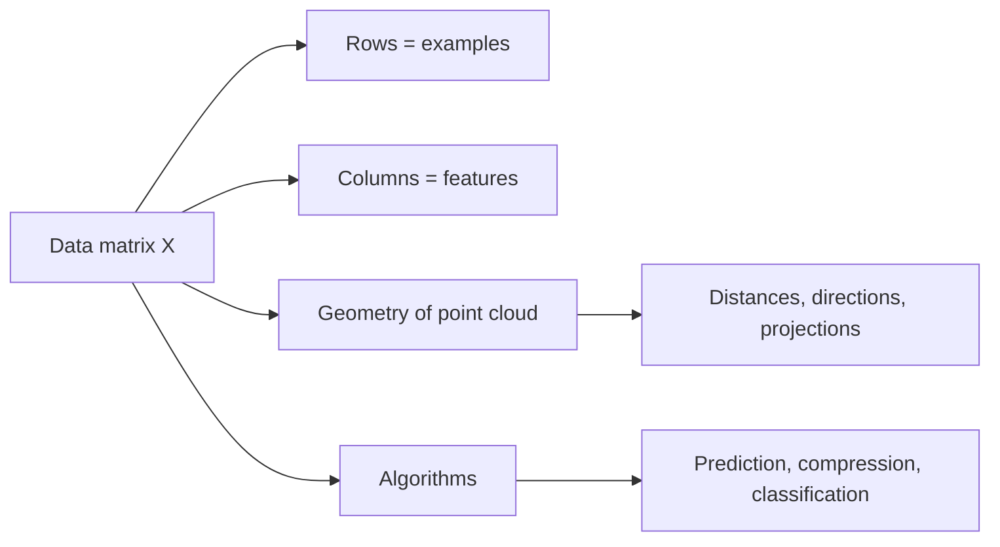
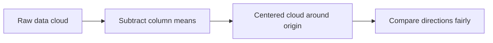

# Chapter 15: Matrices in Data, Images, and Machine Learning

## Opening Intuition: A Spreadsheet with Hidden Geometry

Suppose you open a spreadsheet with 10,000 rows and 30 columns.

- Each row is a customer.
- Each column is a feature: age, income, purchases, location score, and so on.

At first glance, it looks like a plain table. But to a linear algebraist, it is much more:

- a cloud of points in space,
- a machine for making predictions,
- a compressed representation of patterns,
- raw material for learning algorithms.

This chapter is about one of the central facts of modern applied mathematics:

> a huge amount of data work is really matrix work.

## The Big Idea

When we organize data into a matrix, linear algebra gives us tools to:

- summarize patterns,
- compare examples,
- fit models,
- reduce dimension,
- denoise signals,
- process images,
- build machine learning systems.



## 15.1 The Data Matrix

The most common setup is a matrix \(X\) whose rows are observations and whose columns are features:

\[
X =
\begin{bmatrix}
\text{--- row 1 ---} \\
\text{--- row 2 ---} \\
\vdots \\
\text{--- row m ---}
\end{bmatrix}
\]

If \(X\) has shape \(m\times n\), then:

- \(m\) = number of examples,
- \(n\) = number of measured variables.

### Example

Suppose we record three houses using four features:

| House | Size (m²) | Bedrooms | Age | Price |
| --- | ---: | ---: | ---: | ---: |
| A | 80 | 2 | 20 | 220 |
| B | 120 | 3 | 10 | 320 |
| C | 150 | 4 | 5 | 410 |

The matrix of features might be

\[
X=
\begin{bmatrix}
80 & 2 & 20 \\
120 & 3 & 10 \\
150 & 4 & 5
\end{bmatrix}
\]

and the target vector of prices could be

\[
y=
\begin{bmatrix}
220\\320\\410
\end{bmatrix}
\]

Now the housing problem becomes a matrix problem.

## 15.2 Rows as Examples, Columns as Directions

There are two complementary ways to look at a data matrix.

### Row View

Each row is one object. The row is its profile.

### Column View

Each column is one feature measured across all examples. The column is a direction of variation.

These two views are both useful:

- clustering often compares rows,
- feature engineering often studies columns,
- rank and singular values describe relationships between both.

### Analogy

Think of a class gradebook:

- each student is a row,
- each assignment is a column.

If two rows are similar, the students performed similarly. If one column is nearly a combination of others, that assignment may not add much new information.

## 15.3 Data Lives in Geometry

A row with \(n\) features can be seen as a point in \(n\)-dimensional space.

For example, if each customer has three features, each customer is a point in 3D. With 100 features, the points live in 100-dimensional space. You cannot draw that space directly, but the geometry still matters.

Questions become geometric:

- Are two examples close together?
- Do points cluster in groups?
- Is the data concentrated near a plane or lower-dimensional subspace?
- Which direction captures the most variation?

That is why matrices matter in data science. They let us move from a pile of numbers to a geometric object.

## 15.4 Centering and Scaling

Raw data often mixes features with very different units:

- age in years,
- income in dollars,
- clicks per day,
- temperature in degrees.

If we do nothing, large-scale features can dominate purely because of units.

Two common preprocessing steps are:

### Centering

Subtract the mean of each column so that each feature has average 0.

### Scaling

Divide by a measure of spread so features are on comparable scales.

This does not magically solve every problem, but it often makes the geometry more meaningful.

### Visual Intuition

Before centering, a data cloud may sit far from the origin. After centering, the cloud is moved so its “balance point” is near zero.



## 15.5 Linear Models as Matrix Equations

A simple predictive model says:

\[
\hat{y} = Xw + b\mathbf{1}
\]

where:

- \(X\) is the data matrix,
- \(w\) is the vector of feature weights,
- \(b\) is a bias term,
- \(\hat{y}\) is the vector of predicted outputs.

Each prediction is a weighted sum of the features.

### Why This Is Appealing

It is simple, interpretable, and scalable. Each weight tells how strongly a feature pulls the prediction up or down.

### Example

Suppose

\[
w=
\begin{bmatrix}
2\\15\\-1
\end{bmatrix}
\]

for size, bedrooms, and age. Then the model says:

- bigger houses cost more,
- more bedrooms cost more,
- older houses cost less.

Whether those exact numbers are good is a separate question. The point is that the model is a matrix-vector multiplication.

## 15.6 Least Squares and Fitting

In practice, \(Xw=y\) usually has no exact solution. The data is noisy. So we look for the vector \(w\) that makes \(Xw\) as close as possible to \(y\).

That leads to the **least-squares problem**:

\[
\min_w \|Xw-y\|^2
\]

This is where earlier ideas about projections become practical:

- the prediction \(Xw\) must lie in the column space of \(X\),
- the best approximation is the projection of \(y\) onto that column space.

So data fitting is geometry in disguise.

## 15.7 Covariance Matrices: How Features Move Together

Once data is centered, a key summary object is the **covariance matrix**.

At a high level, covariance measures whether two features tend to increase and decrease together.

For centered data \(X\), one common form is

\[
\text{Cov}(X)=\frac{1}{m-1}X^TX
\]

This matrix is:

- symmetric,
- positive semidefinite,
- full of geometric information.

### Interpretation

- diagonal entries measure variance of individual features,
- off-diagonal entries measure how pairs of features vary together.

### Worked Mini-Example

If height and weight increase together across many people, the covariance between those two columns is positive. If one tends to rise when the other falls, the covariance is negative.

Covariance matrices are central in:

- statistics,
- principal component analysis,
- signal processing,
- portfolio theory,
- machine learning.

## 15.8 Principal Directions and Dimension Reduction

Real datasets often have many features but fewer truly important directions.

Imagine recording:

- height in centimeters,
- height in meters,
- leg length,
- arm span.

These are not independent sources of information. Much of the variation may lie near a lower-dimensional subspace.

Dimension reduction asks:

> can we keep most of the important structure while using fewer coordinates?

The answer often involves eigenvectors or singular vectors. The biggest directions of variation become the new axes.

That lets us:

- visualize high-dimensional data,
- compress information,
- remove noise,
- speed up learning algorithms.

## 15.9 Images Are Matrices

A grayscale image is almost literally a matrix.

- each entry is a pixel,
- the value records brightness,
- rows and columns locate the pixel.

For example, a tiny \(5\times5\) image might look like

\[
\begin{bmatrix}
0 & 0 & 20 & 0 & 0 \\
0 & 40 & 80 & 40 & 0 \\
20 & 80 & 255 & 80 & 20 \\
0 & 40 & 80 & 40 & 0 \\
0 & 0 & 20 & 0 & 0
\end{bmatrix}
\]

Bright numbers make bright spots. Dark numbers make dark spots.

### Text Illustration

```text
low value  -> dark pixel
high value -> bright pixel
```

For color images, each pixel typically has three channels:

- red,
- green,
- blue.

So a color image is better thought of as a stack of three matrices.

## 15.10 What Linear Algebra Does for Images

Matrices help with images in many ways:

- blurring and sharpening,
- edge detection,
- compression,
- denoising,
- feature extraction,
- face recognition,
- latent representations in neural networks.

One especially elegant idea is **low-rank approximation**. An image matrix often contains redundancy. A low-rank approximation keeps the main structure while discarding less important detail.

This is one reason the singular value decomposition is so useful.

### Analogy

A low-rank approximation is like sketching a portrait with fewer strokes. You lose tiny details, but the main face remains recognizable.

## 15.11 Embeddings: Turning Meaning into Coordinates

In modern machine learning, many objects are represented as vectors:

- words,
- sentences,
- users,
- products,
- images,
- proteins.

This is called an **embedding**.

The idea is simple and profound:

objects that are similar in meaning should end up close in vector space.

For example:

- similar words get nearby vectors,
- similar products get nearby vectors,
- similar faces get nearby vectors.

Once the world is embedded into vectors, matrix operations become useful again:

- dot products measure similarity,
- matrix multiplication scores matches,
- projections extract directions,
- low-rank structure reveals hidden patterns.

## 15.12 A Neural Network Layer Is a Matrix Operation

At a basic level, a neural network layer often computes

\[
h = \sigma(Wx+b)
\]

where:

- \(x\) is the input vector,
- \(W\) is a weight matrix,
- \(b\) is a bias vector,
- \(\sigma\) is a nonlinear activation function.

Without the nonlinearity, this is just a linear map. With the nonlinearity, it becomes a building block for more flexible models.

Even in deep learning, matrices remain everywhere:

- data batches are matrices,
- weight parameters are matrices,
- attention scores are matrix products,
- gradients are often matrix-shaped.

Modern AI is not only about matrices, but it certainly runs on them.

## 15.13 Similarity, Distance, and Recommendation

Suppose users rate movies. Arrange the ratings in a matrix:

- rows = users,
- columns = movies.

Now matrix methods can help answer:

- which users are similar?
- which movies are similar?
- which missing ratings can be predicted?

This viewpoint powers recommendation systems and collaborative filtering. Missing values, latent factors, and low-rank structure all become natural matrix questions.

## Common Mistakes

### Treating the data matrix as “just storage”

It is storage, but it is also geometry. Rows, columns, rank, projections, and singular values all matter.

### Ignoring scaling

If one feature is measured in thousands and another in decimals, comparisons can become misleading.

### Using too many correlated features blindly

Redundant columns can make models unstable or hard to interpret.

### Thinking machine learning replaced linear algebra

It did not. Much of machine learning is an elaborate use of linear algebra with optimization and statistics layered on top.

## Chapter Recap

- A dataset is often organized as a matrix \(X\).
- Rows usually represent examples; columns usually represent features.
- Data can be viewed geometrically as a cloud of points.
- Centering and scaling help make the geometry more meaningful.
- Linear prediction often takes the form \(Xw+b\mathbf{1}\).
- Least squares fits a model by projection onto the column space.
- Covariance matrices summarize how features vary together.
- Images are matrices of pixel values.
- Embeddings represent complex objects as vectors.
- Neural network layers rely heavily on matrix operations.

## Exercises

1. A dataset has 500 rows and 12 columns. What do those numbers usually mean in a machine learning setting?

2. Explain the difference between the row view and the column view of a data matrix.

3. Why is centering a dataset often useful before studying covariance?

4. A grayscale image has size \(64\times64\). How many pixel values does its image matrix contain?

5. In your own words, what does a covariance matrix tell you?

6. Give one reason low-rank approximations can be useful for images or recommendation systems.

7. Write a short paragraph explaining why a neural network layer still depends on linear algebra even though it uses nonlinear activation functions.

## Looking Ahead

The next chapter shifts from data and learning to time and motion. We will study systems that change continuously, where matrices control growth, decay, rotation, and coupling through differential equations.
