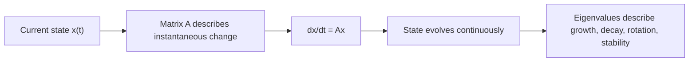
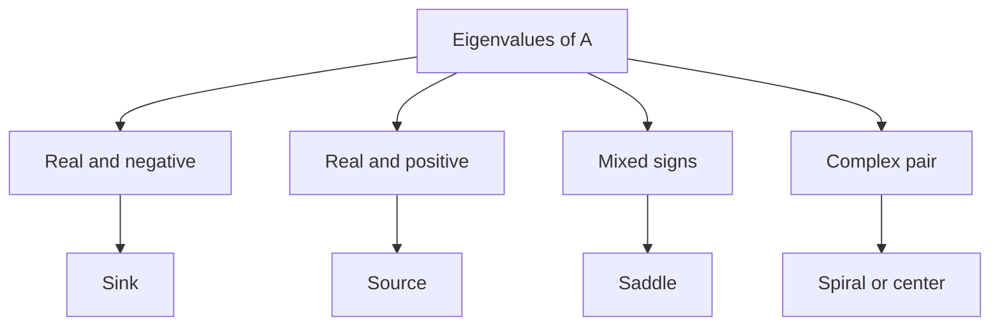

# Chapter 16: Differential Equations and Continuous Systems

## Opening Intuition: When Change Never Pauses

In a Markov chain, time moved in clear steps:

- today to tomorrow,
- click to click,
- turn to turn.

But many systems do not evolve in jumps. They evolve continuously:

- a chemical concentration changes every instant,
- currents flow continuously through a circuit,
- populations rise and fall through time,
- a spring oscillates without waiting for discrete steps.

To model these systems, we use **differential equations**. And when several quantities interact with one another, matrices quickly appear.

## The Big Idea

A linear continuous-time system often has the form

\[
\frac{dx}{dt}=Ax
\]

where:

- \(x(t)\) is the state vector,
- \(A\) is a matrix describing how the components influence one another.

This is the continuous-time cousin of repeated matrix multiplication.



## 16.1 One Equation First

Before dealing with matrices, recall the single equation

\[
\frac{dx}{dt}=ax
\]

Its solution is

\[
x(t)=e^{at}x(0)
\]

If \(a>0\), the solution grows. If \(a<0\), it decays. If \(a=0\), it stays constant.

That simple formula already contains the pattern we need. In the matrix case, the scalar \(a\) becomes a matrix \(A\), and the exponential becomes the **matrix exponential**.

## 16.2 Coupled Systems

Now suppose two quantities affect each other:

\[
\frac{d}{dt}
\begin{bmatrix}
x\\y
\end{bmatrix}
=
\begin{bmatrix}
a & b\\
c & d
\end{bmatrix}
\begin{bmatrix}
x\\y
\end{bmatrix}
\]

Expanded out, this means

\[
x' = ax+by,\qquad y'=cx+dy
\]

Now the rate of change of \(x\) depends not only on \(x\) but also on \(y\), and vice versa.

This is why matrices are natural here. They keep track of all pairwise couplings at once.

### Analogy

Imagine two water tanks connected by pipes.

- Water level in tank 1 affects flow into or out of tank 2.
- Water level in tank 2 affects flow into or out of tank 1.

The matrix \(A\) is like a blueprint of those interactions.

## 16.3 The Matrix Exponential

The solution of

\[
\frac{dx}{dt}=Ax,\qquad x(0)=x_0
\]

is

\[
x(t)=e^{At}x_0
\]

where

\[
e^{At}=I+At+\frac{(At)^2}{2!}+\frac{(At)^3}{3!}+\cdots
\]

This definition looks formal, but the intuition is concrete:

- \(A\) describes infinitesimal change,
- powers of \(A\) describe repeated interaction,
- the exponential packages all those repeated effects together.

### Why This Makes Sense

For tiny time \(\Delta t\),

\[
x(t+\Delta t)\approx x(t)+\Delta t\,Ax(t)=(I+\Delta t\,A)x(t)
\]

Over many tiny steps, you keep multiplying by something like \(I+\Delta t\,A\). In the limit, that repeated multiplication becomes \(e^{At}\).

So the matrix exponential is the continuous analogue of many small linear updates.

## 16.4 Eigenvectors Explain the Motion

If \(v\) is an eigenvector of \(A\) with eigenvalue \(\lambda\), then

\[
Av=\lambda v
\]

and

\[
e^{At}v=e^{\lambda t}v
\]

This is one of the most useful facts in the chapter.

It says:

- along an eigenvector direction, the system behaves like a one-dimensional exponential,
- the sign and size of \(\lambda\) control growth or decay,
- complex eigenvalues bring oscillation and rotation.

That means eigenvalues tell us the qualitative behavior of the system.

## 16.5 A Diagonal Example

Take

\[
A=
\begin{bmatrix}
2 & 0\\
0 & -1
\end{bmatrix}
\]

Then

\[
\frac{dx}{dt}=2x,\qquad \frac{dy}{dt}=-y
\]

So

\[
x(t)=e^{2t}x(0),\qquad y(t)=e^{-t}y(0)
\]

The \(x\)-component grows rapidly while the \(y\)-component decays.

This means trajectories move away from the origin horizontally and toward the axis vertically.

### Visual Intuition

```text
y-axis direction: contracts
x-axis direction: expands
overall picture: one direction in, one direction out
```

This is the signature of a **saddle**.

## 16.6 Phase Portraits

A **phase portrait** is a picture of how solution trajectories move through state space.

For 2D systems, the state vector \((x,y)\) is a point in the plane, and the differential equation tells you the velocity at each point.

Different eigenvalue patterns create different portraits:

| Eigenvalue pattern | Qualitative behavior |
| --- | --- |
| both negative real | sink: trajectories move toward origin |
| both positive real | source: trajectories move away |
| one positive, one negative | saddle |
| complex with negative real part | spiral inward |
| complex with positive real part | spiral outward |
| purely imaginary (idealized case) | center / sustained oscillation |

### Picture Map



You do not need to memorize this blindly. The logic is natural:

- negative real part means decay,
- positive real part means growth,
- imaginary part means oscillation.

<figure class="book-media">
  <video controls playsinline preload="metadata" src="/media/animations/ch16-phase-portrait.mp4"></video>
  <figcaption>Phase portraits are easier to trust once you see points actually flow. Each starting point traces a continuous path rather than jumping from step to step.</figcaption>
</figure>

## 16.7 Oscillation and Rotation

Consider

\[
A=
\begin{bmatrix}
0 & -1\\
1 & 0
\end{bmatrix}
\]

Then

\[
\frac{d}{dt}
\begin{bmatrix}
x\\y
\end{bmatrix}
=
\begin{bmatrix}
0 & -1\\
1 & 0
\end{bmatrix}
\begin{bmatrix}
x\\y
\end{bmatrix}
\]

This system rotates vectors. Its solutions move around circles.

That is remarkable: a constant matrix can encode rotation through time.

If we add damping,

\[
A=
\begin{bmatrix}
-\alpha & -1\\
1 & -\alpha
\end{bmatrix}
\]

with \(\alpha>0\), the motion spirals inward instead of circling forever.

## 16.8 A Population Example

Suppose two interacting populations satisfy

\[
\frac{d}{dt}
\begin{bmatrix}
x\\y
\end{bmatrix}
=
\begin{bmatrix}
0.1 & 0.2\\
-0.3 & 0.05
\end{bmatrix}
\begin{bmatrix}
x\\y
\end{bmatrix}
\]

Interpretation:

- the first population benefits from itself and from the second,
- the second loses from interaction with the first but gains slightly on its own.

Even without solving exactly, the matrix tells us the populations are coupled. Eigenvalues tell us whether the long-run behavior is stable, explosive, or oscillatory.

This is often the practical workflow:

1. write the interaction matrix,
2. compute eigenvalues,
3. classify the qualitative behavior,
4. solve exactly only when needed.

## 16.9 Systems with Forcing

Not every system is homogeneous. Often there is external input:

\[
\frac{dx}{dt}=Ax+f(t)
\]

Examples:

- a circuit driven by a voltage source,
- a spring pushed by an external force,
- an economy receiving periodic shocks.

The homogeneous part \(Ax\) describes the system’s internal tendencies. The forcing term \(f(t)\) describes external influence.

This split is conceptually important:

- internal structure,
- external input.

Linear systems theory studies how both interact.

## 16.10 Discrete vs Continuous Time

It helps to compare two familiar models:

### Discrete Time

\[
x_{k+1}=Ax_k
\]

### Continuous Time

\[
\frac{dx}{dt}=Ax
\]

The first updates by repeated multiplication. The second evolves via the exponential \(e^{At}\).

They are closely related:

- discrete systems suit step-by-step processes,
- continuous systems suit smooth evolution,
- both are governed by the same matrix structure.

## 16.11 Stability

One of the main questions in dynamics is:

> if the system starts near equilibrium, does it stay near, move closer, or move away?

For the system \(x'=Ax\), the eigenvalues of \(A\) largely determine stability:

- if all eigenvalues have negative real part, solutions decay toward zero,
- if any eigenvalue has positive real part, some solutions grow,
- borderline cases require more care.

This is powerful because a complicated time-evolution problem becomes a matrix-spectrum problem.

## 16.12 Why Matrices Are So Useful Here

Matrices help because they separate two levels of understanding:

### Local Rule

The matrix \(A\) tells how each variable influences each rate of change.

### Global Behavior

The exponential \(e^{At}\), eigenvalues, and eigenvectors reveal what happens over time.

That move from local coupling to global motion is one of the deepest recurring themes in linear algebra.

## Common Mistakes

### Confusing the state with its derivative

The equation \(x'=Ax\) says \(Ax\) is the velocity, not the state itself.

### Thinking \(e^{At}\) means exponentiating entries one by one

It does not. The matrix exponential is defined by a power series in the matrix.

### Ignoring eigenvalues

Without them, it is hard to see growth, decay, or oscillation clearly.

### Assuming every continuous system is linear

Many real systems are nonlinear. Linear systems are still central because they are often good approximations near equilibrium points.

## Chapter Recap

- Continuous linear systems often take the form \(x'=Ax\).
- The matrix \(A\) describes instantaneous coupling between variables.
- The solution is \(x(t)=e^{At}x_0\).
- The matrix exponential is the continuous analogue of repeated linear updates.
- Eigenvectors give invariant directions.
- Eigenvalues determine growth, decay, and oscillation.
- Phase portraits visualize qualitative behavior in low dimensions.
- Stability is strongly tied to the real parts of eigenvalues.

## Exercises

1. Solve the scalar equation \(x'=3x\) with initial condition \(x(0)=2\).

2. For

\[
A=
\begin{bmatrix}
-2 & 0\\
0 & -5
\end{bmatrix}
\]

describe the long-run behavior of solutions to \(x'=Ax\).

3. What qualitative behavior do you expect when a \(2\times2\) matrix has one positive and one negative eigenvalue?

4. Explain in words why \(e^{At}\) is the continuous-time analogue of repeated multiplication by a matrix.

5. For the system

\[
x' = y,\qquad y'=-x
\]

write it in matrix form and describe the motion qualitatively.

6. Why are linear systems still useful even when the real world is often nonlinear?

## Looking Ahead

So far, our matrix models have been mathematically clean. The next chapter asks what happens when clean mathematics meets finite-precision computation. That is the world of numerical linear algebra.
