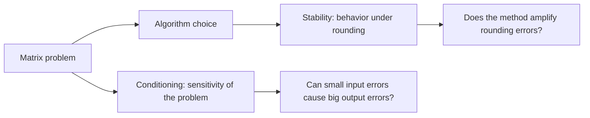

# Chapter 17: Numerical Linear Algebra

## Opening Intuition: Exact Math Meets Imperfect Machines

On paper, numbers can be exact.

- \(1/3\) is exactly \(1/3\).
- A system of equations either has a precise solution or it does not.
- Matrix multiplication follows exact algebraic rules.

On a computer, things are messier.

- Numbers are stored with finite precision.
- Rounding happens constantly.
- Tiny errors can grow.
- Some mathematically equivalent methods behave very differently in practice.

Numerical linear algebra is the part of linear algebra that asks:

> how do we compute matrix problems reliably on real machines?

This chapter is not mainly about new matrix definitions. It is about judgment.

## The Big Idea

There are two separate questions:

1. Is the mathematical problem itself sensitive?
2. Is the algorithm stable when solving it?

If either answer is bad, the computed result may be misleading.



## 17.1 Floating-Point Numbers

Computers store real numbers approximately using **floating-point arithmetic**.

The rough idea is scientific notation:

\[
\text{number} \approx \pm(\text{mantissa})\times(\text{base})^{\text{exponent}}
\]

This gives huge range, but not infinite precision. Many numbers cannot be represented exactly.

### Example

Decimal 0.1 is simple on paper, but in binary it becomes an infinite repeating expansion. So the computer stores a nearby number instead.

That means the error story begins before we even start solving the matrix problem.

## 17.2 Rounding Error Is Unavoidable

Every arithmetic operation may introduce a tiny rounding error:

- addition,
- subtraction,
- multiplication,
- division.

Most of the time these errors are small. But in long chains of computation, they can accumulate or get amplified.

The goal of numerical linear algebra is not to eliminate all error. That is impossible. The goal is to **control** it.

## 17.3 Conditioning: Is the Problem Sensitive?

A problem is **well-conditioned** if small input changes cause only small output changes.

A problem is **ill-conditioned** if tiny input changes can cause large output changes.

This is a property of the problem itself, not of the algorithm.

### Analogy

Imagine balancing a ball:

- in a wide bowl, a small push makes a small change,
- on a knife edge, a small push makes a huge change.

Well-conditioned problems are like the bowl. Ill-conditioned problems are like the knife edge.

## 17.4 Condition Number

For solving \(Ax=b\), a key quantity is the **condition number** of \(A\), often written \(\kappa(A)\).

At a high level:

- small condition number means stable geometry,
- large condition number means the system is close to singular or badly stretched.

If \(A\) has a very large condition number, then small perturbations in \(b\) or in the entries of \(A\) may lead to large changes in the solution \(x\).

### Geometric Intuition

A matrix with a large condition number squashes space strongly in some directions and stretches it in others. Undoing that transformation is delicate.

That is why solving systems with nearly dependent columns can be numerically dangerous.

## 17.5 Subtractive Cancellation

One common source of trouble is **catastrophic cancellation**.

If two nearly equal numbers are subtracted, many leading digits cancel and the relative error in the result can become large.

### Example

Suppose a computer stores

\[
a=1.234567,\qquad b=1.234561
\]

Then

\[
a-b=0.000006
\]

The answer is small, so even tiny errors in \(a\) and \(b\) matter a lot relative to the final result.

This kind of cancellation appears in many naive formulas and can ruin accuracy.

## 17.6 Why We Usually Do Not Compute the Inverse Directly

Mathematically, if \(Ax=b\) and \(A\) is invertible, then

\[
x=A^{-1}b
\]

But numerically, this is often *not* the best way to solve the system.

Why?

- forming \(A^{-1}\) explicitly is usually more work,
- it can introduce extra rounding error,
- direct solve methods exploit structure more efficiently.

In practice, we usually solve \(Ax=b\) using elimination or factorization, not by first computing the inverse.

This is a classic example where a perfectly correct formula is not the best computational strategy.

## 17.7 Gaussian Elimination and Pivoting

Gaussian elimination remains one of the central computational tools for solving linear systems.

But on a computer, one extra idea matters enormously: **pivoting**.

Pivoting means reordering rows (or sometimes columns) to choose numerically safer pivots.

### Why It Helps

If a pivot is extremely small, dividing by it can magnify errors dramatically. Choosing a larger pivot often improves stability.

### Partial Pivoting

The most common practical variant swaps rows so the largest available entry in the current column becomes the pivot.

It is not perfect in every imaginable case, but it is extremely effective in many real computations.

## 17.8 Factorizations as Computational Strategy

Numerical linear algebra loves matrix factorizations because they turn difficult problems into structured ones.

Important examples:

- **LU factorization** for solving square systems,
- **QR factorization** for least squares,
- **eigendecomposition** for spectral problems,
- **SVD** for robust analysis, compression, and low-rank approximation.

The theme is simple:

> instead of attacking a problem head-on, rewrite the matrix in a form that is easier and safer to work with.

## 17.9 Why QR Can Beat Normal Equations

For least squares, one classical approach is to solve the normal equations:

\[
X^TXw=X^Ty
\]

This is mathematically valid, but it can worsen conditioning because \(X^TX\) often has a much larger condition number than \(X\) itself.

That is why QR factorization is often preferred in practice. It usually behaves more stably.

This is an important numerical lesson:

two algebraically equivalent formulas can have very different computational quality.

## 17.10 Backward Stability

An algorithm is often called **backward stable** if the answer it produces is the exact solution to a nearby problem.

This is one of the most useful notions in numerical analysis.

Why? Because it says the algorithm did not go wildly off the rails. It solved almost the right problem exactly.

For many core tasks, a backward stable algorithm is about as good as you can realistically hope for in finite precision.

## 17.11 Sparse Matrices

Many real matrices are mostly zeros:

- network adjacency matrices,
- finite element matrices,
- recommendation matrices,
- graph Laplacians,
- large scientific simulations.

These are called **sparse matrices**.

If we store every zero explicitly, we waste memory and computation. Sparse numerical linear algebra exploits the pattern of nonzero entries.

This can make the difference between:

- a problem that fits in memory and one that does not,
- a solve that takes seconds and one that takes hours.

### Visual Intuition

```text
dense matrix  : many filled entries
sparse matrix : mostly empty with a few structured nonzeros
```

## 17.12 Iterative Methods

For very large systems, especially sparse ones, direct elimination may be too expensive.

Then we often use **iterative methods**, which build approximate solutions step by step.

Examples include:

- Jacobi,
- Gauss-Seidel,
- conjugate gradient,
- GMRES.

The philosophy is different:

- direct methods try to finish in a structured finite sequence,
- iterative methods gradually improve an estimate.

These methods are especially useful when:

- the matrix is huge,
- the matrix is sparse,
- an approximate answer is good enough,
- matrix-vector products are cheap.

## 17.13 Preconditioning

Sometimes an iterative method converges slowly because the problem is badly conditioned. A **preconditioner** transforms the system into an equivalent form that is easier to solve numerically.

This is like loosening a stuck bolt before turning it. The underlying task is the same, but the effort changes dramatically.

Preconditioning is one of the most practical and creative parts of large-scale numerical linear algebra.

## 17.14 Error Analysis: Residual vs True Error

Suppose \(\hat{x}\) is a computed solution to \(Ax=b\).

The **residual** is

\[
r=b-A\hat{x}
\]

If the residual is small, then \(\hat{x}\) nearly satisfies the equation.

But a small residual does not always mean the true error \(\hat{x}-x\) is small. If \(A\) is ill-conditioned, even a tiny residual can hide a large solution error.

This distinction is crucial.

### Short Version

- residual asks: “how well does the computed answer fit the equation?”
- true error asks: “how close is the computed answer to the actual solution?”

They are related, but not identical.

## 17.15 Complexity and Scale

Numerical linear algebra is not only about correctness. It is also about cost.

Questions include:

- How many operations are needed?
- How much memory is needed?
- Can the algorithm use parallel hardware?
- Does it exploit matrix structure?

A method that is beautiful on paper may be unusable at large scale if it ignores sparsity, symmetry, or low-rank structure.

That is why practical matrix computation is a blend of algebra, geometry, and computer science.

## 17.16 A Practical Mindset

When faced with a matrix problem on a computer, ask:

1. Is the matrix dense or sparse?
2. Is the problem well-conditioned?
3. Am I solving one system or many with the same matrix?
4. Should I use LU, QR, SVD, or an iterative method?
5. Am I checking residuals and sensitivity?

These questions matter more in practice than memorizing a long list of formal definitions.

## Common Mistakes

### Believing exact formulas guarantee exact computation

They do not. Floating-point arithmetic changes the game.

### Solving \(Ax=b\) by explicitly computing \(A^{-1}\)

This is usually slower and often less stable than a proper solve.

### Ignoring conditioning

If the problem is ill-conditioned, even a stable algorithm may return an answer with limited accuracy.

### Confusing a small residual with a small true error

They are not the same, especially for ill-conditioned problems.

## Chapter Recap

- Computers use finite-precision floating-point arithmetic.
- Rounding error is unavoidable, so numerical methods must control it.
- Conditioning measures the sensitivity of a problem.
- The condition number helps estimate how fragile a linear system is.
- Stable algorithms avoid unnecessary error amplification.
- Pivoting improves Gaussian elimination in practice.
- We usually solve systems directly rather than forming the inverse.
- Factorizations like LU and QR are central computational tools.
- Sparse and iterative methods matter for very large problems.
- Numerical linear algebra is where theory meets computation.

## Exercises

1. Explain the difference between a well-conditioned and an ill-conditioned problem in your own words.

2. Why can subtracting nearly equal numbers be dangerous numerically?

3. Why is solving \(Ax=b\) by computing \(A^{-1}\) often a poor practical choice?

4. What is the benefit of pivoting in Gaussian elimination?

5. If a matrix is sparse, why should that influence the algorithm you choose?

6. Explain the difference between residual and true error.

7. Why might QR factorization be preferred over normal equations for least squares?

## Looking Ahead

The final chapter gathers the whole book into one map: the central ideas, the common pitfalls, and the best next directions for deeper study.
