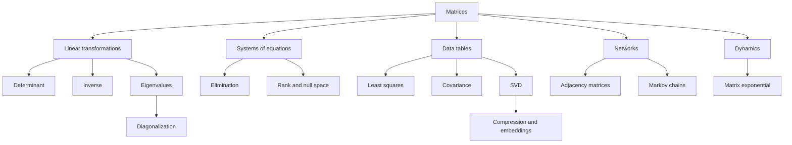

# Chapter 18: Cheat Sheet and Next Steps

## Opening Intuition: From Many Topics to One Mental Map

By now you have seen matrices wear many disguises:

- tables of numbers,
- machines that transform vectors,
- tools for solving systems,
- summaries of data,
- maps of networks,
- engines of dynamics,
- building blocks of machine learning.

This final chapter is not about one more topic. It is about turning the whole book into a single connected picture.

## 18.1 The Matrix Cheat Sheet

### Core Objects

| Object | What it is | What to ask |
| --- | --- | --- |
| Vector | a list of numbers | What point, direction, or state does it represent? |
| Matrix | a rectangular array of numbers | What transformation, table, or relationship does it encode? |
| Linear system \(Ax=b\) | equations packed together | Is there no solution, one solution, or many? |
| Determinant | signed scaling factor | Does the transformation flatten space? Reverse orientation? |
| Inverse \(A^{-1}\) | undoing matrix | Does it exist? Is undoing stable? |
| Rank | number of independent directions | How much genuine information is present? |
| Eigenvalue/eigenvector | invariant scaling direction | What are the natural modes of the system? |
| SVD | factorization into rotate-stretch-rotate | What are the dominant directions and sizes? |

### Core Operations

| Operation | Meaning |
| --- | --- |
| \(A+B\) | combine two same-shaped effects entrywise |
| \(cA\) | scale every entry |
| \(Ax\) | apply matrix to a vector |
| \(AB\) | do \(B\) first, then \(A\) |
| \(A^T\) | swap rows and columns |
| \(A^k\) | repeated application |

## 18.2 The Three Main Ways to See a Matrix

Throughout the book, three viewpoints kept returning.

### 1. Matrix as Table

Useful in:

- datasets,
- images,
- transition tables,
- accounting and measurements.

### 2. Matrix as Transformation

Useful in:

- geometry,
- graphics,
- robotics,
- differential equations,
- coordinate changes.

### 3. Matrix as Relationship Structure

Useful in:

- systems of equations,
- graphs and networks,
- covariance,
- optimization constraints.

If you feel stuck, ask:

> which viewpoint is most helpful here?

Often confusion comes from using the wrong lens.

## 18.3 Concept Map

## 18.4 A Short Dictionary of Big Ideas

### Linearity

The output respects addition and scalar multiplication. This is the rule that makes the whole subject coherent.

### Span

All combinations you can build from a set of vectors.

### Independence

No vector in the set is redundant.

### Basis

A minimal set of building directions for a space.

### Rank

How many genuinely independent directions a matrix can produce.

### Orthogonality

Perpendicularity, but also a powerful algebraic simplifier.

### Projection

The closest point in a subspace to a given vector.

### Spectrum

The collection of eigenvalues, often the fingerprint of a linear system’s behavior.

## 18.5 Common Pitfalls

### Multiplication order matters

Usually \(AB\neq BA\). Matrix multiplication is not commutative.

### A matrix can have full-looking entries and still be singular

The issue is dependence, not visual appearance.

### Determinant is important, but not everything

It tells a lot about scaling and invertibility, but not the whole story of a matrix.

### Orthogonal does not mean “nice angle only”

Orthogonality is deeply tied to stability, projections, and least squares.

### Exact algebra and numerical computation are different worlds

A mathematically valid formula may still be a poor computational method.

### Data matrices are geometric objects

If you only see a spreadsheet, you miss the shape.

## 18.6 A Study Roadmap

If you want to keep going, there are several natural routes.

### Route A: Pure Linear Algebra

Focus on:

- vector spaces,
- linear maps,
- basis and dimension,
- eigenvalues,
- canonical forms.

This route deepens abstraction and proof skills.

### Route B: Applied Mathematics

Focus on:

- differential equations,
- dynamical systems,
- optimization,
- numerical analysis,
- scientific computing.

This route connects matrices to physical and engineered systems.

### Route C: Data and Machine Learning

Focus on:

- probability and statistics,
- least squares,
- PCA,
- optimization,
- deep learning.

This route uses matrices as the language of modern data models.

### Route D: Networks and Graphs

Focus on:

- graph theory,
- random walks,
- spectral graph methods,
- ranking,
- diffusion and flows.

This route studies structure and movement on connected systems.

## 18.7 What to Practice Next

If you want real fluency, do not only read. Practice these habits:

1. Take a small matrix and explain it in words.
2. Compute by hand on \(2\times2\) and \(3\times3\) examples.
3. Draw what a matrix does to the plane whenever possible.
4. Translate between equations, tables, and geometry.
5. Ask what the columns mean, what the rows mean, and what the rank means.
6. Use software for larger examples, but keep intuition from small ones.

## 18.8 The Fast Recall Page

### If you are solving \(Ax=b\)

- think elimination,
- think pivots,
- think rank,
- think consistency,
- think conditioning if computing numerically.

### If you are studying a transformation

- look at columns,
- look at determinant,
- look at eigenvectors,
- look at invariant subspaces.

### If you are fitting data

- think column space,
- think projection,
- think least squares,
- think QR or SVD.

### If you are analyzing repeated behavior

- think powers of matrices,
- think eigenvalues,
- think stability,
- think steady states.

### If you are compressing or denoising

- think rank,
- think singular values,
- think best low-rank approximation.

## 18.9 Final Perspective

The deepest lesson of the book is not that matrices solve many separate problems. It is that they reveal the same structure in many different settings.

The language changes:

- geometry,
- data,
- networks,
- dynamics,
- computation.

But the underlying themes keep returning:

- combination,
- transformation,
- dependence,
- structure,
- approximation,
- repeated action.

Once you start seeing those patterns, matrices stop feeling like a chapter in mathematics and start feeling like a way of thinking.

## Final Exercises

1. Describe one situation from your own field or interests where a matrix could naturally appear.

2. Explain the difference between rank, determinant, and eigenvalues in one sentence each.

3. Choose one previous chapter topic and connect it to another. For example, explain how least squares connects to orthogonality, or how Markov chains connect to eigenvectors.

4. Write a short paragraph answering: “What is a matrix?” in a way that would make sense to a beginner.

## Closing

If you can look at a matrix and ask,

- what does it do,
- what structure does it encode,
- what directions matter most,
- how stable is computation with it,

then you already think much more like a linear algebraist than when you began.
