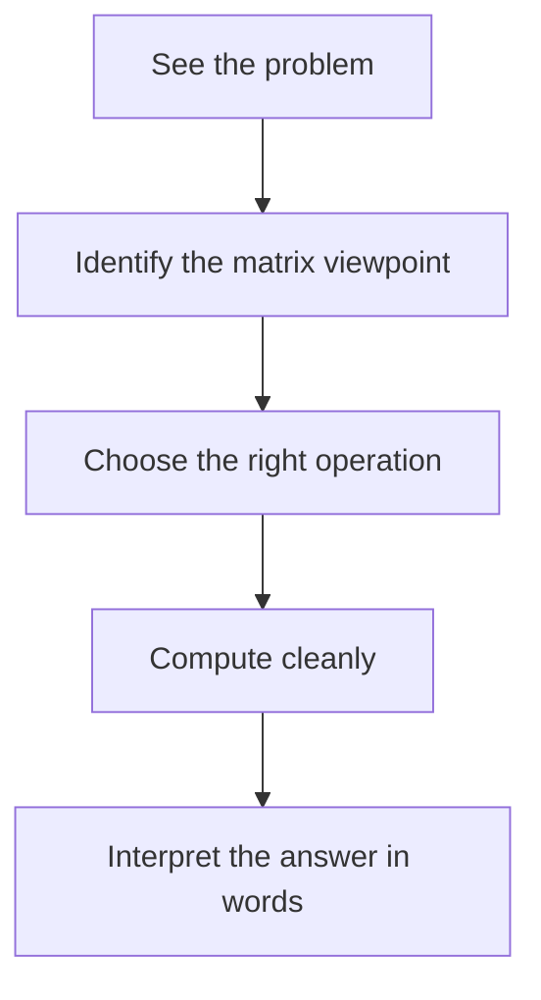

# Appendix A: Guided Problems and Mini-Solutions

This appendix is meant to turn the book from something you have read into something you can *use*.

The goal is not to drown you in drills. The goal is to show what good matrix thinking looks like in action. Each problem is chosen because it rehearses one of the main habits of the subject:

- translating a story into a matrix,
- choosing the right viewpoint,
- carrying out a clean computation,
- and interpreting the result in plain language.

If you get stuck, do not ask only, "What formula do I need?" Ask a better question:

> What kind of object am I looking at: a table, a transformation, a system, a subspace, or a dynamical rule?

That question usually tells you which chapter’s tools belong here.

## A Short Problem-Solving Playbook

Before the worked problems, here is a compact checklist.

| Situation | First question | Common tool |
| --- | --- | --- |
| A rectangular grid of data | What do rows and columns represent? | row/column interpretation |
| A transformation | Where do the basis vectors go? | column view |
| A system \(Ax=b\) | Is it better to eliminate or reason structurally? | row operations, pivots |
| A geometry question | What happens to lengths, areas, or directions? | determinants, eigenvectors, SVD |
| A data-fitting question | What is the closest vector in a subspace? | projection, least squares |
| A repeated-step process | What happens after many applications? | powers, eigenvalues, steady state |

## Problem 1: Read a Matrix Correctly

Suppose

\[
M=
\begin{bmatrix}
12 & 15 & 11 \\
8 & 10 & 9 \\
14 & 13 & 16
\end{bmatrix}.
\]

Interpret this matrix if rows represent stores and columns represent months.

### Solution

The first thing to do is not compute. It is to attach meaning.

- Row 1 is store 1 across the three months: \(12,15,11\).
- Column 2 is month 2 across the three stores: \(15,10,13\).
- The entry in row 3, column 1 means store 3 had value \(14\) in month 1.

This problem is simple, but it matters because many later mistakes come from forgetting what a row and a column mean.

### Takeaway

A matrix is not just entries. It is entries with addresses and interpretation.

## Problem 2: Compute a Matrix-Vector Product

Let

\[
A=
\begin{bmatrix}
2 & 1 \\
-1 & 3 \\
4 & 0
\end{bmatrix},
\qquad
\mathbf{x}=
\begin{bmatrix}
5 \\
2
\end{bmatrix}.
\]

Find \(A\mathbf{x}\).

### Solution

Use the row view first.

\[
A\mathbf{x}=
\begin{bmatrix}
2\cdot 5 + 1\cdot 2 \\
-1\cdot 5 + 3\cdot 2 \\
4\cdot 5 + 0\cdot 2
\end{bmatrix}
=
\begin{bmatrix}
12 \\
1 \\
20
\end{bmatrix}.
\]

Now read the same computation from the column view. The columns of \(A\) are

\[
\mathbf{a}_1=
\begin{bmatrix}
2\\-1\\4
\end{bmatrix},
\qquad
\mathbf{a}_2=
\begin{bmatrix}
1\\3\\0
\end{bmatrix}.
\]

So

\[
A\mathbf{x}=5\mathbf{a}_1+2\mathbf{a}_2.
\]

That produces exactly the same result:

\[
5
\begin{bmatrix}
2\\-1\\4
\end{bmatrix}
+
2
\begin{bmatrix}
1\\3\\0
\end{bmatrix}
=
\begin{bmatrix}
12\\1\\20
\end{bmatrix}.
\]

### Takeaway

Every matrix-vector product has two valid stories:

- rows build outputs,
- columns combine into the output.

## Problem 3: Solve a System with Elimination

Solve

\[
\begin{aligned}
x+y+z &= 6 \\
2x-y+z &= 3 \\
x+2y-z &= 2
\end{aligned}
\]

### Solution

Write the augmented matrix:

\[
\left[
\begin{array}{ccc|c}
1 & 1 & 1 & 6 \\
2 & -1 & 1 & 3 \\
1 & 2 & -1 & 2
\end{array}
\right].
\]

Eliminate below the first pivot:

- \(R_2 \leftarrow R_2 - 2R_1\)
- \(R_3 \leftarrow R_3 - R_1\)

\[
\left[
\begin{array}{ccc|c}
1 & 1 & 1 & 6 \\
0 & -3 & -1 & -9 \\
0 & 1 & -2 & -4
\end{array}
\right].
\]

Now eliminate below the second pivot. A convenient move is \(R_3 \leftarrow 3R_3 + R_2\):

\[
\left[
\begin{array}{ccc|c}
1 & 1 & 1 & 6 \\
0 & -3 & -1 & -9 \\
0 & 0 & -7 & -21
\end{array}
\right].
\]

So \(z=3\). Then the second row gives

\[
-3y-3=-9 \implies y=2.
\]

The first row gives

\[
x+2+3=6 \implies x=1.
\]

Therefore

\[
\begin{bmatrix}
x\\y\\z
\end{bmatrix}
=
\begin{bmatrix}
1\\2\\3
\end{bmatrix}.
\]

### Takeaway

Elimination is controlled cancellation. The numbers matter, but the structure matters more: pivots tell you which variables are determined.

## Problem 4: Read a Transformation from its Columns

Let

\[
A=
\begin{bmatrix}
2 & 1 \\
0 & 3
\end{bmatrix}.
\]

What happens to the standard basis vectors? What does that suggest geometrically?

### Solution

The first column is

\[
A\mathbf{e}_1=
\begin{bmatrix}
2\\0
\end{bmatrix},
\]

and the second column is

\[
A\mathbf{e}_2=
\begin{bmatrix}
1\\3
\end{bmatrix}.
\]

So:

- the vector \((1,0)\) goes to \((2,0)\),
- the vector \((0,1)\) goes to \((1,3)\).

That means the unit square does not stay a square. Its sides become the two column vectors, so it turns into a parallelogram.

The transformation stretches in the horizontal direction and also tilts the vertical direction to the right.

### Takeaway

If you want a fast geometric picture of a matrix, look at its columns first.

## Problem 5: Use the Determinant as an Area Test

For

\[
A=
\begin{bmatrix}
3 & 2 \\
1 & 1
\end{bmatrix},
\]

find \(\det(A)\) and interpret it geometrically.

### Solution

\[
\det(A)=3\cdot 1 - 2\cdot 1 = 1.
\]

This means the transformation preserves signed area. A region may be sheared or reoriented, but its area is multiplied by \(1\), so the area stays the same.

Because the determinant is nonzero, the matrix is invertible.

### Takeaway

The determinant answers two questions at once:

- does area collapse to zero?
- does orientation flip?

Here the answer is: no collapse, no flip.

## Problem 6: Decide if Vectors are Independent

Are the vectors

\[
\mathbf{v}_1=
\begin{bmatrix}
1\\2\\3
\end{bmatrix},
\qquad
\mathbf{v}_2=
\begin{bmatrix}
2\\4\\6
\end{bmatrix},
\qquad
\mathbf{v}_3=
\begin{bmatrix}
1\\0\\1
\end{bmatrix}
\]

linearly independent?

### Solution

Immediately notice that

\[
\mathbf{v}_2 = 2\mathbf{v}_1.
\]

So the set is automatically dependent. We do not even need a full elimination.

That means at least one vector is redundant.

### Takeaway

Before doing a large computation, look for obvious relationships. Good matrix work is not just calculation. It is noticing structure early.

## Problem 7: Find a Basis for a Column Space

Let

\[
A=
\begin{bmatrix}
1 & 2 & 3 \\
0 & 1 & 1 \\
1 & 3 & 4
\end{bmatrix}.
\]

Find a basis for the column space.

### Solution

Use row reduction to identify pivot columns:

\[
\begin{bmatrix}
1 & 2 & 3 \\
0 & 1 & 1 \\
1 & 3 & 4
\end{bmatrix}
\to
\begin{bmatrix}
1 & 2 & 3 \\
0 & 1 & 1 \\
0 & 1 & 1
\end{bmatrix}
\to
\begin{bmatrix}
1 & 2 & 3 \\
0 & 1 & 1 \\
0 & 0 & 0
\end{bmatrix}.
\]

The pivot columns are columns 1 and 2. So a basis for the column space is given by the corresponding original columns:

\[
\left\{
\begin{bmatrix}
1\\0\\1
\end{bmatrix},
\begin{bmatrix}
2\\1\\3
\end{bmatrix}
\right\}.
\]

Do **not** take the columns from the reduced matrix as a basis for the original column space. Row reduction preserves row relationships used to detect pivots, but the actual basis vectors should come from the original matrix.

### Takeaway

Pivot locations come from the reduced matrix. Basis columns come from the original matrix.

## Problem 8: Find an Eigenvalue Pattern

Let

\[
A=
\begin{bmatrix}
4 & 0 \\
0 & -2
\end{bmatrix}.
\]

What are the eigenvalues and what do they say about repeated application of \(A\)?

### Solution

Because \(A\) is diagonal, the eigenvalues are visible immediately:

- \(\lambda_1 = 4\)
- \(\lambda_2 = -2\)

The \(x\)-direction is stretched by 4 at each step.

The \(y\)-direction is scaled by \(-2\), meaning it flips direction and doubles in size each time.

After many powers:

- vectors with an \(x\)-component grow rapidly,
- vectors with a \(y\)-component alternate sign while also growing in magnitude.

### Takeaway

Eigenvalues describe long-term behavior direction by direction.

## Problem 9: Projection Onto a Line

Project

\[
\mathbf{b}=
\begin{bmatrix}
3\\1
\end{bmatrix}
\]

onto the line spanned by

\[
\mathbf{u}=
\begin{bmatrix}
1\\1
\end{bmatrix}.
\]

### Solution

Use the projection formula:

\[
\operatorname{proj}_{\mathbf{u}}(\mathbf{b})=
\frac{\mathbf{u}^T\mathbf{b}}{\mathbf{u}^T\mathbf{u}}\mathbf{u}.
\]

Compute the pieces:

\[
\mathbf{u}^T\mathbf{b}=1\cdot 3 + 1\cdot 1 = 4,
\qquad
\mathbf{u}^T\mathbf{u}=1+1=2.
\]

So

\[
\operatorname{proj}_{\mathbf{u}}(\mathbf{b})=
\frac{4}{2}
\begin{bmatrix}
1\\1
\end{bmatrix}
=
\begin{bmatrix}
2\\2
\end{bmatrix}.
\]

The residual is

\[
\mathbf{b}-
\operatorname{proj}_{\mathbf{u}}(\mathbf{b})=
\begin{bmatrix}
1\\-1
\end{bmatrix},
\]

which is orthogonal to \(\mathbf{u}\), exactly as least-squares geometry predicts.

### Takeaway

The "best approximation" story is geometric before it is algebraic.

## Problem 10: Find a Steady State in a Markov Chain

Suppose a two-state system uses the row-stochastic transition matrix

\[
P=
\begin{bmatrix}
0.8 & 0.2 \\
0.3 & 0.7
\end{bmatrix}.
\]

Find a steady-state row vector \(\pi=[a\ b]\) satisfying

\[
\pi P = \pi,
\qquad
a+b=1.
\]

### Solution

Write out the steady-state condition:

\[
[a\ b]
\begin{bmatrix}
0.8 & 0.2 \\
0.3 & 0.7
\end{bmatrix}
=
[a\ b].
\]

This gives

\[
0.8a + 0.3b = a,
\qquad
0.2a + 0.7b = b.
\]

Either equation is enough together with \(a+b=1\). From the first:

\[
0.3b = 0.2a \implies 3b = 2a.
\]

So \(a = \frac{3}{2}b\). Using \(a+b=1\):

\[
\frac{3}{2}b+b=1
\implies
\frac{5}{2}b=1
\implies
b=\frac{2}{5}.
\]

Then

\[
a=\frac{3}{5}.
\]

So the steady state is

\[
\pi =
\begin{bmatrix}
\frac{3}{5} & \frac{2}{5}
\end{bmatrix}.
\]

### Interpretation

In the long run, the system spends about 60% of its time in state 1 and 40% in state 2.

### Takeaway

Steady state means "unchanged after one more step." It is an eigenvector idea in disguise.

## What These Problems Were Really Training

The ten problems above look different, but they share a common structure:

- identify the role of the matrix,
- use the matching operation,
- interpret the answer rather than stopping at arithmetic.

Here is that structure in compact form:

| Problem type | Core habit |
| --- | --- |
| Reading data matrices | attach meaning to rows and columns |
| Matrix multiplication | move between row view and column view |
| Solving systems | look for pivots and structure |
| Geometry of transformations | read columns as moved basis vectors |
| Determinants | connect algebra to area or volume |
| Basis and rank | separate independent directions from redundancy |
| Projections | think in terms of nearest points and orthogonality |
| Eigenvalues | identify invariant directions and growth rates |
| Markov chains | look for unchanged long-run distributions |

## Suggested Self-Test Routine

If you want to become comfortable with matrices, a good weekly routine is:

1. Solve one elimination problem by hand.
2. Interpret one matrix geometrically.
3. Do one projection or least-squares problem.
4. Compute one set of eigenvalues for a small matrix.
5. Explain one answer aloud in plain language.

That last step matters more than it may seem. If you can explain what a determinant, a pivot, or an eigenvector *means* without hiding behind symbols, you understand the concept at a much deeper level.
