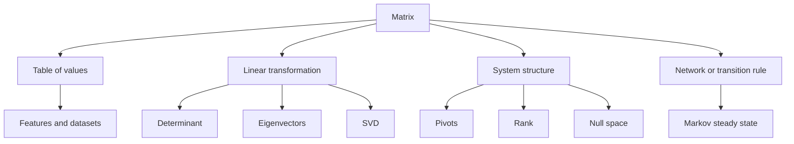

# Appendix B: Visual Glossary and Symbol Guide

This appendix is a compact reference for the language of the book.

It does three jobs:

- it gathers notation in one place,
- it gives short plain-language definitions,
- and it helps translate between the different ways matrices appear across the chapters.

That last point matters. A student often understands a matrix in one setting and then feels lost when it reappears in another. The same matrix can be a data table in one chapter, a transformation in another, and a network object in a third. The symbols may look similar because the underlying structure really is similar.

## A Note on Notation

Across the chapters, vectors are sometimes written as bold symbols such as \(\mathbf{x}\), and sometimes as plain symbols such as \(x\) when the surrounding context already makes clear that the object is a vector.

These choices are stylistic rather than conceptual. In every case, the safe question is:

> Is this symbol representing a scalar, a vector, a matrix, or a set?

Once you know that, the notation becomes much easier to read.

## The Core Symbol Table

| Symbol | Usually means | How to read it |
| --- | --- | --- |
| \(a\), \(b\), \(c\) | scalar | one number |
| \(\mathbf{x}\), \(x\), \(\mathbf{v}\), \(v\) | vector | a point, direction, state, or feature list |
| \(A\), \(B\), \(P\), \(Q\) | matrix | a transformation, table, or relationship structure |
| \(A^T\) | transpose | rows and columns swapped |
| \(I\) | identity matrix | the do-nothing transformation |
| \(A^{-1}\) | inverse | undoing matrix, if it exists |
| \(\det(A)\) | determinant | signed scaling factor |
| \(\operatorname{rank}(A)\) | rank | number of independent output directions |
| \(\operatorname{Col}(A)\) | column space | all outputs \(A\mathbf{x}\) can produce |
| \(\operatorname{Null}(A)\) | null space | all inputs sent to zero |
| \(\lambda\) | eigenvalue | scaling factor on an invariant direction |
| \(v\) | eigenvector | direction preserved by the matrix |
| \(U\Sigma V^T\) | SVD | rotate/reflect, stretch, rotate/reflect |
| \(\pi\) | steady-state distribution | long-run balance in a Markov chain |

## How to Read a Matrix at First Glance

When you see a matrix, do not start multiplying automatically. Start by asking four questions.

### 1. What is the shape?

If the matrix is \(m \times n\), it takes \(n\)-dimensional inputs and produces \(m\)-dimensional outputs when used as a transformation.

### 2. What do the rows mean?

Rows often represent:

- equations,
- observations,
- states leaving a system,
- or output rules.

### 3. What do the columns mean?

Columns often represent:

- variables,
- features,
- basis directions,
- or contributions of each input direction.

### 4. Which viewpoint is active here?

Use the table below.

| Viewpoint | Typical question | Typical chapters |
| --- | --- | --- |
| Table | What is stored where? | 1, 2, 15 |
| Transformation | What happens to vectors or shapes? | 3, 5, 6, 10, 11, 13 |
| System | Which inputs satisfy all equations? | 4, 7, 8 |
| Approximation | What is the nearest point in a subspace? | 9, 13 |
| Network | Who connects to whom? | 14 |
| Dynamics | What happens after many steps or over time? | 11, 14, 16 |
| Computation | What is stable and efficient on a computer? | 17 |

## A Visual Concept Map



## Visual Glossary of Core Ideas

### Matrix

A rectangular array of numbers with organized meaning.

Visual idea:

```text
a matrix is a grid
but also a rule
```

### Vector

A directed quantity, point, state, or list of features.

Visual idea:

```text
vector = one arrow or one stacked list
```

### Linear Transformation

A rule that preserves addition and scalar multiplication.

Visual idea:

- lines stay lines,
- the origin stays fixed,
- squares may become parallelograms.

### Determinant

The signed amount by which a transformation scales area or volume.

Visual idea:

```text
unit square -> transformed parallelogram
area scale = determinant magnitude
```

### Inverse

A transformation that exactly undoes another one.

Visual idea:

```text
forward move, then exact rewind
```

### Span

Everything reachable by linear combinations of a set of vectors.

Visual idea:

- one nonzero vector in the plane spans a line,
- two independent vectors in the plane span the whole plane.

### Basis

A smallest nonredundant generating set for a space.

Visual idea:

```text
basis = enough directions, but no extras
```

### Rank

The number of independent directions a matrix can output.

Visual idea:

- full rank means no output directions are missing,
- lower rank means some directions collapse.

### Null Space

All inputs that disappear under the matrix.

Visual idea:

```text
hidden inputs that the machine cannot distinguish
```

### Orthogonality

Perpendicularity, but also a tool for clean projection and numerical stability.

Visual idea:

two directions that do not interfere with each other.

### Eigenvector

A direction that a matrix does not turn away from itself.

Visual idea:

```text
most arrows bend
special arrows only stretch or flip
```

### Diagonalization

A change of coordinates that reveals a matrix as independent scaling actions, when possible.

Visual idea:

complicated motion becomes simple in the right coordinates.

### Symmetric Matrix

A matrix equal to its transpose.

Visual idea:

balanced interactions and a geometry with especially clean axes.

### Singular Value Decomposition

A universal factorization that says every matrix acts like:

1. rotate or reflect,
2. stretch along perpendicular axes,
3. rotate or reflect again.

Visual idea:

circle to ellipse.

### Markov Chain

A step-by-step stochastic process where the next state depends only on the current state.

Visual idea:

probability mass flowing through a network one step at a time.

## Common Matrix Types at a Glance

| Matrix type | Defining feature | Why it matters |
| --- | --- | --- |
| Square | same number of rows and columns | needed for determinant, inverse, eigenvalues |
| Diagonal | only diagonal entries may be nonzero | acts by scaling coordinate axes |
| Upper triangular | zeros below diagonal | easy determinant and back substitution |
| Symmetric | \(A^T=A\) | real eigenvalues, orthogonal eigenvectors |
| Orthogonal | \(Q^TQ=I\) | preserves lengths and angles |
| Singular | determinant zero | not invertible |
| Stochastic | rows or columns sum to 1 | models transitions of probabilities |
| Low-rank | only a few independent directions | compression, approximation, structure |

## Translation Guide: Same Idea, Different Chapters

This table is here to reduce a common source of confusion: a concept changes clothes from chapter to chapter, but the underlying idea stays the same.

| Core idea | In geometry | In systems | In data | In networks |
| --- | --- | --- | --- | --- |
| Columns | moved basis vectors | variable influence patterns | features or measurements | outgoing connections |
| Matrix-vector product | transformed point | evaluated left-hand sides | weighted feature combination | one-step update |
| Rank | surviving dimensions | number of pivot variables | intrinsic degrees of variation | effective connectivity |
| Null space | collapsed directions | homogeneous solutions | invisible directions | conserved or lost modes |
| Eigenvectors | invariant directions | natural modes | principal behaviors | steady or repeated patterns |

## What to Ask When You Feel Lost

If you encounter a matrix problem and your understanding starts to slip, use this triage sequence.

### Ask what is fixed

Is the matrix fixed while vectors vary? Is the system \(Ax=b\) changing through different right-hand sides? Is time advancing through repeated multiplication?

### Ask what is being preserved

Are we preserving lines, probability mass, orthogonality, or best approximation?

### Ask what the output means

Is the output:

- a transformed vector,
- a solved state,
- a residual,
- a prediction,
- or a long-run distribution?

### Ask whether the important structure is algebraic, geometric, or computational

Sometimes the same formula is understood in three different ways:

- algebraically, by symbolic identities,
- geometrically, by shapes and directions,
- computationally, by stability and algorithm design.

Good intuition means being able to move between these views.

## A Mini Dictionary of Verbs

These verbs appear all through matrix work. It helps to know what kind of action each one suggests.

| Verb | Usually means |
| --- | --- |
| solve | find inputs that satisfy constraints |
| transform | apply a matrix to move vectors |
| eliminate | simplify a system by row operations |
| span | generate all linear combinations |
| project | find the nearest point in a subspace |
| diagonalize | rewrite using eigenvector coordinates |
| decompose | break into simpler structured pieces |
| iterate | apply repeatedly |
| approximate | keep the main structure and ignore the rest |

## The Deep Unifying Idea

If this appendix had to end with one sentence, it would be this:

> A matrix is a compact description of coordinated linear behavior.

"Coordinated" means many quantities interact together.

"Linear" means the interaction respects addition and scaling.

"Behavior" means the matrix is not just sitting there. It is doing something:

- transforming,
- constraining,
- encoding,
- connecting,
- or evolving.

That is why the same mathematics keeps reappearing in geometry, physics, data science, economics, graphics, and machine learning.

## How to Use This Appendix

Use this appendix in three ways:

1. Before a chapter, skim the relevant entries to prime your intuition.
2. During exercises, use the symbol table to decode notation quickly.
3. After confusion, use the translation guide to move the concept into a viewpoint you understand better.

If the main chapters are the journey, this appendix is the map legend.
